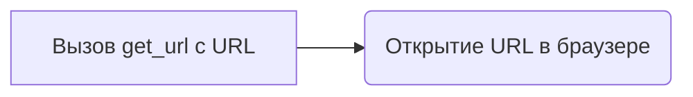
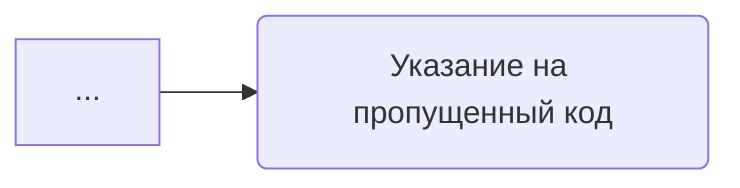

# Модуль alirequests

## Обзор

Модуль `alirequests.py` предназначен для экспериментов с AliExpress, вероятно, включает в себя настройку веб-драйвера для автоматизации задач на сайте AliExpress. В текущей версии модуль инициализирует драйвер Firefox и открывает главную страницу AliExpress.

## Подробней

Этот модуль, вероятно, является частью более крупной системы автоматизации или сбора данных с сайта AliExpress. Он демонстрирует начальную настройку веб-драйвера Firefox для доступа к сайту.

## Функции

### `Driver`

```python
d = Driver(Firefox)
```

**Назначение**: Создание экземпляра веб-драйвера Firefox.

**Параметры**:
- `Firefox`: Класс, определяющий использование браузера Firefox.

**Как работает функция**:

1.  Создается экземпляр класса `Driver`, который инициализирует веб-драйвер с использованием браузера Firefox.
2.  Драйвер настраивается для автоматического управления браузером Firefox.


**Примеры**:

```python
from src.webdriver.driver import Driver, Chrome, Firefox
d = Driver(Firefox)
```

### `get_url`

```python
d.get_url(r"https://www.aliexpress.com")
```

**Назначение**: Открытие указанного URL в браузере, управляемом веб-драйвером.

**Параметры**:
- `url` (str): URL для открытия в браузере. В данном случае, это `"https://www.aliexpress.com"`.

**Как работает функция**:

1.  Функция `get_url` используется для открытия указанного URL в браузере, управляемом экземпляром `Driver`.
2.  В данном случае, она открывает главную страницу AliExpress.



**Примеры**:

```python
d.get_url(r"https://www.aliexpress.com")
```

### `...`

```python
...
```

**Назначение**: Указание на пропущенный или не реализованный код.

**Параметры**:
- нет.

**Как работает функция**:
Функция не выполняет никаких действий, так как `...` является заполнителем для будущего кода.



**Примеры**:

```python
...