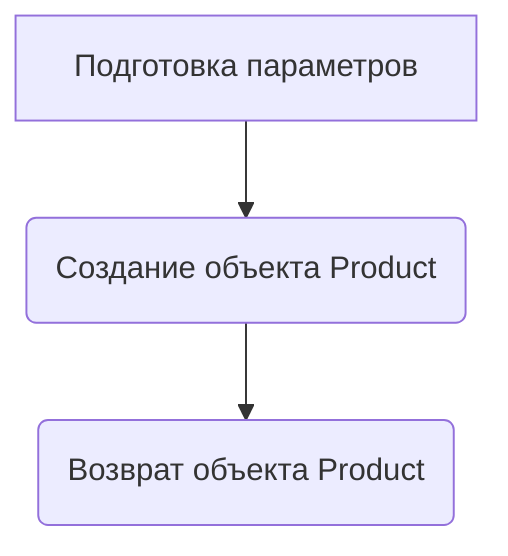

# Документация модуля `test_aliexpress_scenario.py`

## Обзор

Модуль `test_aliexpress_scenario.py` предназначен для проведения экспериментов и тестов, связанных с поставщиком Aliexpress. Он содержит функции для инициализации поставщика, настройки тестового сценария и работы с продуктами.

## Подробней

Этот модуль используется для тестирования логики работы с Aliexpress, включая получение данных о продуктах, их категоризацию и добавление в базу данных PrestaShop. Он включает в себя настройку тестового сценария, инициализацию класса `Supplier` и `Product`, а также выполнение действий через веб-драйвер.

## Функции

### `start_supplier`

```python
def start_supplier(supplier_prefix: str) -> Supplier:
    """
    Инициализирует и возвращает объект класса `Supplier` с указанным префиксом поставщика.

    Args:
        supplier_prefix (str): Префикс поставщика.

    Returns:
        Supplier: Объект класса `Supplier`.

    Example:
        >>> supplier = start_supplier('aliexpress')
        >>> print(supplier.supplier_prefix)
        aliexpress
    """
    ...
```

**Назначение**:
Функция `start_supplier` создает и возвращает экземпляр класса `Supplier`.

**Параметры**:
- `supplier_prefix` (str): Префикс поставщика, который будет использоваться для инициализации объекта `Supplier`.

**Возвращает**:
- `Supplier`: Объект класса `Supplier`, инициализированный с переданным префиксом.

**Как работает функция**:
1. Функция принимает `supplier_prefix`.
2. Создает словарь `params` с ключом `'supplier_prefix'` и переданным значением.
3. Инициализирует и возвращает объект `Supplier` с параметрами из словаря `params`.

**Примеры**:
```python
supplier = start_supplier('aliexpress')
print(supplier.supplier_prefix)
```

### `start_product`

```python
def start_product() -> Product:
    """
    Инициализирует и возвращает объект класса `Product` с параметрами,
    необходимыми для работы с продуктами.

    Args:
        supplier (Supplier): Объект класса `Supplier`.
        webelements_locators (dict): Локаторы веб-элементов.
        product_categories (dict): Категории продукта.

    Returns:
        Product: Объект класса `Product`.
    """
    ...
```

**Назначение**:
Функция `start_product` создает и возвращает экземпляр класса `Product`.

**Параметры**:
Функция не принимает параметров напрямую, но использует глобальные переменные `s` и `test_scenario` для создания параметров для инициализации объекта `Product`.

**Возвращает**:
- `Product`: Объект класса `Product`, инициализированный с параметрами, созданными на основе глобальных переменных.

**Как работает функция**:
1. Функция использует глобальные переменные `s` (объект `Supplier`) и `test_scenario` для получения необходимых данных.
2. Создает словарь `params` с ключами:
   - `'supplier'`: Значение `s`.
   - `'webelements_locators'`: Локаторы веб-элементов, полученные из `s.locators.get('product')`.
   - `'product_categories'`: Категории продукта, полученные из `test_scenario['iPhone 13 & 13 MINI']['presta_categories']`.
3. Инициализирует и возвращает объект `Product` с параметрами из словаря `params`.

**Примеры**:
```python
product = start_product()
print(product.supplier.supplier_prefix)
```



## Переменные

- `supplier_prefix`: Префикс поставщика (строка), используемый для инициализации объекта `Supplier`.
- `s`: Объект класса `Supplier`, созданный на основе `supplier_prefix`.
- `test_scenario`: Словарь, содержащий информацию о тестовом сценарии, включая ID категории на сайте, бренд, URL, статус активности и категории PrestaShop.
- `test_products_list`: Список URL-адресов продуктов для тестирования.
- `p`: Объект класса `Product`, созданный на основе `s` и `test_scenario`.
- `d`: Объект веб-драйвера, полученный из `s.driver`.
- `_`: Сокращение для вызова `d.execute_locator`.
- `f`: Ссылка на `p.fields`.
- `l`: Ссылка на `p.webelements_locators`.

## Описание работы модуля

1.  **Инициализация поставщика**:
    *   Инициализируется объект `Supplier` с префиксом `'aliexpress'`.

2.  **Настройка тестового сценария**:

    *   Определяется словарь `test_scenario`, содержащий данные о тестовом сценарии для iPhone 13.

3.  **Инициализация продукта**:

    *   Создается объект `Product` с использованием данных из `test_scenario` и локаторов из объекта `Supplier`.

4.  **Работа с веб-драйвером**:

    *   Получается объект веб-драйвера из `s.driver`.
    *   Определяются сокращения для часто используемых функций и атрибутов.

5.  **Получение данных о продукте**:

    *   Открывается URL первого продукта из списка `test_products_list`.
    *   Извлекается reference (артикул) продукта из URL.
    *   Извлекается цена продукта с использованием локатора `'price'`.

6.  **Проверка и добавление в PrestaShop**:

    *   Проверяется, есть ли продукт с данным reference в базе данных PrestaShop.
    *   Если продукта нет в базе данных, он добавляется.