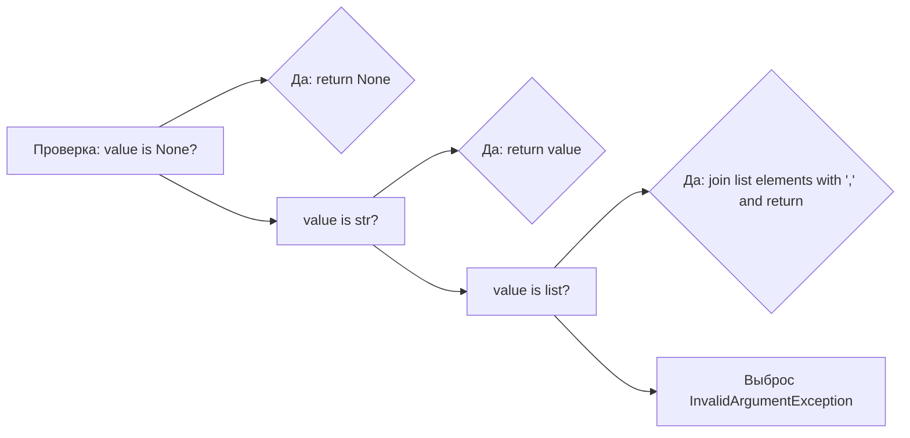

# Модуль для обработки аргументов API AliExpress

## Обзор

Модуль `arguments.py` предоставляет набор вспомогательных функций для обработки и валидации аргументов, используемых в API AliExpress. Он содержит функции для преобразования списков в строки, а также для извлечения и проверки идентификаторов продуктов.

## Подробнее

Этот модуль содержит функции, которые помогают при работе с API AliExpress, приводя аргументы к нужным типам и форматам. Это необходимо для обеспечения корректной работы API запросов. В частности, модуль используется для обработки идентификаторов продуктов и преобразования их в нужный формат.

## Функции

### `get_list_as_string`

```python
def get_list_as_string(value):
    """Преобразует список в строку, разделенную запятыми.

    Args:
        value (list | str | None): Значение для преобразования.

    Returns:
        str | None: Строка, разделенная запятыми, если `value` является списком или строкой, иначе `None`.

    Raises:
        InvalidArgumentException: Если `value` не является списком или строкой.

    Example:
        >>> get_list_as_string(['a', 'b', 'c'])
        'a,b,c'
        >>> get_list_as_string('abc')
        'abc'
        >>> get_list_as_string(None) is None
        True
    """
    ...
```

**Назначение**: Преобразует входное значение в строку, если это список или строка. Если значение равно `None`, возвращает `None`. Если значение не является ни списком, ни строкой, вызывает исключение `InvalidArgumentException`.

**Как работает функция**:

1.  Проверяет, является ли входное значение `value` равным `None`. Если да, возвращает `None`.
2.  Если `value` является строкой, возвращает `value` без изменений.
3.  Если `value` является списком, объединяет элементы списка в строку, разделенную запятыми, и возвращает эту строку.
4.  Если `value` не является ни строкой, ни списком, вызывает исключение `InvalidArgumentException` с сообщением об ошибке.



**Примеры**:

```python
get_list_as_string(['a', 'b', 'c'])
# 'a,b,c'

get_list_as_string('abc')
# 'abc'

get_list_as_string(None) is None
# True
```

### `get_product_ids`

```python
def get_product_ids(values):
    """Извлекает и проверяет идентификаторы продуктов из списка или строки.

    Args:
        values (list | str): Список или строка идентификаторов продуктов.

    Returns:
        list: Список идентификаторов продуктов после извлечения.

    Raises:
        InvalidArgumentException: Если `values` не является списком или строкой.

    Example:
        >>> get_product_ids('12345,67890')
        ['12345', '67890']
        >>> get_product_ids(['12345', '67890'])
        ['12345', '67890']
    """
    ...
```

**Назначение**: Извлекает идентификаторы продуктов из входного списка или строки, разделенной запятыми. Использует функцию `get_product_id` для каждого значения.

**Как работает функция**:

1.  Проверяет, является ли входное значение `values` строкой. Если да, разделяет строку на список по запятой.
2.  Если `values` не является ни строкой, ни списком, выбрасывает исключение `InvalidArgumentException`.
3.  Инициализирует пустой список `product_ids`.
4.  Итерируется по элементам в списке `values`.
5.  Для каждого `value` вызывает функцию `get_product_id` и добавляет результат в список `product_ids`.
6.  Возвращает список `product_ids`.

```mermaid
graph LR
    A[Проверка: values is str?] --> B{Да: split values by ','};
    A --> C[values is list?];
    C --> D{Нет: Raise InvalidArgumentException};
    C --> E[Инициализация product_ids = []];
    E --> F[Цикл for value in values];
    F --> G[product_id = get_product_id(value)];
    G --> H[product_ids.append(product_id)];
    H --> I[return product_ids];
```

**Примеры**:

```python
get_product_ids('12345,67890')
# ['12345', '67890']

get_product_ids(['12345', '67890'])
# ['12345', '67890']