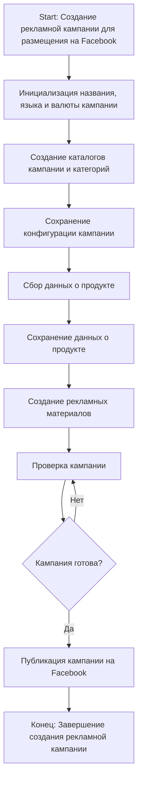
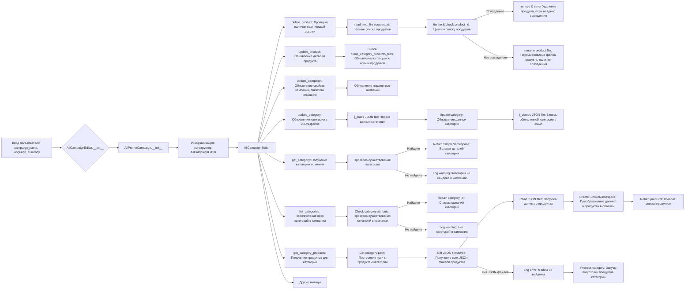

# Модуль `campaign`

## Обзор

Модуль `campaign` предназначен для управления процессом создания и публикации рекламных кампаний на Facebook. Он включает в себя функциональность для инициализации параметров кампании (название, язык, валюта), создания структуры каталогов, сохранения конфигураций для новой кампании, сбора и сохранения данных о продуктах через `ali` или `html`, генерации рекламных материалов, проверки кампании и публикации её на Facebook.

## Подробнее

Этот модуль является ключевым компонентом системы, отвечающим за автоматизацию процесса создания и управления рекламными кампаниями. Он обеспечивает гибкость в настройке кампаний, позволяя указывать язык, валюту и категории товаров, а также предоставляет инструменты для сбора данных о продуктах и создания рекламных материалов.

## Классы

В данном разделе отсутствуют классы. Описана структура и принцип работы модуля.

## Функции

В данном разделе отсутствуют функции. Описана структура и принцип работы модуля.

## Как работает модуль

1.  **Инициализация деталей кампании**: Определяется название кампании, язык и валюта.
2.  **Создание каталогов кампании и категорий**: Создаются необходимые каталоги или файлы для кампании.
3.  **Сохранение конфигурации кампании**: Сохраненные детали инициализированной кампании.
4.  **Сбор данных о продукте**: Собираются данные, относящиеся к продуктам, которые будут продвигаться в рамках кампании.
5.  **Сохранение данных о продукте**: Собранные данные о продукте сохраняются.
6.  **Создание рекламных материалов**: Генерируются или выбираются графика, баннеры и другие рекламные материалы.
7.  **Обзор кампании**: Процесс проверки подтверждает, что компоненты кампании готовы.
8.  **Кампания готова?**: Проверка для определения, является ли кампания полной и готовой к публикации.
9.  **Публикация кампании**: Кампания публикуется на платформе, готовая к маркетинговым усилиям.
10. **Конец**: Процесс создания кампании завершен.



## Примеры

1.  Запуск процесса создания рекламной кампании для размещения на Facebook.
2.  Определение названия кампании как "Летняя распродажа", языка как "Русский", валюты как "RUB".
3.  Создание структуры папок в файловой системе для хранения активов кампании.
4.  Запись данных в базу данных или файл конфигурации.
5.  Получение идентификаторов продуктов, описаний, изображений и цен из системы инвентаризации.
6.  Запись данных в таблицу базы данных, посвященную продуктам кампании.
7.  Создание изображений и описаний, адаптированных для привлечения клиентов.
8.  Оценка качества и полноты всех компонентов кампании человеком или системой.
9.  Логический флаг сигнализирует "Да", если все на месте, в противном случае "Нет", вызывая возврат к предыдущему шагу для внесения исправлений.
10. Вызовы API для публикации кампании на соответствующей платформе.
11. Процесс создания кампании завершен.

## Редактирование кампании



## Подготовка кампании

```mermaid
flowchart TD
    A[Начало] --> B{Обработать все кампании?}
    B -->|Да| C[Обработать все кампании]
    B -->|Нет| D[Обработать конкретную кампанию]
    
    C --> E{Предоставлен язык и валюта?}
    E -->|Да| F[Обработать каждую кампанию с предоставленным языком и валютой]
    E -->|Нет| G[Обработать все локали для каждой кампании]
    
    D --> H{Указаны категории?}
    H -->|Да| I[Обработать конкретные категории для кампании]
    H -->|Нет| J[Обработать всю кампанию]
    
    F --> K[Обработать категорию кампании]
    G --> L[Обработать кампанию для всех локалей]
    I --> K
    J --> L
    
    K --> M[Возврат]
    L --> M