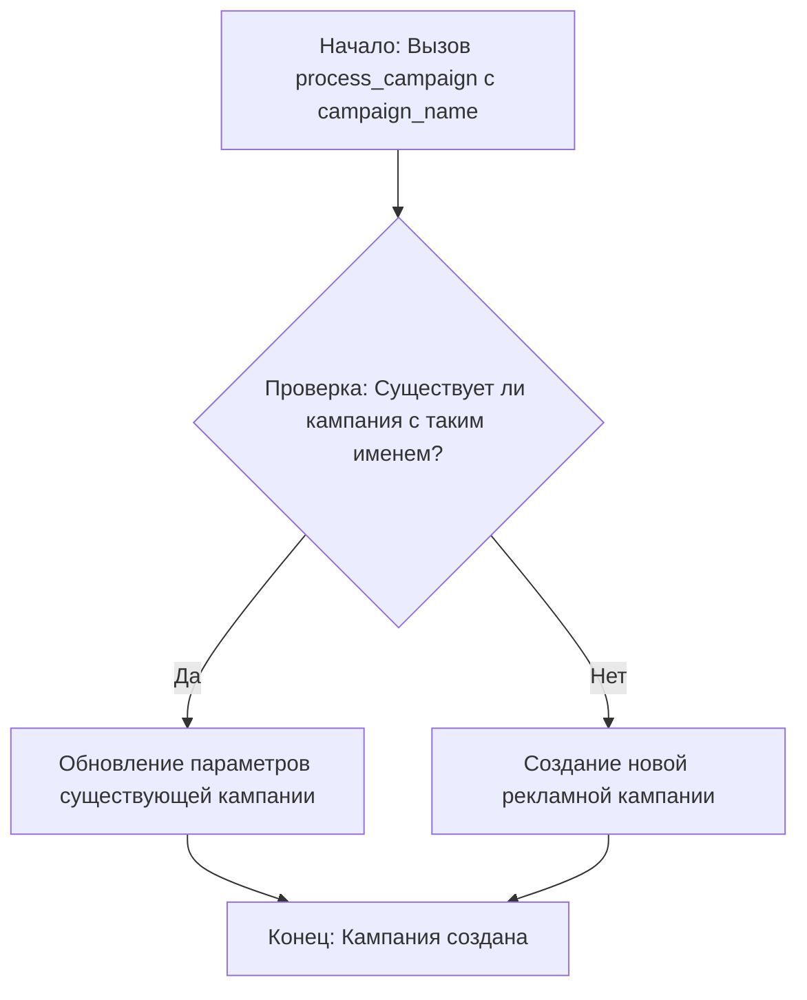

# Модуль prepare_campaign.py

## Обзор

Модуль `prepare_campaign.py` предназначен для подготовки и запуска рекламных кампаний на платформе AliExpress. Он включает импорт необходимых модулей и определение основных параметров, таких как язык, валюта и имя кампании. Основная задача модуля - проверить существование рекламной кампании и, если она не существует, создать новую.

## Подробней

Модуль `prepare_campaign.py` является частью более широкой системы для управления рекламными кампаниями на AliExpress. Он отвечает за инициализацию и запуск процесса создания или обновления рекламной кампании, используя функциональность, предоставляемую модулем `process_campaign`. 

Импортируемые модули:
- `header`: Предположительно, содержит общие заголовки или настройки для проекта.
- `src.suppliers.aliexpress.campaign.process_campaign`: Модуль, который содержит логику для обработки и создания рекламных кампаний.

В данном модуле происходит определение словаря `locales`, который содержит соответствие языков и валют. Также определены переменные `language`, `currency`, `campaign_name`, которые используются при создании или обновлении кампании.

## Функции

### `process_campaign`

```python
process_campaign(campaign_name: str)
```

**Назначение**: Функция отвечает за запуск процесса создания или обновления рекламной кампании.

**Параметры**:
- `campaign_name` (str): Имя рекламной кампании.

**Возвращает**:
- Отсутствует.

**Вызывает исключения**:
- Зависит от реализации в модуле `src.suppliers.aliexpress.campaign.process_campaign`.

**Как работает функция**:

1.  Функция `process_campaign` вызывается с параметром `campaign_name`.

2.  Внутри функции происходит вся логика по созданию или обновлению рекламной кампании.



**Примеры**:

```python
campaign_name = 'brands'
process_campaign(campaign_name = campaign_name)