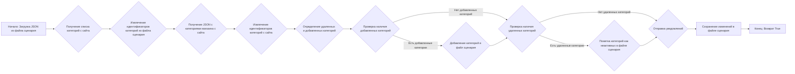
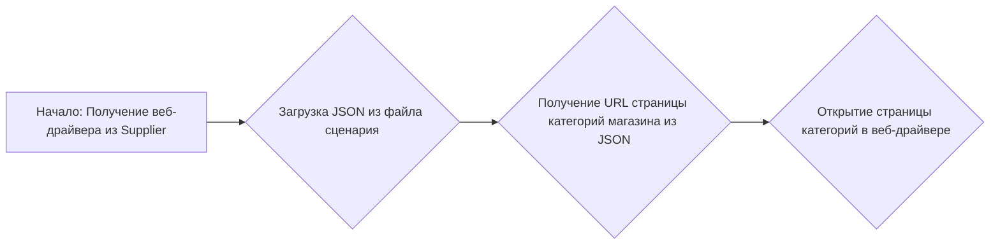
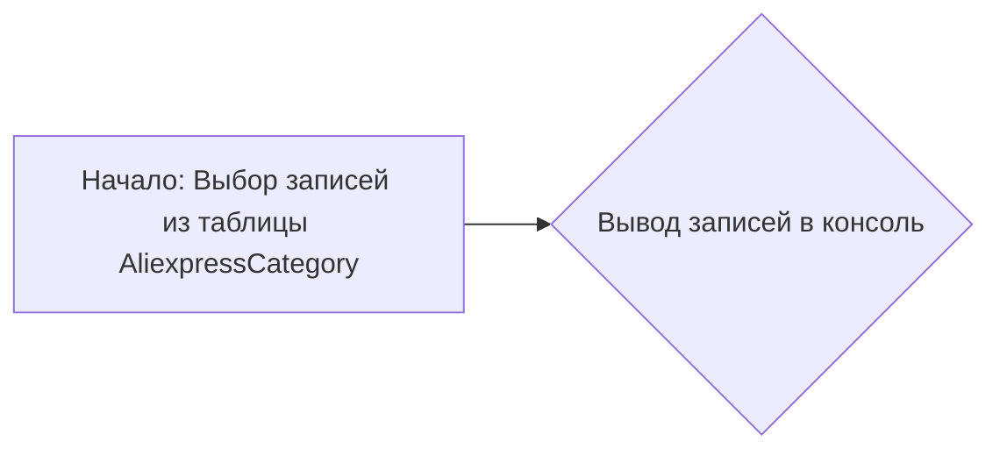
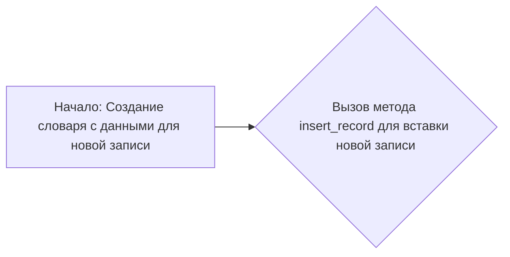
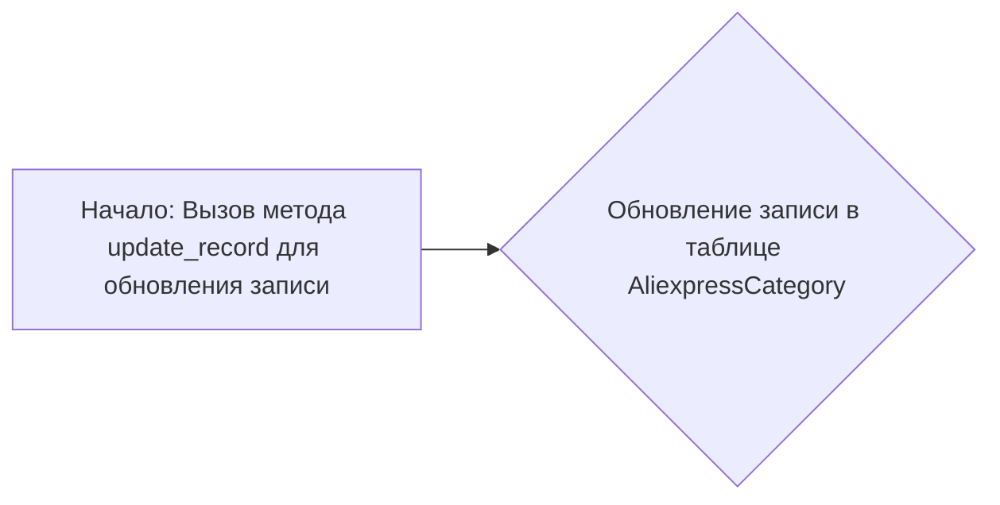
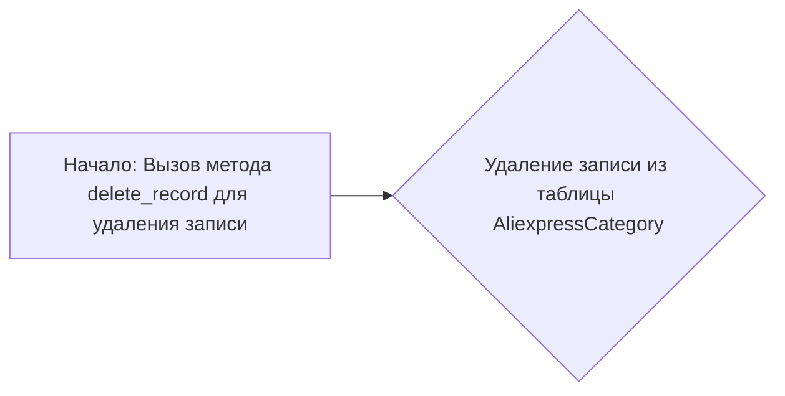

# Модуль для управления категориями Aliexpress

## Обзор

Модуль `category.py` предназначен для управления категориями товаров на сайте Aliexpress. Он включает в себя функции для сбора URL товаров из категорий, обновления информации о категориях на основе данных с сайта, а также для адаптации данных категорий к базе данных.

## Подробней

Этот модуль играет важную роль в процессе сбора и обработки данных о товарах с Aliexpress. Он автоматизирует навигацию по категориям сайта, извлечение информации о товарах и поддержание актуальности данных о категориях в соответствии с изменениями на сайте. Модуль использует веб-драйвер для взаимодействия с сайтом Aliexpress и библиотеку `jjson` для работы с JSON-файлами.

## Функции

### `get_list_products_in_category(s) -> list[str, str]`

Функция считывает URL товаров со страницы категории Aliexpress.

**Назначение**:
Функция предназначена для получения списка URL товаров, представленных в заданной категории на сайте Aliexpress. Если категория содержит несколько страниц с товарами, функция автоматически переходит по страницам и собирает URL со всех страниц.

**Параметры**:
- `s` (Supplier): Экземпляр класса `Supplier`, представляющий поставщика (Aliexpress). Содержит необходимые атрибуты, такие как веб-драйвер и локаторы элементов на странице.

**Возвращает**:
- `list[str, str]`: Список URL товаров, найденных в категории. Может быть пустым, если в категории нет товаров.

**Как работает функция**:

1.  Функция вызывает функцию `get_prod_urls_from_pagination(s)` для получения списка URL товаров с учетом пагинации.

```mermaid
graph LR
    A[Начало: Вызов get_prod_urls_from_pagination(s)] --> B{Получение списка URL товаров};
    B --> C{Возврат списка URL товаров};
```

**Примеры**:

```python
# Пример вызова функции (предполагается, что экземпляр класса Supplier уже создан)
# supplier = Supplier(...)
# product_urls = get_list_products_in_category(supplier)
# if product_urls:
#     print(f"Найдено {len(product_urls)} URL товаров в категории.")
# else:
#     print("В категории нет товаров.")
```

### `get_prod_urls_from_pagination(s) -> list[str]`

Функция собирает ссылки на товары со страницы категории с перелистыванием страниц.

**Назначение**:
Функция предназначена для сбора URL товаров со страницы категории Aliexpress, учитывая пагинацию (перелистывание страниц). Она автоматически переходит по страницам категории и извлекает ссылки на товары с каждой страницы.

**Параметры**:
- `s` (Supplier): Экземпляр класса `Supplier`, представляющий поставщика (Aliexpress). Содержит необходимые атрибуты, такие как веб-драйвер и локаторы элементов на странице.

**Возвращает**:
- `list[str]`: Список URL товаров, найденных на всех страницах категории.

**Как работает функция**:

1.  Извлекает веб-драйвер (`_d`) и локаторы (`_l`) из объекта `s`.
2.  Инициализирует пустой список `list_products_in_category` для хранения URL товаров.
3.  Выполняет поиск элементов, содержащих ссылки на товары, с использованием локатора `_l`.
4.  Если список URL пуст, возвращает пустой список (категория не содержит товаров).
5.  Запускает бесконечный цикл, который переходит по страницам категории, пока это возможно.
6.  На каждой итерации цикла проверяет наличие кнопки "следующая страница" с помощью локатора `s.locators ['category']['pagination']['->']`.
7.  Если кнопка "следующая страница" отсутствует, цикл завершается.
8.  Если кнопка "следующая страница" присутствует, функция добавляет URL товаров с текущей страницы в список `list_products_in_category` и переходит на следующую страницу.
9.  После завершения цикла функция возвращает список `list_products_in_category`.

```mermaid
graph LR
    A[Начало: Получение веб-драйвера и локаторов из Supplier] --> B{Инициализация списка URL товаров};
    B --> C{Выполнение поиска элементов, содержащих ссылки на товары};
    C --> D{Проверка наличия товаров в категории};
    D -- Нет товаров --> E[Возврат пустого списка];
    D -- Товары есть --> F{Запуск цикла пагинации};
    F --> G{Проверка наличия кнопки "следующая страница"};
    G -- Кнопка отсутствует --> H[Завершение цикла];
    G -- Кнопка присутствует --> I{Добавление URL товаров с текущей страницы в список};
    I --> J{Переход на следующую страницу};
    J --> F;
    H --> K[Возврат списка URL товаров];
```

**Примеры**:

```python
# Пример вызова функции (предполагается, что экземпляр класса Supplier уже создан)
# supplier = Supplier(...)
# product_urls = get_prod_urls_from_pagination(supplier)
# if product_urls:
#     print(f"Найдено {len(product_urls)} URL товаров: {product_urls}")
# else:
#     print("В категории нет товаров или не удалось получить URL.")
```

### `update_categories_in_scenario_file(s, scenario_filename: str) -> bool`

Функция проверяет изменения категорий на сайте и обновляет файл сценария.

**Назначение**:
Функция предназначена для синхронизации информации о категориях товаров, хранящейся в файле сценария, с актуальными данными, полученными с сайта Aliexpress. Она сравнивает списки категорий, выявляет добавленные и удаленные категории, и вносит соответствующие изменения в файл сценария.

**Параметры**:
- `s` (Supplier): Экземпляр класса `Supplier`, представляющий поставщика (Aliexpress).
- `scenario_filename` (str): Имя файла сценария, который необходимо обновить.

**Возвращает**:
- `bool`: `True`, если обновление файла сценария прошло успешно.

**Как работает функция**:

1.  Загружает JSON из файла сценария.
2.  Получает список категорий с сайта Aliexpress, используя функцию `get_list_categories_from_site()`.
3.  Извлекает идентификаторы категорий из файла сценария и сохраняет их в списке `all_ids_in_file`.
4.  Получает JSON с категориями магазина с сайта Aliexpress.
5.  Извлекает идентификаторы категорий с сайта и сохраняет их в списке `all_ids_on_site`, а также информацию о категориях в списке `all_categories_on_site`.
6.  Определяет удаленные категории (категории, которые есть в файле сценария, но отсутствуют на сайте) и добавленные категории (категории, которые есть на сайте, но отсутствуют в файле сценария).
7.  Если есть добавленные категории, добавляет их в файл сценария.
8.  Если есть удаленные категории, помечает их как неактивные в файле сценария.
9.  Отправляет уведомления о добавленных и удаленных категориях.
10. Сохраняет изменения в файле сценария.



**Примеры**:

```python
# Пример вызова функции (предполагается, что экземпляр класса Supplier уже создан)
# supplier = Supplier(...)
# scenario_file = "aliexpress_scenario.json"
# result = update_categories_in_scenario_file(supplier, scenario_file)
# if result:
#     print(f"Файл сценария {scenario_file} успешно обновлен.")
# else:
#     print(f"Ошибка при обновлении файла сценария {scenario_file}.")
```

### `get_list_categories_from_site(s, scenario_file, brand='')`

Функция получает список категорий с сайта.

**Параметры**:
- `s` (Supplier): Экземпляр класса `Supplier`, представляющий поставщика (Aliexpress).
- `scenario_file` (str): Имя файла сценария, содержащего информацию о магазине.
- `brand` (str, optional): Бренд. По умолчанию ''.

**Как работает функция**:

1.  Извлекает веб-драйвер (`_d`) из объекта `s`.
2.  Загружает JSON из файла сценария.
3.  Получает URL страницы категорий магазина из JSON.
4.  Открывает страницу категорий в веб-драйвере.



## Классы

### `DBAdaptor`

Класс предоставляет методы для взаимодействия с базой данных категорий Aliexpress.

**Описание**:
Класс `DBAdaptor` предоставляет набор методов для выполнения операций CRUD (Create, Read, Update, Delete) с данными категорий Aliexpress в базе данных. Он использует класс `CategoryManager` для выполнения этих операций.

**Методы**:

#### `select(cat_id: int = None, parent_id: int = None, project_cat_id: int = None)`

**Назначение**:
Метод выполняет операцию SELECT для извлечения записей из таблицы `AliexpressCategory`.

**Параметры**:
- `cat_id` (int, optional): ID категории. По умолчанию `None`.
- `parent_id` (int, optional): ID родительской категории. По умолчанию `None`.
- `project_cat_id` (int, optional): ID категории проекта. По умолчанию `None`.

**Как работает функция**:

1.  Выбирает все записи из таблицы `AliexpressCategory`, где `parent_category_id` равен `'parent_id_value'`.
2.  Выводит выбранные записи в консоль.



#### `insert()`

**Назначение**:
Метод выполняет операцию INSERT для добавления новой записи в таблицу `AliexpressCategory`.

**Как работает функция**:

1.  Создает словарь `fields` с данными для новой записи.
2.  Вызывает метод `insert_record` класса `CategoryManager` для вставки новой записи в таблицу `AliexpressCategory`.



#### `update()`

**Назначение**:
Метод выполняет операцию UPDATE для обновления существующей записи в таблице `AliexpressCategory`.

**Как работает функция**:

1.  Вызывает метод `update_record` класса `CategoryManager` для обновления записи в таблице `AliexpressCategory`, где `hypotez_category_id` равен `'hypotez_id_value'`.



#### `delete()`

**Назначение**:
Метод выполняет операцию DELETE для удаления записи из таблицы `AliexpressCategory`.

**Как работает функция**:

1.  Вызывает метод `delete_record` класса `CategoryManager` для удаления записи из таблицы `AliexpressCategory`, где `hypotez_category_id` равен `'hypotez_id_value'`.

