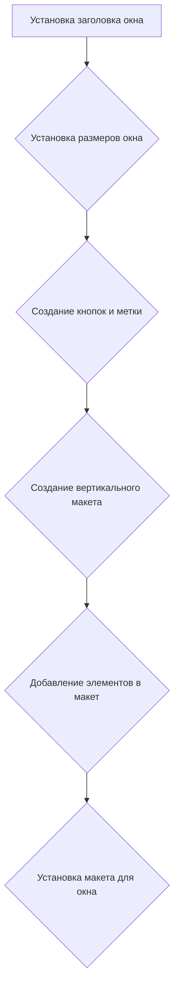
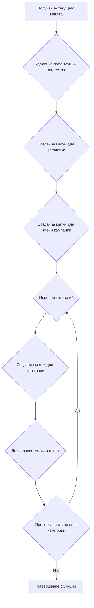

# Модуль `category.py`

## Обзор

Модуль предоставляет графический интерфейс для подготовки рекламных кампаний AliExpress. Он позволяет пользователю загружать JSON-файлы с данными о категориях, просматривать их и запускать процесс подготовки категорий для рекламных кампаний как целиком, так и по отдельности.

## Подробней

Этот модуль является частью GUI (графического интерфейса пользователя) для работы с рекламными кампаниями AliExpress. Он использует библиотеку `PyQt6` для создания окон и элементов интерфейса, а также `asyncio` и `qasync` для асинхронного выполнения операций, таких как подготовка категорий.

Модуль предоставляет следующие возможности:

1.  Загрузка данных о категориях из JSON-файла.
2.  Отображение основной информации о категориях в интерфейсе.
3.  Подготовка всех категорий или отдельной категории в асинхронном режиме.
4.  Отображение сообщений об успехе или ошибке в процессе подготовки.

## Классы

### `CategoryEditor`

**Описание**: Главный класс, представляющий окно редактора категорий.

**Наследует**: `QtWidgets.QWidget`

**Атрибуты**:

*   `campaign_name` (str): Имя кампании. По умолчанию `None`.
*   `data` (`SimpleNamespace`): Данные, загруженные из JSON-файла. По умолчанию `None`.
*   `language` (str): Язык кампании. По умолчанию `'EN'`.
*   `currency` (str): Валюта кампании. По умолчанию `'USD'`.
*   `file_path` (str): Путь к файлу кампании. По умолчанию `None`.
*   `editor` (`AliCampaignEditor`): Экземпляр класса `AliCampaignEditor` для подготовки кампании.
*   `main_app`: Ссылка на главный экземпляр приложения.

**Методы**:

*   `__init__(self, parent=None, main_app=None)`: Инициализирует окно редактора категорий.
*   `setup_ui(self)`: Настраивает пользовательский интерфейс, добавляет кнопки и метки.
*   `setup_connections(self)`: Устанавливает соединения между сигналами и слотами. В данном случае не используется.
*   `open_file(self)`: Открывает диалоговое окно для выбора JSON-файла и загружает его.
*   `load_file(self, campaign_file)`: Загружает JSON-файл и создает виджеты на основе данных.
*   `create_widgets(self, data)`: Создает виджеты для отображения данных о категориях.
*   `prepare_all_categories_async(self)`: Асинхронно подготавливает все категории.
*   `prepare_category_async(self)`: Асинхронно подготавливает выбранную категорию.

## Функции

### `__init__`

```python
def __init__(self, parent=None, main_app=None):
    """ Initialize the main window"""
```

**Назначение**: Инициализация главного окна редактора категорий.

**Параметры**:

*   `parent` (QtWidgets.QWidget, optional): Родительский виджет. По умолчанию `None`.
*   `main_app` (MainApp, optional): Главный экземпляр приложения. По умолчанию `None`.

**Возвращает**: `None`

**Как работает функция**:

1.  Вызывает конструктор родительского класса `QtWidgets.QWidget`.
2.  Сохраняет ссылку на главный экземпляр приложения `main_app`.
3.  Вызывает методы `setup_ui()` и `setup_connections()` для настройки интерфейса и соединений.

```mermaid
graph TD
    A[Вызов конструктора QtWidgets.QWidget] --> B{Сохранение ссылки на main_app};
    B --> C{Вызов setup_ui()};
    C --> D{Вызов setup_connections()};
```

**Примеры**:

```python
editor = CategoryEditor(main_app=app)
```

### `setup_ui`

```python
def setup_ui(self):
    """ Setup the user interface"""
```

**Назначение**: Настройка пользовательского интерфейса главного окна.

**Параметры**:

*   `self`: Ссылка на экземпляр класса.

**Возвращает**: `None`

**Как работает функция**:

1.  Устанавливает заголовок окна.
2.  Устанавливает размеры окна.
3.  Определяет и добавляет кнопки "Open JSON File", "Prepare All Categories" и "Prepare Category".
4.  Добавляет метку для отображения имени выбранного файла.
5.  Создает вертикальный макет (`QVBoxLayout`) и добавляет в него созданные элементы интерфейса.
6.  Устанавливает созданный макет для главного окна.



**Примеры**:

```python
self.setup_ui()
```

### `setup_connections`

```python
def setup_connections(self):
    """ Setup signal-slot connections"""
```

**Назначение**: Установка соединений между сигналами и слотами.

**Параметры**:

*   `self`: Ссылка на экземпляр класса.

**Возвращает**: `None`

**Как работает функция**:
В текущей реализации функция пуста, что означает отсутствие каких-либо соединений между сигналами и слотами.


**Примеры**:

```python
self.setup_connections()
```

### `open_file`

```python
def open_file(self):
    """ Open a file dialog to select and load a JSON file """
```

**Назначение**: Открытие диалогового окна для выбора и загрузки JSON-файла.

**Параметры**:

*   `self`: Ссылка на экземпляр класса.

**Возвращает**: `None`

**Как работает функция**:

1.  Открывает диалоговое окно выбора файла с фильтром JSON-файлов.
2.  Если файл выбран, вызывает метод `load_file()` для загрузки содержимого файла.
3.  Если файл не выбран, функция завершается.

```mermaid
graph TD
    A[Открытие диалогового окна выбора файла] --> B{Проверка, выбран ли файл};
    B -- Да --> C{Вызов load_file()};
    B -- Нет --> D[Завершение функции];
```

**Примеры**:

```python
self.open_file()
```

### `load_file`

```python
def load_file(self, campaign_file):
    """ Load a JSON file """
```

**Назначение**: Загрузка JSON-файла и инициализация данных кампании.

**Параметры**:

*   `campaign_file` (str): Путь к JSON-файлу.

**Возвращает**: `None`

**Как работает функция**:

1.  Использует `j_loads_ns` для загрузки данных из JSON-файла в объект `SimpleNamespace`.
2.  Сохраняет путь к файлу и имя кампании.
3.  Извлекает язык кампании из имени файла (без расширения).
4.  Создает экземпляр класса `AliCampaignEditor` для редактирования кампании.
5.  Вызывает метод `create_widgets()` для создания виджетов на основе загруженных данных.
6.  Обрабатывает возможные исключения при загрузке файла и отображает сообщение об ошибке.

```mermaid
graph TD
    A[Загрузка данных из JSON-файла с помощью j_loads_ns] --> B{Сохранение пути к файлу и имени кампании};
    B --> C{Извлечение языка кампании из имени файла};
    C --> D{Создание экземпляра AliCampaignEditor};
    D --> E{Вызов create_widgets()};
    E --> F{Обработка исключений};
```

**Примеры**:

```python
self.load_file("path/to/campaign.json")
```

### `create_widgets`

```python
def create_widgets(self, data):
    """ Create widgets based on the data loaded from the JSON file """
```

**Назначение**: Создание виджетов на основе данных, загруженных из JSON-файла.

**Параметры**:

*   `data` (`SimpleNamespace`): Данные, загруженные из JSON-файла.

**Возвращает**: `None`

**Как работает функция**:

1.  Получает текущий макет (`layout`).
2.  Удаляет все предыдущие виджеты из макета, кроме кнопок "Open JSON File","Prepare All Categories" и "Prepare Category" и метки имени файла.
3.  Создает метки для отображения заголовка и имени кампании.
4.  Создает метки для отображения категорий.
5.  Добавляет все созданные метки в макет.



**Примеры**:

```python
self.create_widgets(self.data)
```

### `prepare_all_categories_async`

```python
@asyncSlot()
async def prepare_all_categories_async(self):
    """ Asynchronously prepare all categories """
```

**Назначение**: Асинхронная подготовка всех категорий.

**Параметры**:

*   `self`: Ссылка на экземпляр класса.

**Возвращает**: `None`

**Как работает функция**:

1.  Проверяет, инициализирован ли редактор кампании (`self.editor`).
2.  Если редактор инициализирован, вызывает асинхронный метод `prepare_all_categories()` редактора.
3.  Отображает сообщение об успехе или ошибке в зависимости от результата выполнения.

```mermaid
graph TD
    A{Проверка, инициализирован ли редактор} --> B{Вызов prepare_all_categories()};
    B --> C{Отображение сообщения об успехе/ошибке};
```

**Примеры**:

```python
await self.prepare_all_categories_async()
```

### `prepare_category_async`

```python
@asyncSlot()
async def prepare_category_async(self):
    """ Asynchronously prepare a specific category """
```

**Назначение**: Асинхронная подготовка конкретной категории.

**Параметры**:

*   `self`: Ссылка на экземпляр класса.

**Возвращает**: `None`

**Как работает функция**:

1.  Проверяет, инициализирован ли редактор кампании (`self.editor`).
2.  Если редактор инициализирован, вызывает асинхронный метод `prepare_category()` редактора, передавая имя кампании.
3.  Отображает сообщение об успехе или ошибке в зависимости от результата выполнения.

```mermaid
graph TD
    A{Проверка, инициализирован ли редактор} --> B{Вызов prepare_category()};
    B --> C{Отображение сообщения об успехе/ошибке};
```

**Примеры**:

```python
await self.prepare_category_async()