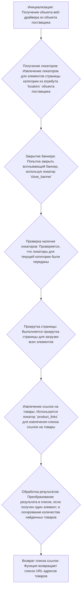

# Модуль `scenario.py`

## Обзор

Модуль `scenario.py` предназначен для сбора информации о товарах с сайта bangood.co.il. Он включает в себя функции для получения списка категорий товаров и списка товаров в каждой категории, используя веб-драйвер. Модуль адаптирован для работы с особенностями структуры страниц данного поставщика.

## Подробней

Этот модуль является частью системы автоматизированного сбора данных о товарах с сайтов поставщиков для проекта `hypotez`. Он выполняет следующие основные задачи:

1.  **Сбор списка категорий** товаров с сайта продавца (`get_list_categories_from_site()`).
2.  **Сбор списка товаров** с каждой страницы категории (`get_list_products_in_category()`).
3.  **Передача управления** в функцию `grab_product_page()`, которая отвечает за обработку отдельных товаров.

Модуль спроектирован с учетом возможной динамики изменений на сайте поставщика, таких как добавление, переименование или удаление категорий. Предусмотрена необходимость синхронизации категорий между `PrestaShop` и данными, собранными с сайта поставщика.

## Функции

### `get_list_products_in_category`

```python
def get_list_products_in_category (s) -> list[str, str, None]:
    """ Returns list of products urls from category page
    Если надо пролистстать - страницы категорий - листаю ??????

    Attrs:
        s - Supplier
    @returns
        list or one of products urls or None
    """
```

**Назначение**: Функция извлекает список URL-адресов товаров со страницы категории.

**Параметры**:

*   `s` (Supplier): Объект поставщика, содержащий необходимые атрибуты и методы для работы с веб-драйвером и локаторами элементов на странице.

**Возвращает**:

*   `list[str, str, None]`: Список URL-адресов товаров на странице категории. Может вернуть `None`, если список товаров не найден.

**Как работает функция**:

1.  **Инициализация**: Получает объект веб-драйвера из объекта поставщика `s`.
2.  **Получение локаторов**: Извлекает локаторы для элементов страницы категории из атрибута `locators` объекта поставщика.
3.  **Закрытие баннера**: Пытается закрыть всплывающий баннер, используя локатор `close_banner`.
4.  **Проверка наличия локаторов**: Проверяет, что локаторы для текущей категории были переданы.
5.  **Прокрутка страницы**: Выполняет прокрутку страницы для загрузки всех элементов, используя метод `scroll()`.
6.  **Извлечение ссылок на товары**: Использует локатор `product_links` для извлечения списка ссылок на товары.
7.  **Обработка результатов**: Преобразует результат в список, если получен один элемент, и логирует количество найденных товаров.
8.  **Возврат списка ссылок**: Возвращает список URL-адресов товаров.



**Примеры**:

```python
# Пример вызова функции с объектом поставщика
supplier = Supplier(...)  # Предполагается, что класс Supplier определен в другом месте
product_links = get_list_products_in_category(supplier)
if product_links:
    print(f"Найдено {len(product_links)} ссылок на товары")
else:
    print("Ссылки на товары не найдены")
```

### `get_list_categories_from_site`

```python
def get_list_categories_from_site(s):
    ...
```

**Назначение**: Функция извлекает список категорий с сайта. Конкретная реализация не предоставлена (`...`).

**Параметры**:

*   `s` (Supplier): Объект поставщика, содержащий необходимые атрибуты и методы для работы с веб-драйвером.

**Возвращает**:

*   Описание возвращаемого значения отсутствует, так как код функции не предоставлен.

**Как работает функция**:

*   Описание отсутствует, так как код функции не предоставлен.
```mermaid
graph TD
    A[Начало работы функции] --> B{Описание отсутствует, так как код функции не предоставлен.};
    B --> C[Конец работы функции];