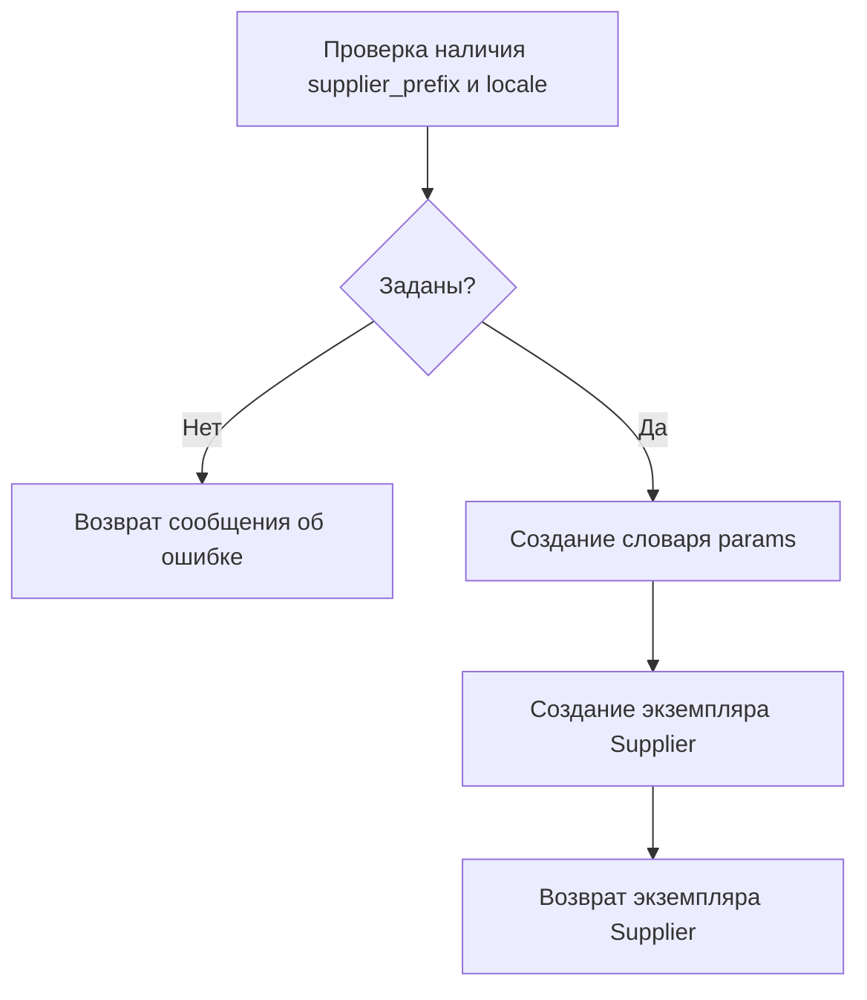

# Модуль `notebook_header.py`

## Обзор

Модуль `notebook_header.py` предназначен для настройки окружения и импорта необходимых модулей для экспериментов и разработки в проекте `hypotez`. Он добавляет корневую директорию проекта в `sys.path`, что позволяет импортировать модули из других частей проекта. Кроме того, он импортирует различные классы и функции, используемые в процессе разработки и тестирования, такие как `Driver`, `Supplier`, `Product` и другие. Модуль также содержит функцию `start_supplier`, предназначенную для запуска поставщика с заданными параметрами.

## Подробнее

Данный модуль выполняет следующие задачи:

1.  Определение корневой директории проекта `hypotez` и добавление её в `sys.path`, чтобы обеспечить возможность импорта модулей из любой части проекта.
2.  Импорт необходимых модулей и классов, таких как `pathlib`, `json`, `re`, `Driver`, `Supplier`, `Product`, `Category` и других, которые используются в дальнейшей работе.
3.  Определение функции `start_supplier`, которая принимает префикс поставщика и локаль в качестве аргументов и возвращает экземпляр класса `Supplier` с заданными параметрами.

## Функции

### `start_supplier`

```python
def start_supplier(supplier_prefix, locale):
    """ Старт поставщика """
```

**Назначение**: Запускает поставщика с заданными параметрами.

**Параметры**:

*   `supplier_prefix` (str): Префикс поставщика.
*   `locale` (str): Локаль.

**Возвращает**:

*   `Supplier | str`: Экземпляр класса `Supplier` или сообщение об ошибке, если не заданы префикс поставщика и локаль.

**Как работает функция**:

1.  Проверяет, заданы ли префикс поставщика и локаль. Если нет, возвращает сообщение об ошибке "Не задан сценарий и язык".
2.  Создает словарь `params` с параметрами поставщика: `supplier_prefix` и `locale`.
3.  Создает и возвращает экземпляр класса `Supplier` с параметрами из словаря `params`.



**Примеры**:

```python
# Пример вызова функции start_supplier с заданными параметрами
supplier = start_supplier('test_supplier', 'ru_RU')

# Пример вызова функции start_supplier без параметров
message = start_supplier(None, None)
print(message)  # Вывод: Не задан сценарий и язык