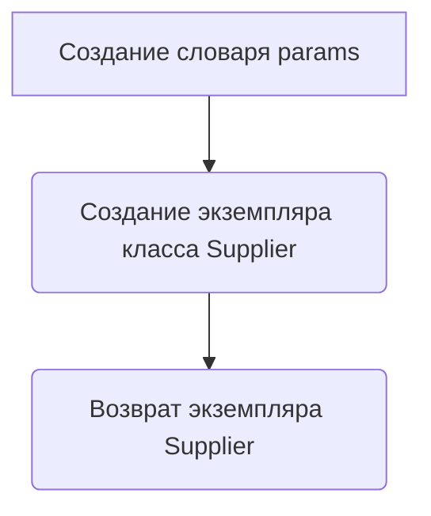

# Модуль notebook_header.py

## Обзор

Модуль `notebook_header.py` предназначен для экспериментов с поставщиком `kualastyle`. Он содержит импорты необходимых библиотек и классов для работы с поставщиками, продуктами и категориями, а также функцию для запуска поставщика.

## Подробней

Этот файл содержит код для экспериментов, связанных с поставщиком `kualastyle`. Он включает импорт различных модулей и классов, таких как `Supplier`, `Product`, `Category` и другие утилиты.  Файл также содержит функцию `start_supplier`, которая используется для запуска поставщика с заданным префиксом.

## Функции

### `start_supplier`

```python
def start_supplier(supplier_prefix: str = 'kualastyle'):
    """ Старт поставщика (kualastyle)
    Args:
        supplier_prefix (str, optional): Префикс поставщика. По умолчанию 'kualastyle'.

    Returns:
        Supplier: Объект поставщика.
    """
    ...
```

**Назначение**: Запускает поставщика с заданным префиксом.

**Параметры**:

- `supplier_prefix` (str): Префикс поставщика. По умолчанию `'kualastyle'`.

**Возвращает**:

- `Supplier`: Объект поставщика.

**Как работает функция**:

1.  Функция создает словарь `params` с параметром `'supplier_prefix'`, значение которого равно переданному аргументу `supplier_prefix`.
2.  Создает и возвращает экземпляр класса `Supplier`, передавая словарь `params` в качестве аргумента.



**Примеры**:

```python
from src.suppliers import Supplier

# Пример 1: Запуск поставщика с префиксом по умолчанию
supplier = start_supplier()
print(type(supplier))  # Вывод: <class 'src.suppliers.Supplier'>

# Пример 2: Запуск поставщика с указанным префиксом
supplier = start_supplier(supplier_prefix='another_supplier')
print(type(supplier))  # Вывод: <class 'src.suppliers.Supplier'>