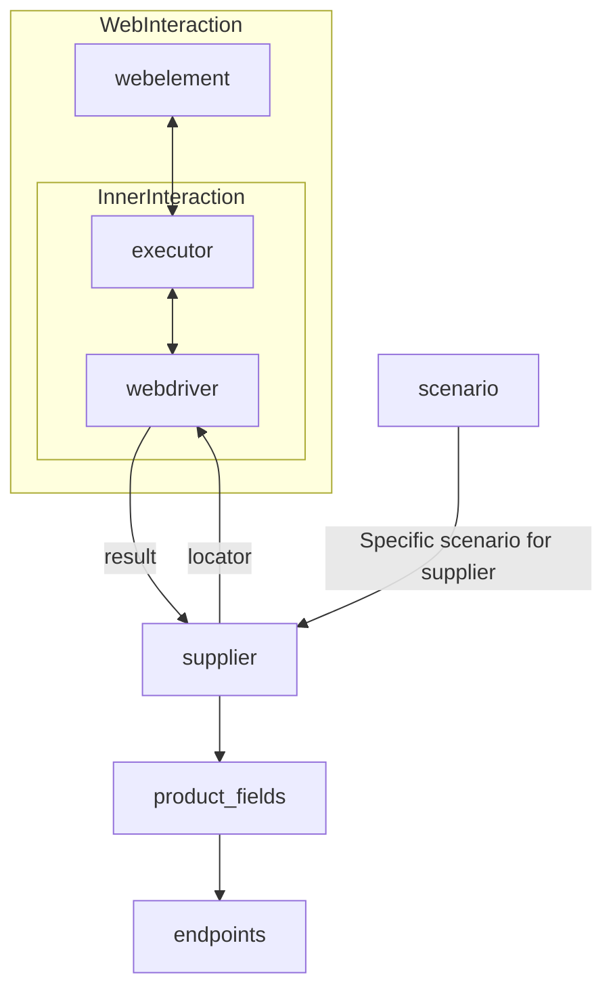

# Модуль `Supplier`

## Обзор

Этот модуль содержит базовый класс `Supplier`, который служит основой для всех поставщиков информации в проекте `hypotez`. Поставщиками могут быть производители товаров, данных или информации, а источниками — целевые страницы сайтов, документы, базы данных или таблицы. Класс `Supplier` сводит различных поставщиков к единому алгоритму действий. Каждый поставщик имеет свой уникальный префикс (подробности в [prefixes.md](prefixes.md)).

## Подробней

Класс `Supplier` является основой для управления взаимодействиями с поставщиками. Он выполняет инициализацию, настройку, аутентификацию и запуск сценариев для различных источников данных, таких как `amazon.com`, `walmart.com`, `mouser.com` и `digikey.com`. Клиент может определять дополнительные поставщики, расширяя функциональность системы.

## Содержание

- [Список реализованных поставщиков](#список-реализованных-поставщиков)
- [Диаграмма взаимодействия](#диаграмма-взаимодействия)

## Список реализованных поставщиков:

- [aliexpress](aliexpress/README.RU.MD) - Реализован в двух вариантах сценариев: `webdriver` и `api`
- [amazon](amazon/README.RU.MD) - `webdriver`
- [bangood](bangood/README.RU.MD) - `webdriver`
- [cdata](cdata/README.RU.MD) - `webdriver`
- [chat_gpt](chat_gpt/README.RU.MD) - Работа с чатом chatgpt (НЕ С МОДЕЛЬЮ!)
- [ebay](ebay/README.RU.MD) - `webdriver`
- [etzmaleh](etzmaleh/README.RU.MD) - `webdriver`
- [gearbest](gearbest/README.RU.MD) - `webdriver`
- [grandadvance](grandadvance/README.RU.MD) - `webdriver`
- [hb](hb/README.RU.MD) - `webdriver`
- [ivory](ivory/README.RU.MD) - `webdriver`
- [ksp](ksp/README.RU.MD) - `webdriver`
- [kualastyle](kualastyle/README.RU.MD) - `webdriver`
- [morlevi](morlevi/README.RU.MD) - `webdriver`
- [visualdg](visualdg/README.RU.MD) - `webdriver`
- [wallashop](wallashop/README.RU.MD) - `webdriver`
- [wallmart](wallmart/README.RU.MD) - `webdriver`

Подробная информация:

- [Вебдрайвер (class `Driver`)](https://github.com/hypo69/hypo/blob/master/docs/ru/src/webdriver/driver.py.md)
- [Сценарии (class `Scenario`)](https://github.com/hypo69/hypo/blob/master/docs/ru/src/scenario/executor.py.md)
- [Локаторы](https://github.com/hypo69/hypo/blob/master/docs/ru/src/suppliers/locator.ru.md)

## Диаграмма взаимодействия

