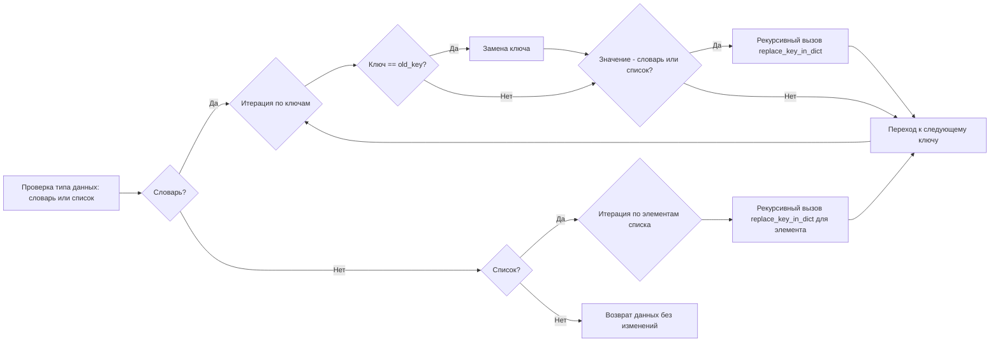
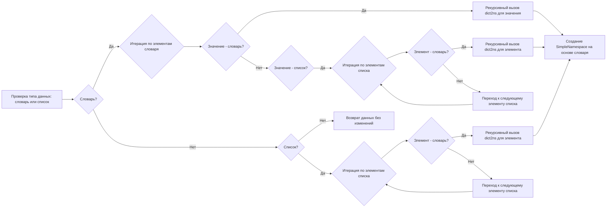
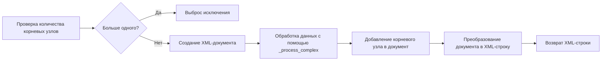

# Модуль `src.utils.convertors.dict`

## Обзор

Модуль предоставляет инструменты для преобразования данных между различными форматами, такими как словари, объекты `SimpleNamespace`, XML, CSV, JSON, XLS, HTML и PDF. Он содержит функции для рекурсивного преобразования словарей в объекты `SimpleNamespace` и обратно, а также для экспорта данных в различные форматы.

## Подробней

Модуль содержит набор функций для преобразования и сохранения данных в различных форматах. Это может быть полезно для работы с данными, полученными из разных источников или для экспорта данных в формат, который требуется для конкретной задачи.
Например, функция `dict2ns` преобразует словарь в объект `SimpleNamespace`, что позволяет обращаться к элементам словаря как к атрибутам объекта. Функция `dict2xml` преобразует словарь в XML-строку, а функции `dict2csv`, `dict2json`, `dict2xls` сохраняют данные в соответствующие файлы.

## Функции

### `replace_key_in_dict`

```python
def replace_key_in_dict(data, old_key, new_key) -> dict:
    """
    Recursively replaces a key in a dictionary or list.
    
    Args:
        data (dict | list): The dictionary or list where key replacement occurs.
        old_key (str): The key to be replaced.
        new_key (str): The new key.
    
    Returns:
        dict: The updated dictionary with replaced keys.

    Example Usage:

        replace_key_in_json(data, 'name', 'category_name')

        # Example 1: Simple dictionary
        data = {"old_key": "value"}
        updated_data = replace_key_in_json(data, "old_key", "new_key")
        # updated_data becomes {"new_key": "value"}

        # Example 2: Nested dictionary
        data = {"outer": {"old_key": "value"}}
        updated_data = replace_key_in_json(data, "old_key", "new_key")
        # updated_data becomes {"outer": {"new_key": "value"}}

        # Example 3: List of dictionaries
        data = [{"old_key": "value1"}, {"old_key": "value2"}]
        updated_data = replace_key_in_json(data, "old_key", "new_key")
        # updated_data becomes [{"new_key": "value1"}, {"new_key": "value2"}]

        # Example 4: Mixed nested structure with lists and dictionaries
        data = {"outer": [{"inner": {"old_key": "value"}}]}
        updated_data = replace_key_in_json(data, "old_key", "new_key")
        # updated_data becomes {"outer": [{"inner": {"new_key": "value"}}]}

    """
    ...
```

**Назначение**: Рекурсивно заменяет ключ в словаре или списке.

**Параметры**:
- `data` (dict | list): Словарь или список, в котором производится замена ключа.
- `old_key` (str): Ключ, который нужно заменить.
- `new_key` (str): Новый ключ.

**Возвращает**:
- `dict`: Обновленный словарь с замененными ключами.

**Как работает функция**:

1.  **Проверка типа данных**: Функция проверяет, является ли входной параметр `data` словарем или списком.
2.  **Обработка словаря**: Если `data` является словарем, функция итерируется по ключам словаря. Если ключ совпадает с `old_key`, он заменяется на `new_key`. Если значение по ключу является словарем или списком, функция рекурсивно вызывает саму себя для этого значения.
3.  **Обработка списка**: Если `data` является списком, функция итерируется по элементам списка и рекурсивно вызывает саму себя для каждого элемента.
4.  **Возврат результата**: Функция возвращает обновленный словарь.



**Примеры**:

```python
# Пример 1: Простой словарь
data = {"old_key": "value"}
updated_data = replace_key_in_dict(data, "old_key", "new_key")
# updated_data становится {"new_key": "value"}

# Пример 2: Вложенный словарь
data = {"outer": {"old_key": "value"}}
updated_data = replace_key_in_dict(data, "old_key", "new_key")
# updated_data становится {"outer": {"new_key": "value"}}

# Пример 3: Список словарей
data = [{"old_key": "value1"}, {"old_key": "value2"}]
updated_data = replace_key_in_dict(data, "old_key", "new_key")
# updated_data становится [{"new_key": "value1"}, {"new_key": "value2"}]

# Пример 4: Смешанная вложенная структура со списками и словарями
data = {"outer": [{"inner": {"old_key": "value"}}]}
updated_data = replace_key_in_dict(data, "old_key", "new_key")
# updated_data становится {"outer": [{"inner": {"new_key": "value"}}]}
```

### `dict2ns`

```python
def dict2ns(data: Dict[str, Any] | List[Any]) -> Any:
    """
    Recursively convert dictionaries to SimpleNamespace.

    Args:
        data (Dict[str, Any] | List[Any]): The data to convert.

    Returns:
        Any: Converted data as a SimpleNamespace or a list of SimpleNamespace.
    """
    ...
```

**Назначение**: Рекурсивно преобразует словари в объекты `SimpleNamespace`.

**Параметры**:
- `data` (Dict[str, Any] | List[Any]): Данные для преобразования.

**Возвращает**:
- `Any`: Преобразованные данные в виде объекта `SimpleNamespace` или списка объектов `SimpleNamespace`.

**Как работает функция**:

1.  **Проверка типа данных**: Функция проверяет, является ли входной параметр `data` словарем или списком.
2.  **Обработка словаря**: Если `data` является словарем, функция итерируется по элементам словаря. Если значение является словарем, то вызывается рекурсивно `dict2ns` для этого значения. Если значение является списком, то для каждого элемента списка, являющегося словарем, вызывается рекурсивно `dict2ns`. После обработки всех элементов, функция возвращает объект `SimpleNamespace`, созданный на основе словаря.
3.  **Обработка списка**: Если `data` является списком, функция итерируется по элементам списка. Если элемент является словарем, то вызывается рекурсивно `dict2ns` для этого элемента. После обработки всех элементов, функция возвращает список преобразованных элементов.
4.  **Возврат результата**: Если `data` не является ни словарем, ни списком, функция возвращает данные без изменений.



**Примеры**:

```python
data = {"name": "John", "age": 30, "address": {"street": "Main", "number": 123}}
ns = dict2ns(data)
print(ns.name)  # John
print(ns.address.street)  # Main
```

### `dict2xml`

```python
def dict2xml(data: Dict[str, Any], encoding: str = 'UTF-8') -> str:
    """
    Generate an XML string from a dictionary.

    Args:
        data (Dict[str, Any]): The data to convert to XML.
        encoding (str, optional): Data encoding. Defaults to 'UTF-8'.

    Returns:
        str: The XML string representing the input dictionary.

    Raises:
        Exception: If more than one root node is provided.
    """
    ...
```

**Назначение**: Генерирует XML-строку из словаря.

**Параметры**:
- `data` (Dict[str, Any]): Данные для преобразования в XML.
- `encoding` (str, optional): Кодировка данных. По умолчанию 'UTF-8'.

**Возвращает**:
- `str`: XML-строка, представляющая входной словарь.

**Вызывает исключения**:
- `Exception`: Если предоставлено больше одного корневого узла.

**Как работает функция**:

1.  **Внутренние функции**: Функция использует несколько внутренних функций для обработки различных типов данных и создания XML-элементов.
    - `_process_simple`: Создает XML-узел для простых типов (int, str).
    - `_process_attr`: Создает атрибуты для XML-элемента.
    - `_process_complex`: Создает узлы для сложных типов, таких как списки или словари.
    - `_process`: Генерирует XML DOM объект для тега и его значения.
2.  **Создание XML-документа**: Функция создает XML-документ с использованием `getDOMImplementation().createDocument()`.
3.  **Обработка данных**: Функция вызывает `_process_complex` для обработки входных данных и создания корневого узла XML-документа.
4.  **Добавление корневого узла**: Функция добавляет корневой узел в XML-документ.
5.  **Преобразование в XML-строку**: Функция преобразует XML-документ в XML-строку с указанной кодировкой.



**Примеры**:

```python
json_data = {
    "product": {
        "name": {
            "language": [
                {
                    "@id": "1",
                    "#text": "Test Product"
                },
                {
                    "@id": "2",
                    "#text": "Test Product"
                },
                {
                    "@id": "3",
                    "#text": "Test Product"
                }
            ]
        },
        "price": "10.00",
        "id_tax_rules_group": "13",
        "id_category_default": "2"
    }
}

xml_output = dict2xml(json_data)
print(xml_output)
```

#### `_process_simple`

```python
def _process_simple(doc, tag, tag_value):
    """
    Generate a node for simple types (int, str).

    Args:
        doc (xml.dom.minidom.Document): XML document object.
        tag (str): Tag name for the XML element.
        tag_value (Any): Value of the tag.

    Returns:
        xml.dom.minidom.Element: Node representing the tag and value.
    """
    ...
```

**Назначение**: Создает XML-узел для простых типов (int, str).

**Параметры**:
- `doc` (xml.dom.minidom.Document): XML document object.
- `tag` (str): Tag name for the XML element.
- `tag_value` (Any): Value of the tag.

**Возвращает**:
- `xml.dom.minidom.Element`: Node representing the tag and value.

**Как работает функция**:

1.  **Создание элемента**: Функция создает XML-элемент с указанным именем тега.
2.  **Создание текстового узла**: Функция создает текстовый узел со значением тега.
3.  **Добавление текстового узла**: Функция добавляет текстовый узел в XML-элемент.
4.  **Возврат элемента**: Функция возвращает созданный XML-элемент.

#### `_process_attr`

```python
def _process_attr(doc, attr_value: Dict[str, Any]):
    """
    Generate attributes for an XML element.

    Args:
        doc (xml.dom.minidom.Document): XML document object.
        attr_value (Dict[str, Any]): Dictionary of attributes.

    Returns:
        List[xml.dom.minidom.Attr]: List of attributes for the XML element.
    """
    ...
```

**Назначение**: Создает атрибуты для XML-элемента.

**Параметры**:
- `doc` (xml.dom.minidom.Document): XML document object.
- `attr_value` (Dict[str, Any]): Dictionary of attributes.

**Возвращает**:
- `List[xml.dom.minidom.Attr]`: List of attributes for the XML element.

**Как работает функция**:

1.  **Инициализация списка атрибутов**: Функция инициализирует пустой список для хранения атрибутов.
2.  **Итерация по атрибутам**: Функция итерируется по элементам словаря атрибутов.
3.  **Создание атрибута**: Для каждого атрибута функция создает XML-атрибут с указанным именем.
4.  **Установка значения атрибута**: Функция устанавливает значение атрибута. Если значение является словарем, то используется значение ключа 'value', иначе используется само значение.
5.  **Добавление атрибута в список**: Функция добавляет созданный атрибут в список атрибутов.
6.  **Возврат списка атрибутов**: Функция возвращает список атрибутов.

#### `_process_complex`

```python
def _process_complex(doc, children):
    """
    Generate nodes for complex types like lists or dicts.

    Args:
        doc (xml.dom.minidom.Document): XML document object.
        children (List[Tuple[str, Any]]): List of tag-value pairs.

    Returns:
        Tuple[List[xml.dom.minidom.Element], List[xml.dom.minidom.Attr]]: List of child nodes and attributes.
    """
    ...
```

**Назначение**: Создает узлы для сложных типов, таких как списки или словари.

**Параметры**:
- `doc` (xml.dom.minidom.Document): XML document object.
- `children` (List[Tuple[str, Any]]): List of tag-value pairs.

**Возвращает**:
- `Tuple[List[xml.dom.minidom.Element], List[xml.dom.minidom.Attr]]`: List of child nodes and attributes.

**Как работает функция**:

1.  **Инициализация списков**: Функция инициализирует два пустых списка: `nodelist` для хранения дочерних узлов и `attrs` для хранения атрибутов.
2.  **Итерация по дочерним элементам**: Функция итерируется по списку пар тег-значение.
3.  **Обработка атрибутов**: Если тег равен 'attrs', функция вызывает `_process_attr` для обработки атрибутов.
4.  **Обработка других тегов**: Если тег не равен 'attrs', функция вызывает `_process` для обработки тега и значения. Результат добавляется в список `nodelist`.
5.  **Возврат списков**: Функция возвращает кортеж, содержащий списки `nodelist` и `attrs`.

#### `_process`

```python
def _process(doc, tag, tag_value):
    """
    Generate XML DOM object for a tag and its value.

    Args:
        doc (xml.dom.minidom.Document): XML document object.
        tag (str): Tag name for the XML element.
        tag_value (Any): Value of the tag.

    Returns:
        xml.dom.minidom.Element | List[xml.dom.minidom.Element]: Node or list of nodes for the tag and value.
    """
    ...
```

**Назначение**: Генерирует XML DOM объект для тега и его значения.

**Параметры**:
- `doc` (xml.dom.minidom.Document): XML document object.
- `tag` (str): Tag name for the XML element.
- `tag_value` (Any): Value of the tag.

**Возвращает**:
- `xml.dom.minidom.Element | List[xml.dom.minidom.Element]`: Node or list of nodes for the tag and value.

**Как работает функция**:

1.  **Обработка значения 'value'**: Если значение является словарем и содержит только ключ 'value', то значение этого ключа присваивается `tag_value`.
2.  **Обработка None**: Если значение равно None, то `tag_value` присваивается пустая строка.
3.  **Обработка простых типов**: Если значение является простым типом (float, int, str), то вызывается `_process_simple` для создания XML-узла.
4.  **Обработка списков**: Если значение является списком, то вызывается `_process_complex` для обработки списка.
5.  **Обработка словарей**: Если значение является словарем, то создается XML-элемент с указанным тегом, вызывается `_process_complex` для обработки словаря, и добавляются дочерние узлы и атрибуты в XML-элемент.
6.  **Возврат результата**: Функция возвращает созданный XML-элемент или список XML-элементов.

### `dict2csv`

```python
def dict2csv(data: dict | SimpleNamespace, file_path: str | Path) -> bool:
    """
    Save dictionary or SimpleNamespace data to a CSV file.

    Args:
        data (dict | SimpleNamespace): The data to save to a CSV file.
        file_path (str | Path): Path to the CSV file.

    Returns:
        bool: True if the file was saved successfully, False otherwise.
    """
    ...
```

**Назначение**: Сохраняет данные словаря или `SimpleNamespace` в CSV-файл.

**Параметры**:
- `data` (dict | SimpleNamespace): Данные для сохранения в CSV-файл.
- `file_path` (str | Path): Путь к CSV-файлу.

**Возвращает**:
- `bool`: `True`, если файл был успешно сохранен, `False` в противном случае.

**Как работает функция**:

Функция вызывает функцию `save_csv_file` из модуля `src.utils.csv` для сохранения данных в CSV-файл.

### `dict2xls`

```python
def dict2xls(data: dict | SimpleNamespace, file_path: str | Path) -> bool:
    """
    Save dictionary or SimpleNamespace data to an XLS file.

    Args:
        data (dict | SimpleNamespace): The data to save to an XLS file.
        file_path (str | Path): Path to the XLS file.

    Returns:
        bool: True if the file was saved successfully, False otherwise.
    """
    ...
```

**Назначение**: Сохраняет данные словаря или `SimpleNamespace` в XLS-файл.

**Параметры**:
- `data` (dict | SimpleNamespace): Данные для сохранения в XLS-файл.
- `file_path` (str | Path): Путь к XLS-файлу.

**Возвращает**:
- `bool`: `True`, если файл был успешно сохранен, `False` в противном случае.

**Как работает функция**:

Функция вызывает функцию `save_xls_file` из модуля `src.utils.xls` для сохранения данных в XLS-файл.

### `dict2html`

```python
def dict2html(data: dict | SimpleNamespace, encoding: str = 'UTF-8') -> str:
    """
    Generate an HTML table string from a dictionary or SimpleNamespace object.

    Args:
        data (dict | SimpleNamespace): The data to convert to HTML.
        encoding (str, optional): Data encoding. Defaults to 'UTF-8'.

    Returns:
        str: The HTML string representing the input dictionary.
    """
    ...
```

**Назначение**: Генерирует HTML-строку таблицы из словаря или объекта `SimpleNamespace`.

**Параметры**:
- `data` (dict | SimpleNamespace): Данные для преобразования в HTML.
- `encoding` (str, optional): Кодировка данных. По умолчанию 'UTF-8'.

**Возвращает**:
- `str`: HTML-строка, представляющая входной словарь.

**Как работает функция**:

1.  **Внутренняя функция `dict_to_html_table`**: Рекурсивно преобразует словарь в HTML-таблицу.
    - Если `data` является словарем, для каждого элемента словаря создается строка таблицы (`<tr>`). Ключ становится заголовком ячейки (`<td><strong>{key}</strong></td>`). Если значение является словарем, вызывается рекурсивно `dict_to_html_table` для этого значения. Если значение является списком, создается неупорядоченный список (`<ul>`) с элементами списка в виде элементов списка (`<li>`).
    - Если `data` не является словарем, создается строка таблицы с данными, охватывающими две колонки.
2.  **Преобразование в словарь**: Если входные данные являются `SimpleNamespace`, они преобразуются в словарь.
3.  **Создание HTML-контента**: HTML-контент создается путем вызова `dict_to_html_table` с данными.
4.  **Формирование HTML-строки**: Функция формирует полную HTML-строку, включая `<!DOCTYPE html>`, `<html>`, `<head>` с указанием кодировки и `<title>`, и `<body>` с HTML-контентом таблицы.

```mermaid
graph LR
    A[Преобразование SimpleNamespace в словарь (если необходимо)] --> B[Вызов dict_to_html_table];
    B --> C[Формирование HTML-строки];
    C --> D[Возврат HTML-строки];
```

**Внутренние функции**:

#### `dict_to_html_table`

```python
def dict_to_html_table(data: dict, depth: int = 0) -> str:
    """
    Recursively convert dictionary to HTML table.

    Args:
        data (dict): The dictionary data to convert.
        depth (int, optional): The depth of recursion, used for nested tables. Defaults to 0.

    Returns:
        str: The HTML table as a string.
    """
    ...
```

**Назначение**: Рекурсивно преобразует словарь в HTML-таблицу.

**Параметры**:
- `data` (dict): Данные словаря для преобразования.
- `depth` (int, optional): Глубина рекурсии, используется для вложенных таблиц. По умолчанию 0.

**Возвращает**:
- `str`: HTML-таблица в виде строки.

**Как работает функция**:

1.  **Инициализация HTML**: Функция инициализирует список `html`, который будет содержать HTML-код таблицы.
2.  **Обработка словаря**: Если `data` является словарем, функция итерируется по элементам словаря.
    - Для каждого элемента словаря создается строка таблицы (`<tr>`).
    - Ключ становится заголовком ячейки (`<td><strong>{key}</strong></td>`).
    - Если значение является словарем, вызывается рекурсивно `dict_to_html_table` для этого значения.
    - Если значение является списком, создается неупорядоченный список (`<ul>`) с элементами списка в виде элементов списка (`<li>`).
    - Если значение не является словарем или списком, создается ячейка таблицы с значением.
3.  **Обработка не-словаря**: Если `data` не является словарем, создается строка таблицы с данными, охватывающими две колонки.
4.  **Формирование HTML-строки**: Функция объединяет элементы списка `html` в одну строку с переносами строк.

### `example_json2xml`

```python
def example_json2xml():
    """

    """
    ...
```

**Назначение**: Функция представляет пример использования функции `json2xml`.

**Как работает функция**:

Функция создает пример JSON-данных, затем вызывает функцию `json2xml` для преобразования JSON-данных в XML-формат и выводит результат в консоль.

## Примеры

```python
# Пример использования dict2ns
data = {"name": "John", "age": 30, "address": {"street": "Main", "number": 123}}
ns = dict2ns(data)
print(ns.name)  # John
print(ns.address.street)  # Main

# Пример использования dict2xml
json_data = {
    "product": {
        "name": {
            "language": [
                {
                    "@id": "1",
                    "#text": "Test Product"
                },
                {
                    "@id": "2",
                    "#text": "Test Product"
                },
                {
                    "@id": "3",
                    "#text": "Test Product"
                }
            ]
        },
        "price": "10.00",
        "id_tax_rules_group": "13",
        "id_category_default": "2"
    }
}

xml_output = dict2xml(json_data)
print(xml_output)

# Пример использования dict2html
data = {"name": "John", "age": 30, "address": {"street": "Main", "number": 123}}
html_output = dict2html(data)
print(html_output)