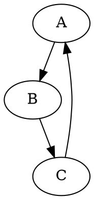

# Модуль для конвертации DOT файлов в PNG изображения

## Обзор

Этот модуль предназначен для конвертации файлов в формате DOT (используемых для описания графов) в PNG изображения с использованием библиотеки Graphviz. Он предоставляет функцию `dot2png`, которая принимает путь к DOT файлу и путь для сохранения PNG файла.

## Подробней

Модуль `dot` предоставляет возможность программно преобразовывать графы, описанные в формате DOT, в графические изображения PNG. Это может быть полезно для визуализации данных, автоматической генерации документации или создания графических представлений сложных систем.

## Функции

### `dot2png`

```python
def dot2png(dot_file: str, png_file: str) -> None:
    """ Converts a DOT file to a PNG image.

    Args:
        dot_file (str): The path to the input DOT file.
        png_file (str): The path where the output PNG file will be saved.

    Raises:
        FileNotFoundError: If the DOT file does not exist.
        Exception: For other errors during conversion.

    Example:
        >>> dot2png(\'example.dot\', \'output.png\')

        This converts the DOT file \'example.dot\' into a PNG image named \'output.png\'.

        Sample DOT content for \'example.dot\':

        ```dot
        digraph G {
            A -> B;
            B -> C;
            C -> A;
        }
        ```

        To run the script from the command line:

        ```bash
        python dot2png.py example.dot output.png
        ```

        This command will create a PNG file named \'output.png\' from the graph defined in \'example.dot\'.
    """
    try:
        # Read the DOT file
        with open(dot_file, 'r') as f:
            dot_content = f.read()

        # Create a Source object from the DOT content
        source = Source(dot_content)

        # Render the source to a PNG file
        source.format = 'png'
        source.render(png_file, cleanup=True)
    except FileNotFoundError as e:
        print(f"Error: The file '{dot_file}' was not found.")
        raise e
    except Exception as e:
        print(f"An error occurred during the conversion: {e}")
        raise e
```

**Как работает функция**:
Функция `dot2png` принимает два аргумента: путь к DOT файлу (`dot_file`) и путь для сохранения PNG файла (`png_file`). Сначала она пытается открыть и прочитать содержимое DOT файла. Затем использует библиотеку `graphviz` для создания объекта `Source` из содержимого DOT файла. После этого устанавливает формат вывода на PNG и сохраняет изображение в указанный файл. Если DOT файл не найден, функция вызывает исключение `FileNotFoundError`. В случае любых других ошибок в процессе конвертации, функция вызывает общее исключение `Exception`.

**Параметры**:
- `dot_file` (str): Путь к входному DOT файлу.
- `png_file` (str): Путь, по которому будет сохранен выходной PNG файл.

**Вызывает исключения**:
- `FileNotFoundError`: Если DOT файл не существует.
- `Exception`: При возникновении других ошибок во время конвертации.

**Примеры**:
```python
dot2png('example.dot', 'output.png')
```
Этот код преобразует DOT файл `'example.dot'` в PNG изображение `'output.png'`.

Пример содержимого DOT файла (`example.dot`):

```bash
python dot2png.py example.dot output.png
```
Эта команда создаст PNG файл `'output.png'` из графа, определенного в `'example.dot'`.