# Модуль для конвертации HTML в Markdown

## Обзор

Модуль `html2text` предназначен для преобразования HTML-документов в Markdown-форматированный текст. Он обеспечивает базовую структуру и форматирование, сохраняя читаемость контента.

## Подробнее

Модуль анализирует HTML-код и преобразует его в Markdown, поддерживая заголовки, списки, ссылки, изображения и другие элементы. Он также включает настройки для обработки специфичных для Google Docs стилей и предоставляет возможность настройки ширины текста.

## Функции

### `has_key(x, y)`

**Назначение**: Проверяет наличие ключа в объекте.

**Параметры**:
- `x` (object): Объект, в котором производится проверка.
- `y` (object): Ключ, который нужно проверить.

**Возвращает**:
- `bool`: `True`, если ключ присутствует в объекте, иначе `False`.

**Как работает функция**:
1. Проверяет, есть ли у объекта `x` метод `has_key`.
2. Если метод `has_key` существует, использует его для проверки наличия ключа `y`.
3. Если метод `has_key` не существует, использует оператор `in` для проверки наличия ключа `y`.
4. Возвращает результат проверки.

```mermaid
graph LR
A[Проверка наличия метода has_key в объекте x] --> B{Метод has_key существует?};
B -- Да --> C[Использование x.has_key(y)];
B -- Нет --> D[Использование y in x];
C --> E[Возврат результата];
D --> E;
```

**Примеры**:

```python
>>> has_key({'a': 1}, 'a')
True
>>> has_key({'a': 1}, 'b')
False
```

### `name2cp(k)`

**Назначение**: Преобразует имя HTML-сущности в кодовую точку Unicode.

**Параметры**:
- `k` (str): Имя HTML-сущности.

**Возвращает**:
- `int`: Кодовая точка Unicode, соответствующая сущности.

**Как работает функция**:
1. Проверяет, является ли имя сущности `'apos'`. Если да, возвращает кодовую точку символа апострофа.
2. Проверяет, существует ли атрибут `name2codepoint` в модуле `htmlentitydefs`. Если да, использует его для получения кодовой точки.
3. Если атрибут `name2codepoint` не существует, получает значение сущности из `htmlentitydefs.entitydefs`.
4. Если значение начинается с `"&#"` и заканчивается `";"`, преобразует подстроку между этими символами в целое число (кодовую точку).
5. Иначе декодирует значение с помощью `codecs.latin_1_decode` и возвращает кодовую точку первого символа.

```mermaid
graph LR
A[Проверка сущности на 'apos'] --> B{Сущность 'apos'?};
B -- Да --> C[Возврат кодовой точки апострофа];
B -- Нет --> D[Проверка наличия htmlentitydefs.name2codepoint];
D -- Да --> E[Использование htmlentitydefs.name2codepoint[k]];
D -- Нет --> F[Получение значения сущности из htmlentitydefs.entitydefs];
F --> G[Проверка значения на заголовок "&#" и окончание ";"];
G -- Да --> H[Преобразование подстроки в целое число];
G -- Нет --> I[Декодирование с помощью codecs.latin_1_decode];
I --> J[Возврат кодовой точки первого символа];
E --> K[Возврат кодовой точки];
H --> K;
```

**Примеры**:

```python
>>> name2cp('copy')
169
>>> name2cp('eacute')
233
```

### `charref(name)`

**Назначение**: Преобразует символьную ссылку (например, `&#123;`) в символ Unicode.

**Параметры**:
- `name` (str): Символьная ссылка.

**Возвращает**:
- `str`: Соответствующий символ Unicode.

**Как работает функция**:
1. Проверяет, начинается ли имя с `'x'` или `'X'`. Если да, преобразует подстроку после первого символа в целое число из шестнадцатеричной системы.
2. Иначе преобразует имя в целое число из десятичной системы.
3. Проверяет, выключен ли `UNICODE_SNOB` и содержится ли полученное число в `unifiable_n`. Если да, возвращает соответствующее значение из `unifiable_n`.
4. Иначе пытается преобразовать число в символ с помощью `chr`.

```mermaid
graph LR
A[Проверка имени на заголовок 'x' или 'X'] --> B{Имя начинается с 'x' или 'X'?};
B -- Да --> C[Преобразование подстроки в целое число (hex)];
B -- Нет --> D[Преобразование имени в целое число (dec)];
C --> E[Проверка UNICODE_SNOB и наличия числа в unifiable_n];
D --> E;
E -- Да --> F[Возврат значения из unifiable_n];
E -- Нет --> G[Преобразование числа в символ с помощью chr];
F --> H[Возврат символа];
G --> H;
```

**Примеры**:

```python
>>> charref('169')
'©'
>>> charref('233')
'é'
```

### `entityref(c)`

**Назначение**: Преобразует ссылку на HTML-сущность в символ Unicode.

**Параметры**:
- `c` (str): Ссылка на HTML-сущность.

**Возвращает**:
- `str`: Соответствующий символ Unicode.

**Как работает функция**:
1. Проверяет, выключен ли `UNICODE_SNOB` и содержится ли имя сущности в `unifiable`. Если да, возвращает соответствующее значение из `unifiable`.
2. Иначе пытается получить кодовую точку сущности с помощью `name2cp`.
3. Если `name2cp` вызывает исключение `KeyError`, возвращает исходную ссылку на сущность.
4. Иначе пытается преобразовать кодовую точку в символ с помощью `chr`.

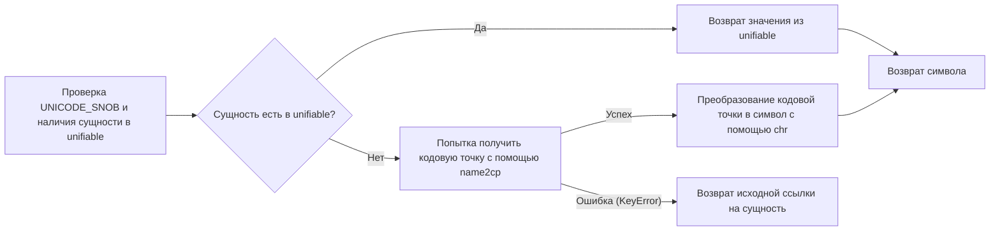

**Примеры**:

```python
>>> entityref('copy')
'(C)'
>>> entityref('eacute')
'é'
```

### `replaceEntities(s)`

**Назначение**: Заменяет HTML-сущности в строке на соответствующие символы Unicode.

**Параметры**:
- `s` (re.Match): Объект соответствия регулярного выражения, содержащий HTML-сущность.

**Возвращает**:
- `str`: Соответствующий символ Unicode.

**Как работает функция**:
1. Извлекает HTML-сущность из объекта соответствия.
2. Если сущность начинается с `"#"`, вызывает функцию `charref` для преобразования символьной ссылки в символ Unicode.
3. Иначе вызывает функцию `entityref` для преобразования ссылки на HTML-сущность в символ Unicode.

```mermaid
graph LR
A[Извлечение HTML-сущности из объекта соответствия] --> B[Проверка сущности на заголовок "#"];
B -- Да --> C[Вызов charref(s[1:])];
B -- Нет --> D[Вызов entityref(s)];
C --> E[Возврат символа];
D --> E;
```

**Примеры**:

```python
>>> import re
>>> r_unescape = re.compile(r"&(#?[xX]?(?:[0-9a-fA-F]+|\w{1,8}));")
>>> s = r_unescape.search('&copy;')
>>> replaceEntities(s)
'(C)'
>>> s = r_unescape.search('&#169;')
>>> replaceEntities(s)
'©'
```

### `unescape(s)`

**Назначение**: Заменяет все HTML-сущности в строке на соответствующие символы Unicode.

**Параметры**:
- `s` (str): Строка, содержащая HTML-сущности.

**Возвращает**:
- `str`: Строка с замененными HTML-сущностями.

**Как работает функция**:
1. Использует регулярное выражение `r_unescape` для поиска всех HTML-сущностей в строке.
2. Для каждого соответствия вызывает функцию `replaceEntities` для замены HTML-сущности на символ Unicode.

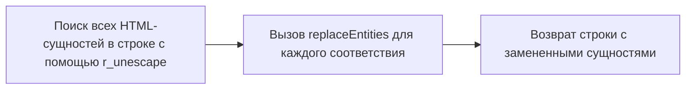

**Примеры**:

```python
>>> unescape('&copy; &eacute;')
'(C) é'
>>> unescape('&#169; &#233;')
'© é'
```

### `onlywhite(line)`

**Назначение**: Проверяет, состоит ли строка только из пробельных символов.

**Параметры**:
- `line` (str): Строка для проверки.

**Возвращает**:
- `bool`: `True`, если строка состоит только из пробельных символов, иначе `False`.

**Как работает функция**:
1. Итерируется по каждому символу в строке.
2. Если символ не является пробелом, возвращает `False`.
3. Если все символы являются пробелами, возвращает `True`.

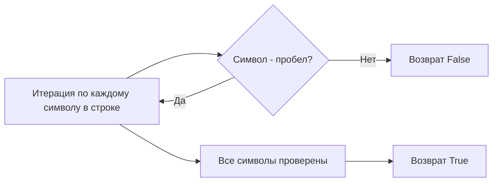

**Примеры**:

```python
>>> onlywhite('   ')
True
>>> onlywhite('  a ')
False
```

### `optwrap(text)`

**Назначение**: Оборачивает все параграфы в предоставленном тексте до заданной ширины.

**Параметры**:
- `text` (str): Текст для оборачивания.

**Возвращает**:
- `str`: Текст с обернутыми параграфами.

**Как работает функция**:
1. Проверяет, задана ли ширина текста (`BODY_WIDTH`). Если нет, возвращает исходный текст.
2. Разделяет текст на параграфы по символу новой строки.
3. Для каждого параграфа проверяет, начинается ли он с пробела, дефиса или звездочки.
4. Если параграф не начинается с указанных символов, оборачивает его до заданной ширины и добавляет символ новой строки.
5. Если параграф начинается с указанных символов, добавляет его без изменений.

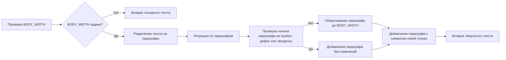

**Примеры**:

```python
>>> BODY_WIDTH = 20
>>> text = "This is a long paragraph that needs to be wrapped.This is a long paragraph that needs to be wrapped."
>>> optwrap(text)
'This is a long pa\\nparagraph that nee\\nds to be wrapped.\\n\\nThis is a long pa\\nparagraph that nee\\nds to be wrapped.\\n\\n'
```

### `hn(tag)`

**Назначение**: Определяет уровень заголовка HTML-тега.

**Параметры**:
- `tag` (str): HTML-тег.

**Возвращает**:
- `int`: Уровень заголовка (1-9), или 0, если тег не является заголовком.

**Как работает функция**:
1. Проверяет, начинается ли тег с `'h'` и имеет ли длину 2.
2. Пытается преобразовать второй символ тега в целое число.
3. Если преобразование успешно и число находится в диапазоне от 1 до 9, возвращает это число.
4. Иначе возвращает 0.

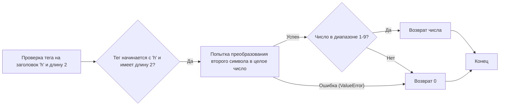

**Примеры**:

```python
>>> hn('h1')
1
>>> hn('h6')
6
>>> hn('h10')
0
>>> hn('div')
```

### `dumb_property_dict(style)`

**Назначение**: Преобразует строку CSS-стилей в словарь атрибутов.

**Параметры**:
- `style` (str): Строка CSS-стилей.

**Возвращает**:
- `dict`: Словарь, где ключи - это атрибуты CSS, а значения - их соответствующие значения.

**Как работает функция**:
1. Разделяет строку стилей на отдельные атрибуты по символу `;`.
2. Для каждого атрибута разделяет его на имя и значение по символу `:`.
3. Удаляет пробелы в начале и конце имени и значения атрибута.
4. Возвращает словарь атрибутов.

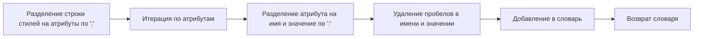

**Примеры**:

```python
>>> style = "color: blue; font-size: 12px;"
>>> dumb_property_dict(style)
{'color': 'blue', 'font-size': '12px'}
```

### `dumb_css_parser(data)`

**Назначение**: Преобразует CSS-данные в словарь селекторов и их атрибутов.

**Параметры**:
- `data` (str): CSS-данные в виде строки.

**Возвращает**:
- `dict`: Словарь, где ключи - это CSS-селекторы, а значения - словари атрибутов.

**Как работает функция**:
1. Удаляет все `@import` предложения из CSS-данных.
2. Разделяет CSS-данные на блоки селекторов и их атрибутов по символу `}`.
3. Для каждого блока разделяет его на селектор и атрибуты по символу `{`.
4. Преобразует строку атрибутов в словарь с помощью функции `dumb_property_dict`.
5. Возвращает словарь селекторов и их атрибутов.

```mermaid
graph LR
A[Удаление @import предложений] --> B[Разделение на блоки селекторов и атрибутов по '}'];
B --> C[Итерация по блокам];
C --> D[Разделение блока на селектор и атрибуты по '{'];
D --> E[Преобразование атрибутов в словарь с помощью dumb_property_dict];
E --> F[Добавление в словарь селекторов и атрибутов];
F --> G[Возврат словаря];
```

**Примеры**:

```python
>>> data = ".class {color: blue; font-size: 12px;}"
>>> dumb_css_parser(data)
{'.class': {'color': 'blue', 'font-size': '12px'}}
```

### `element_style(attrs, style_def, parent_style)`

**Назначение**: Определяет финальные стили элемента на основе атрибутов, определений стилей и стилей родительского элемента.

**Параметры**:
- `attrs` (dict): Атрибуты HTML-элемента.
- `style_def` (dict): Определения стилей CSS.
- `parent_style` (dict): Стили родительского элемента.

**Возвращает**:
- `dict`: Словарь финальных стилей элемента.

**Как работает функция**:
1. Создает копию стилей родительского элемента.
2. Если в атрибутах элемента есть класс (`class`), итерируется по классам и обновляет стили элемента стилями из `style_def` для каждого класса.
3. Если в атрибутах элемента есть стили (`style`), обновляет стили элемента стилями из атрибута `style`.
4. Возвращает финальные стили элемента.

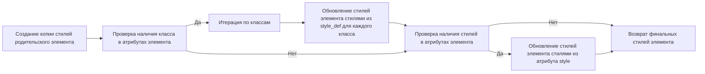

**Примеры**:

```python
>>> attrs = {'class': 'class1 class2', 'style': 'font-weight: bold;'}
>>> style_def = {'.class1': {'color': 'blue'}, '.class2': {'font-size': '12px'}}
>>> parent_style = {'color': 'black'}
>>> element_style(attrs, style_def, parent_style)
{'color': 'blue', 'font-size': '12px', 'font-weight': 'bold'}
```

### `google_list_style(style)`

**Назначение**: Определяет, является ли список упорядоченным или неупорядоченным, на основе CSS-стилей Google Docs.

**Параметры**:
- `style` (dict): Словарь CSS-стилей.

**Возвращает**:
- `str`: `'ul'`, если список неупорядоченный, `'ol'`, если упорядоченный.

**Как работает функция**:
1. Проверяет наличие атрибута `list-style-type` в стилях.
2. Если атрибут существует, проверяет его значение на `disc`, `circle`, `square` или `none`.
3. Если значение атрибута соответствует одному из перечисленных, возвращает `'ul'`.
4. Иначе возвращает `'ol'`.

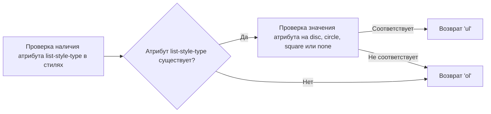

**Примеры**:

```python
>>> style = {'list-style-type': 'disc'}
>>> google_list_style(style)
'ul'
>>> style = {'list-style-type': 'decimal'}
>>> google_list_style(style)
'ol'
```

### `google_nest_count(style)`

**Назначение**: Вычисляет уровень вложенности списка Google Docs на основе CSS-стилей.

**Параметры**:
- `style` (dict): Словарь CSS-стилей.

**Возвращает**:
- `int`: Уровень вложенности списка.

**Как работает функция**:
1. Проверяет наличие атрибута `margin-left` в стилях.
2. Если атрибут существует, преобразует его значение в целое число, удалив последние два символа (`px`).
3. Делит полученное число на `GOOGLE_LIST_INDENT` и возвращает результат.
4. Если атрибут `margin-left` не существует, возвращает 0.

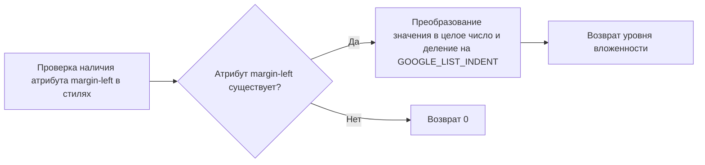

**Примеры**:

```python
>>> style = {'margin-left': '72px'}
>>> GOOGLE_LIST_INDENT = 36
>>> google_nest_count(style)
2.0
>>> style = {}
>>> google_nest_count(style)
0
```

### `google_has_height(style)`

**Назначение**: Проверяет, определен ли атрибут `height` в стилях элемента.

**Параметры**:
- `style` (dict): Словарь CSS-стилей.

**Возвращает**:
- `bool`: `True`, если атрибут `height` определен, иначе `False`.

**Как работает функция**:
1. Проверяет наличие атрибута `height` в стилях.
2. Если атрибут существует, возвращает `True`.
3. Иначе возвращает `False`.

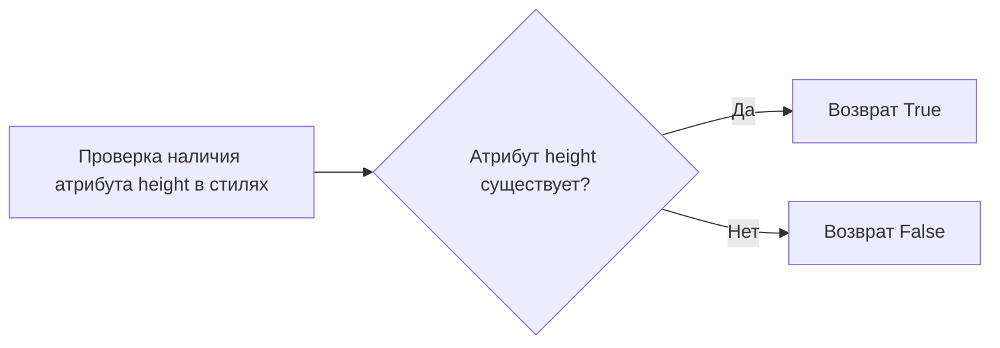

**Примеры**:

```python
>>> style = {'height': '10px'}
>>> google_has_height(style)
True
>>> style = {}
>>> google_has_height(style)
False
```

### `google_text_emphasis(style)`

**Назначение**: Возвращает список всех модификаторов выделения текста элемента.

**Параметры**:
- `style` (dict): Словарь CSS-стилей.

**Возвращает**:
- `list`: Список модификаторов выделения текста.

**Как работает функция**:
1. Создает пустой список `emphasis`.
2. Проверяет наличие атрибута `text-decoration` в стилях. Если да, добавляет его значение в список `emphasis`.
3. Проверяет наличие атрибута `font-style` в стилях. Если да, добавляет его значение в список `emphasis`.
4. Проверяет наличие атрибута `font-weight` в стилях. Если да, добавляет его значение в список `emphasis`.
5. Возвращает список `emphasis`.

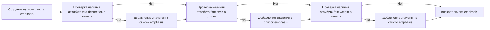

**Примеры**:

```python
>>> style = {'text-decoration': 'line-through', 'font-style': 'italic'}
>>> google_text_emphasis(style)
['line-through', 'italic']
>>> style = {}
>>> google_text_emphasis(style)
[]
```

### `google_fixed_width_font(style)`

**Назначение**: Проверяет, определяет ли CSS текущего элемента шрифт фиксированной ширины.

**Параметры**:
- `style` (dict): Словарь CSS-стилей.

**Возвращает**:
- `bool`: `True`, если шрифт фиксированной ширины, иначе `False`.

**Как работает функция**:
1. Проверяет наличие атрибута `font-family` в стилях.
2. Если атрибут существует, проверяет его значение на `Courier New` или `Consolas`.
3. Если значение атрибута соответствует одному из перечисленных, возвращает `True`.
4. Иначе возвращает `False`.

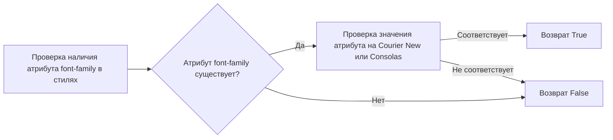

**Примеры**:

```python
>>> style = {'font-family': 'Courier New'}
>>> google_fixed_width_font(style)
True
>>> style = {'font-family': 'Arial'}
>>> google_fixed_width_font(style)
False
```

### `list_numbering_start(attrs)`

**Назначение**: Извлекает начальный номер из атрибутов элемента списка.

**Параметры**:
- `attrs` (dict): Атрибуты HTML-элемента.

**Возвращает**:
- `int`: Начальный номер списка, уменьшенный на 1, или 0, если атрибут `start` не найден.

**Как работает функция**:
1. Проверяет наличие атрибута `start` в атрибутах элемента.
2. Если атрибут существует, преобразует его значение в целое число и уменьшает на 1.
3. Возвращает полученное число.
4. Если атрибут `start` не существует, возвращает 0.

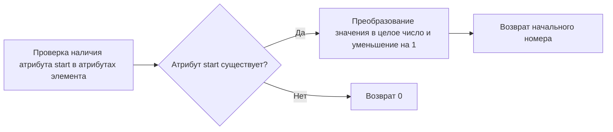

**Примеры**:

```python
>>> attrs = {'start': '5'}
>>> list_numbering_start(attrs)
4
>>> attrs = {}
>>> list_numbering_start(attrs)
0
```

## Классы

### `_html2text`

**Описание**: Класс для преобразования HTML в текст.

**Наследует**:
- `HTMLParser.HTMLParser`

**Атрибуты**:
- `out` (callable): Функция для вывода текста.
- `outtextlist` (list): Список для хранения выводимых символов.
- `outtext` (str): Строка для хранения выведенного текста.
- `quiet` (int): Уровень "тишины" (подавления вывода).
- `p_p` (int): Количество символов новой строки для вывода перед следующим выводом.
- `outcount` (int): Счетчик выведенных элементов.
- `start` (int): Флаг начала документа.
- `space` (int): Флаг наличия пробела.
- `a` (list): Список ссылок.
- `astack` (list): Стек атрибутов ссылок.
- `acount` (int): Счетчик ссылок.
- `list` (list): Список списков.
- `blockquote` (int): Уровень цитирования.
- `pre` (int): Флаг режима `<pre>`.
- `startpre` (int): Флаг начала режима `<pre>`.
- `code` (bool): Флаг режима `<code>`.
- `br_toggle` (str): Переключатель для `<br>`.
- `lastWasNL` (bool): Флаг, указывающий, был ли последний символ новой строкой.
- `lastWasList` (bool): Флаг, указывающий, был ли последний тег списком.
- `style` (int): Уровень стилей.
- `style_def` (dict): Определения стилей.
- `tag_stack` (list): Стек тегов.
- `emphasis` (int): Уровень выделения текста.
- `drop_white_space` (int): Флаг для удаления пробелов.
- `inheader` (bool): Флаг, указывающий, находится ли парсер в заголовке.
- `abbr_title` (str): Заголовок текущего определения аббревиатуры.
- `abbr_data` (str): Последний внутренний HTML (для определяемой аббревиатуры).
- `abbr_list` (dict): Список аббревиатур для записи позже.
- `baseurl` (str): Базовый URL.

**Методы**:
- `__init__`: Инициализирует объект класса `_html2text`.
- `feed`: Обрабатывает данные HTML.
- `outtextf`: Добавляет текст в список вывода.
- `close`: Завершает обработку и возвращает преобразованный текст.
- `handle_charref`: Обрабатывает символьные ссылки.
- `handle_entityref`: Обрабатывает ссылки на сущности.
- `handle_starttag`: Обрабатывает открывающие теги.
- `handle_endtag`: Обрабатывает закрывающие теги.
- `previousIndex`: Возвращает индекс набора атрибутов ссылки в списке ссылок.
- `drop_last`: Удаляет последние символы из выведенного текста.
- `handle_emphasis`: Обрабатывает различные выделения текста.
- `handle_tag`: Обрабатывает теги HTML.
- `pbr`: Добавляет перенос строки.
- `p`: Добавляет параграф.
- `soft_br`: Добавляет мягкий перенос строки.
- `o`: Выводит данные.
- `handle_data`: Обрабатывает текстовые данные.
- `unknown_decl`: Обрабатывает неизвестные объявления.

### `_html2text.__init__(self, out=None, baseurl='')`

**Назначение**: Инициализирует объект класса `_html2text`.

**Параметры**:
- `out` (callable, optional): Функция для вывода текста. По умолчанию `self.outtextf`.
- `baseurl` (str, optional): Базовый URL. По умолчанию `''`.

**Как работает функция**:
1. Инициализирует базовый класс `HTMLParser.HTMLParser`.
2. Устанавливает функцию вывода `self.out`.
3. Инициализирует пустой список `self.outtextlist` для хранения выводимых символов.
4. Инициализирует пустую строку `self.outtext` для хранения выведенного текста.
5. Инициализирует флаги и счетчики.
6. Если включена опция `google_doc`, удаляет сущность `nbsp` из `unifiable_n` и заменяет её на `&nbsp_place_holder;` в `unifiable`.

### `_html2text.feed(self, data)`

**Назначение**: Обрабатывает данные HTML.

**Параметры**:
- `data` (str): Данные HTML для обработки.

**Как работает функция**:
1. Заменяет `</\' + \'script>` на `</ignore>`.
2. Вызывает метод `feed` базового класса `HTMLParser.HTMLParser` для обработки данных.

### `_html2text.outtextf(self, s)`

**Назначение**: Добавляет текст в список вывода.

**Параметры**:
- `s` (str): Текст для добавления.

**Как работает функция**:
1. Добавляет текст `s` в список `self.outtextlist`.
2. Устанавливает флаг `self.lastWasNL`, если последний символ текста `s` является символом новой строки.

### `_html2text.close(self)`

**Назначение**: Завершает обработку и возвращает преобразованный текст.

**Как работает функция**:
1. Вызывает метод `close` базового класса `HTMLParser.HTMLParser`.
2. Вызывает метод `self.pbr` для добавления переноса строки.
3. Вызывает метод `self.o` с параметрами `''`, `0`, `'end'` для завершения вывода.
4. Объединяет все элементы списка `self.outtextlist` в строку `self.outtext`.
5. Если включена опция `google_doc`, заменяет `&nbsp_place_holder;` на пробел в строке `self.outtext`.
6. Возвращает преобразованный текст.

### `_html2text.handle_charref(self, c)`

**Назначение**: Обрабатывает символьные ссылки.

**Параметры**:
- `c` (str): Символьная ссылка.

**Как работает функция**:
1. Вызывает метод `self.o` с результатом функции `charref(c)` и параметром `1`.

### `_html2text.handle_entityref(self, c)`

**Назначение**: Обрабатывает ссылки на сущности.

**Параметры**:
- `c` (str): Ссылка на сущность.

**Как работает функция**:
1. Вызывает метод `self.o` с результатом функции `entityref(c)` и параметром `1`.

### `_html2text.handle_starttag(self, tag, attrs)`

**Назначение**: Обрабатывает открывающие теги.

**Параметры**:
- `tag` (str): Имя тега.
- `attrs` (list): Список атрибутов тега.

**Как работает функция**:
1. Вызывает метод `self.handle_tag` с параметрами `tag`, `attrs`, `1`.

### `_html2text.handle_endtag(self, tag)`

**Назначение**: Обрабатывает закрывающие теги.

**Параметры**:
- `tag` (str): Имя тега.

**Как работает функция**:
1. Вызывает метод `self.handle_tag` с параметрами `tag`, `None`, `0`.

### `_html2text.previousIndex(self, attrs)`

**Назначение**: Возвращает индекс набора атрибутов ссылки в списке ссылок.

**Параметры**:
- `attrs` (dict): Атрибуты ссылки.

**Возвращает**:
- `int`: Индекс набора атрибутов в списке ссылок, или `None`, если набор не найден.

**Как работает функция**:
1. Проверяет наличие атрибута `href` в атрибутах. Если атрибут отсутствует, возвращает `None`.
2. Итерируется по списку ссылок