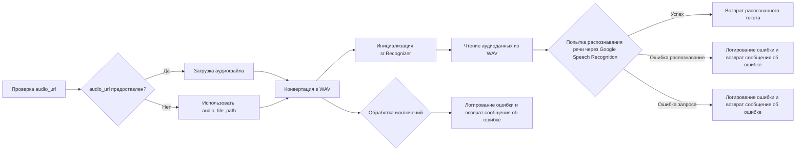
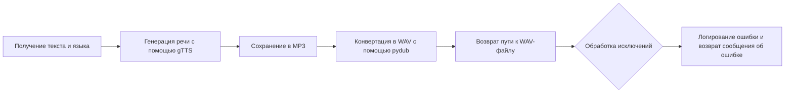

# Модуль для преобразования речи в текст и текста в речь
## Обзор

Модуль `tts.py` предоставляет функциональность для распознавания речи из аудиофайлов и преобразования текста в речь. Он использует библиотеки `speech_recognition` для распознавания речи и `gTTS` для синтеза речи. Также в модуле применяются библиотеки `pydub` для работы с аудио и `requests` для загрузки аудиофайлов по URL.

## Подробней

Этот модуль предназначен для интеграции возможностей распознавания и синтеза речи в проект `hypotez`. Он позволяет автоматически обрабатывать аудиофайлы, получая текстовое представление содержащейся в них речи, а также генерировать аудиофайлы на основе заданного текста.

## Функции

### `speech_recognizer`

```python
def speech_recognizer(audio_url: str = None, audio_file_path: Path = None, language: str = 'ru-RU') -> str:
    """ Download an audio file and recognize speech in it.

    Args:
        audio_url (str, optional): URL of the audio file to be downloaded. Defaults to `None`.
        audio_file_path (Path, optional): Local path to an audio file. Defaults to `None`.
        language (str): Language code for recognition (e.g., 'ru-RU'). Defaults to 'ru-RU'.

    Returns:
        str: Recognized text from the audio or an error message.

    Example:
        .. code::

            recognized_text = speech_recognizer(audio_url='https://example.com/audio.ogg')
            print(recognized_text)  # Output: "Привет"
    """
    ...
```

**Назначение**: Распознает речь в аудиофайле, который может быть предоставлен по URL или через локальный путь к файлу.

**Параметры**:

-   `audio_url` (str, optional): URL аудиофайла для загрузки. По умолчанию `None`.
-   `audio_file_path` (Path, optional): Локальный путь к аудиофайлу. По умолчанию `None`.
-   `language` (str): Языковой код для распознавания речи (например, 'ru-RU'). По умолчанию 'ru-RU'.

**Возвращает**:

-   `str`: Распознанный текст из аудио или сообщение об ошибке.

**Вызывает исключения**:

-   `Exception`: В случае возникновения ошибок при загрузке, конвертации или распознавании аудио.

**Как работает функция**:

1.  **Загрузка аудиофайла**: Если предоставлен `audio_url`, функция загружает аудиофайл и сохраняет его во временную директорию.
2.  **Конвертация в WAV**: Аудиофайл конвертируется из формата OGG (или другого поддерживаемого формата) в формат WAV, который лучше подходит для распознавания речи.
3.  **Распознавание речи**: Используется библиотека `speech_recognition` для распознавания речи в WAV-файле с использованием Google Speech Recognition.
4.  **Обработка результатов**: В случае успешного распознавания, функция возвращает распознанный текст. Если возникают ошибки (например, не удалось распознать речь или произошла ошибка при обращении к сервису распознавания), функция возвращает сообщение об ошибке.



**Примеры**:

```python
recognized_text = speech_recognizer(audio_url='https://example.com/audio.ogg')
print(recognized_text)  # Вывод: "Привет"
```

```python
recognized_text = speech_recognizer(audio_file_path=Path('/path/to/audio.ogg'))
print(recognized_text)  # Вывод: "Текст из аудиофайла"
```

### `text2speech`

```python
async def text2speech(text: str, lang: str = 'ru') -> str:
    """ Convert text to speech and save it as an audio file.

    Args:
        text (str): The text to be converted into speech.
        lang (str, optional): Language code for the speech (e.g., 'ru'). Defaults to 'ru'.

    Returns:
        str: Path to the generated audio file.

    Example:
        .. code::

            audio_path = await text2speech('Привет', lang='ru')
            print(audio_path)  # Output: "/tmp/response.mp3"
    """
    ...
```

**Назначение**: Преобразует текст в речь и сохраняет его в виде аудиофайла.

**Параметры**:

-   `text` (str): Текст для преобразования в речь.
-   `lang` (str, optional): Языковой код для речи (например, 'ru'). По умолчанию 'ru'.

**Возвращает**:

-   `str`: Путь к сгенерированному аудиофайлу.

**Вызывает исключения**:

-   `Exception`: В случае возникновения ошибок при генерации или сохранении аудио.

**Как работает функция**:

1.  **Генерация речи**: Используется библиотека `gTTS` для генерации речи на основе заданного текста и языка.
2.  **Сохранение аудиофайла**: Сгенерированная речь сохраняется во временный MP3-файл.
3.  **Конвертация в WAV**: Аудиофайл конвертируется из формата MP3 в формат WAV с использованием библиотеки `pydub`.
4.  **Возврат пути к файлу**: Функция возвращает путь к сконвертированному WAV-файлу.



**Примеры**:

```python
audio_path = await text2speech('Привет', lang='ru')
print(audio_path)  # Вывод: "/tmp/response.mp3"
```

```python
audio_path = await text2speech('Hello', lang='en')
print(audio_path)  # Вывод: "/tmp/response.mp3"