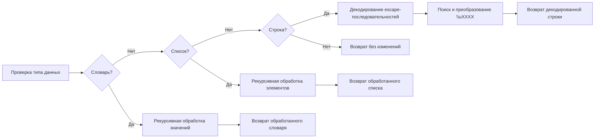

# Модуль `unicode`

## Обзор

Модуль `unicode` содержит функцию `decode_unicode_escape`, предназначенную для декодирования строк, списков или словарей, содержащих юникодные escape-последовательности, в читаемый формат.

## Подробней

Этот модуль предоставляет удобный способ преобразования данных, содержащих юникодные escape-последовательности, в удобочитаемый вид. Это особенно полезно при работе с данными, полученными из внешних источников, таких как JSON-файлы или API, где юникодные символы могут быть представлены в виде escape-последовательностей.

## Функции

### `decode_unicode_escape`

```python
def decode_unicode_escape(input_data: Dict[str, Any] | list | str) -> Dict[str, Any] | list | str:
    """Функция декодирует значения в словаре, списке или строке, содержащие юникодные escape-последовательности, в читаемый текст.

    Args:
        input_data (dict | list | str): Входные данные - словарь, список или строка, которые могут содержать юникодные escape-последовательности.

    Returns:
        dict | list | str: Преобразованные данные. В случае строки применяется декодирование escape-последовательностей. В случае словаря или списка рекурсивно обрабатываются все значения.

    Пример использования:
    .. code-block:: python
        input_dict = {
            'product_name': r'\\u05de\\u05e7\\"\\u05d8 \\u05d9\\u05e6\\u05e8\\u05df\\nH510M K V2',
            'category': r'\\u05e2\\u05e8\\u05db\\u05ea \\u05e9\\u05d1\\u05d1\\u05d9\\u05dd',
            'price': 123.45
        }

        input_list = [r'\\u05e2\\u05e8\\u05db\\u05ea \\u05e9\\u05d1\\u05d1\\u05d9\\u05dd', r'H510M K V2']

        input_string = r'\\u05de\\u05e7\\"\\u05d8 \\u05d9\\u05e6\\u05e8\\u05df\\nH510M K V2'

        # Применяем функцию
        decoded_dict = decode_unicode_escape(input_dict)
        decoded_list = decode_unicode_escape(input_list)
        decoded_string = decode_unicode_escape(input_string)

        print(decoded_dict)
        print(decoded_list)
        print(decoded_string)

    """
```

**Назначение**: Декодирует юникодные escape-последовательности в строке, списке или словаре.

**Параметры**:

- `input_data` (Dict[str, Any] | list | str): Входные данные, которые могут быть словарем, списком или строкой, содержащей юникодные escape-последовательности.

**Возвращает**:

- `Dict[str, Any] | list | str`: Преобразованные данные.

**Как работает функция**:

Функция `decode_unicode_escape` выполняет декодирование юникодных escape-последовательностей в зависимости от типа входных данных.

1.  **Проверка типа входных данных**: Определяется, является ли входной параметр словарем, списком или строкой.
2.  **Обработка словаря**: Если входные данные - словарь, функция рекурсивно вызывает саму себя для каждого значения в словаре.
3.  **Обработка списка**: Если входные данные - список, функция рекурсивно вызывает саму себя для каждого элемента в списке.
4.  **Обработка строки**: Если входные данные - строка, выполняются следующие шаги:
    *   Декодирование строки с escape-последовательностями с использованием `encode('utf-8').decode('unicode_escape')`.
    *   Поиск и преобразование всех найденных последовательностей `\\uXXXX` с использованием регулярного выражения и `re.sub`.
5.  **Возврат результата**: Возвращаются преобразованные данные. Если тип данных не поддерживается, возвращаются входные данные без изменений.



**Примеры**:

```python
input_dict = {
    'product_name': r'\\u05de\\u05e7\\"\\u05d8 \\u05d9\\u05e6\\u05e8\\u05df\\nH510M K V2',
    'category': r'\\u05e2\\u05e8\\u05db\\u05ea \\u05e9\\u05d1\\u05d1\\u05d9\\u05dd',
    'price': 123.45
}

input_list = [r'\\u05e2\\u05e8\\u05db\\u05ea \\u05e9\\u05d1\\u05d1\\u05d9\\u05dd', r'H510M K V2']

input_string = r'\\u05de\\u05e7\\"\\u05d8 \\u05d9\\u05e6\\u05e8\\u05df\\nH510M K V2'

# Применяем функцию
decoded_dict = decode_unicode_escape(input_dict)
decoded_list = decode_unicode_escape(input_list)
decoded_string = decode_unicode_escape(input_string)

print(decoded_dict)
print(decoded_list)
print(decoded_string)