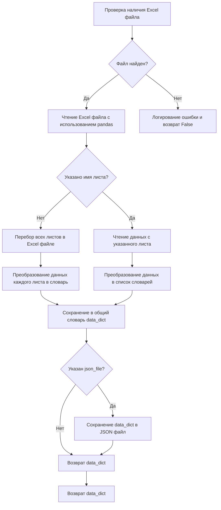
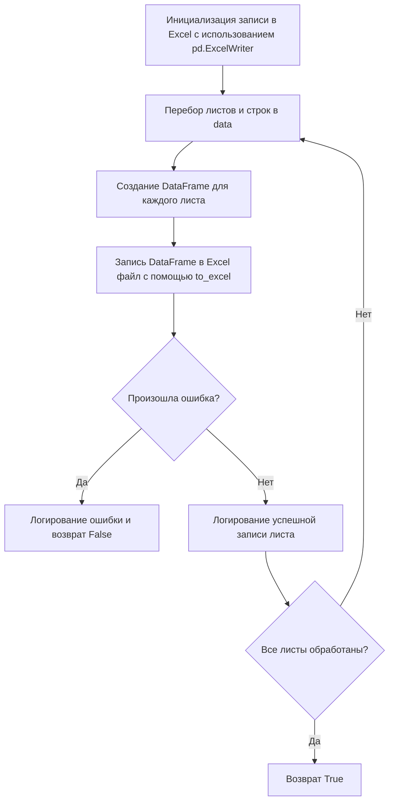

# Модуль для работы с Excel и JSON
## Обзор

Модуль `src.utils.xls` предоставляет функциональность для конвертации файлов Excel (`.xls`) в формат JSON и наоборот. Он позволяет читать данные из Excel файлов, преобразовывать их в JSON и сохранять JSON данные обратно в файлы Excel. Модуль поддерживает работу с несколькими листами в Excel файлах.

## Подробнее

Этот модуль предоставляет функции для облегчения обмена данными между форматами Excel и JSON. Он использует библиотеку `pandas` для чтения и записи файлов Excel и модуль `json` для работы с данными в формате JSON. Модуль включает обработку исключений для обеспечения устойчивости при работе с файлами.

## Функции

### `read_xls_as_dict`

```python
def read_xls_as_dict(
    xls_file: str,
    json_file: str = None,
    sheet_name: Union[str, int] = None
) -> Union[Dict, List[Dict], bool]:
    """
    Читает Excel файл и конвертирует его в JSON. Опционально, конвертирует конкретный лист и сохраняет результат в JSON файл.
    Обрабатывает ошибки.

    Args:
        xls_file (str): Путь к Excel файлу.
        json_file (str, optional): Путь для сохранения JSON файла. По умолчанию `None`.
        sheet_name (Union[str, int], optional): Имя или индекс листа для конвертации. По умолчанию `None`.

    Returns:
        Union[Dict, List[Dict], bool]: Словарь с данными из Excel файла, список словарей, если указан конкретный лист, или `False` в случае ошибки.

    Raises:
        FileNotFoundError: Если указанный Excel файл не найден.
        Exception: Если возникает ошибка при обработке листа или сохранении в JSON.
    """
```

**Как работает функция**:

1.  **Проверка наличия файла**: Функция начинает с проверки существования Excel файла по указанному пути. Если файл не найден, функция логирует ошибку и возвращает `False`.
2.  **Чтение Excel файла**: Если файл существует, функция использует `pandas` для чтения Excel файла.
3.  **Обработка листов**:
    *   Если `sheet_name` не указан, функция перебирает все листы в Excel файле. Для каждого листа функция читает данные и преобразует их в словарь, где ключом является имя листа, а значением - список словарей, представляющих строки листа.
    *   Если `sheet_name` указан, функция читает данные только с указанного листа и преобразует их в список словарей.
4.  **Сохранение в JSON (опционально)**: Если указан `json_file`, функция сохраняет полученные данные в JSON файл с отступом в 4 пробела и кодировкой UTF-8.
5.  **Обработка ошибок**: Функция обрабатывает исключения, которые могут возникнуть при чтении Excel файла или сохранении в JSON, логирует ошибки и возвращает `False`.
6.  **Возврат данных**: Если все операции выполнены успешно, функция возвращает словарь с данными из Excel файла или список словарей, если указан конкретный лист.



**Примеры**:

```python
# Чтение Excel файла без указания конкретного листа
data = read_xls_as_dict('input.xlsx')
if data:
    print(data)

# Чтение Excel файла с указанием конкретного листа и сохранением в JSON файл
data = read_xls_as_dict('input.xlsx', 'output.json', 'Sheet1')
if data:
    print(data)
```

### `save_xls_file`

```python
def save_xls_file(data: Dict[str, List[Dict]], file_path: str) -> bool:
    """Сохраняет JSON данные в Excel файл. Обрабатывает ошибки."""
    try:
        with pd.ExcelWriter(file_path, engine='xlsxwriter') as writer:
            for sheet_name, rows in data.items():
                df = pd.DataFrame(rows)
                df.to_excel(writer, sheet_name=sheet_name, index=False)
                logging.info(f"Sheet '{sheet_name}' saved to {file_path}")
        return True
    except Exception as ex:
        logging.error(f"Error saving Excel file: {ex}", exc_info=True)
        return False
```

**Как работает функция**:

1.  **Инициализация записи в Excel**: Функция использует `pd.ExcelWriter` для создания объекта, который позволяет записывать данные в Excel файл. В качестве движка используется `xlsxwriter`.
2.  **Перебор листов и строк**: Функция перебирает листы и строки в переданных данных. Ключи словаря `data` рассматриваются как имена листов, а значения - как списки словарей, представляющих строки для каждого листа.
3.  **Создание DataFrame**: Для каждого листа функция создает `pandas.DataFrame` из списка словарей, представляющих строки.
4.  **Запись в Excel**: Функция записывает `DataFrame` в Excel файл, используя метод `to_excel`. Параметр `index=False` предотвращает запись индексов строк в Excel файл.
5.  **Обработка ошибок**: Если в процессе записи возникает ошибка, функция логирует ошибку и возвращает `False`.
6.  **Логирование успешной записи**: После успешной записи каждого листа функция логирует сообщение об успешном сохранении.
7.  **Возврат значения**: В случае успешной записи всех данных функция возвращает `True`.



**Примеры**:

```python
# Данные для сохранения в Excel файл
data_to_save = {'Sheet1': [{'column1': 'value1', 'column2': 'value2'}]}

# Сохранение данных в Excel файл
success = save_xls_file(data_to_save, 'output.xlsx')
if success:
    print("Successfully saved to output.xlsx")