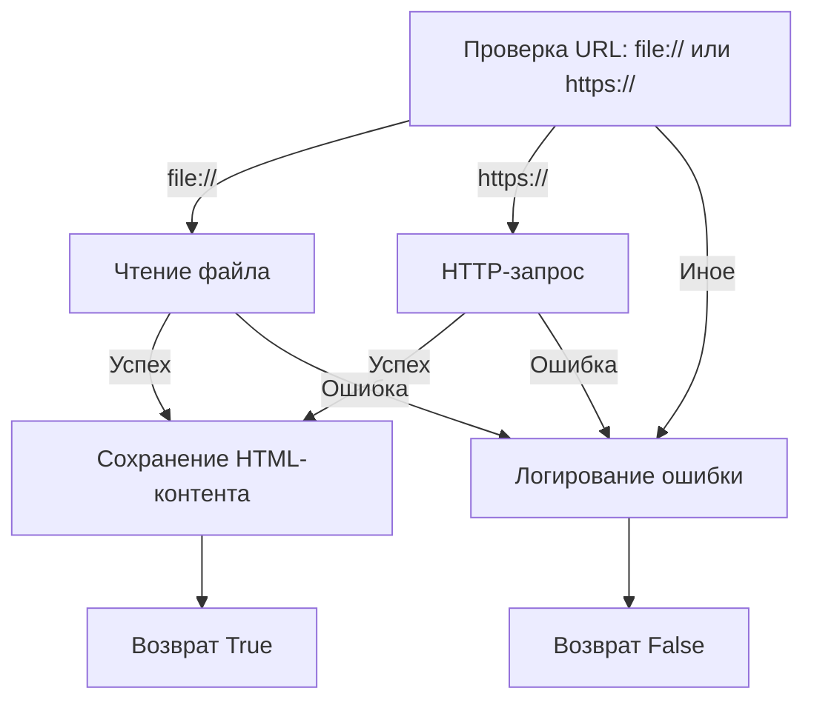
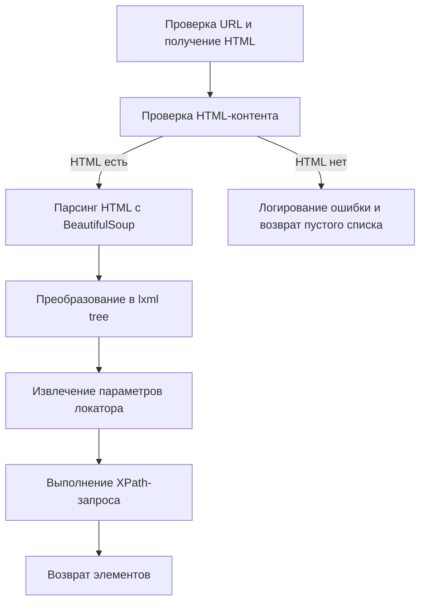

# Модуль для парсинга HTML с использованием `BeautifulSoup` и XPath

## Обзор

Модуль `src.webdriver.bs` предоставляет класс `BS` для парсинга HTML-контента с использованием библиотек `BeautifulSoup` и `lxml` (для XPath). Он позволяет получать HTML с веб-страниц или из локальных файлов, а затем извлекать элементы, соответствующие заданным локаторам XPath.

## Подробнее

Этот модуль предоставляет удобный способ извлечения данных из HTML-документов, комбинируя простоту `BeautifulSoup` с мощностью XPath. Он может быть использован для автоматизации задач веб-скрейпинга, тестирования веб-приложений и других задач, требующих анализа HTML-контента.

## Классы

### `BS`

**Описание**: Класс `BS` предназначен для парсинга HTML-контента с использованием `BeautifulSoup` и XPath.

**Атрибуты**:

-   `html_content` (str): HTML-контент, который необходимо распарсить. Изначально установлен в `None`.

**Методы**:

-   `__init__(self, url: Optional[str] = None)`: Инициализирует экземпляр класса `BS` с опциональным URL.
-   `get_url(self, url: str) -> bool`: Получает HTML-контент из файла или URL-адреса.
-   `execute_locator(self, locator: Union[SimpleNamespace, dict], url: Optional[str] = None) -> List[etree._Element]`: Выполняет XPath-локатор на HTML-контенте.

### `__init__(self, url: Optional[str] = None)`

**Описание**: Инициализирует класс `BS`.

**Параметры**:

-   `url` (Optional[str], optional): URL-адрес или путь к файлу, из которого необходимо получить HTML-контент. По умолчанию `None`.

**Как работает класс**:

1.  Если `url` предоставлен, вызывается метод `get_url` для получения HTML-контента.

### `get_url(self, url: str) -> bool`

**Описание**: Получает HTML-контент из файла или URL-адреса.

**Параметры**:

-   `url` (str): URL-адрес или путь к файлу.

**Возвращает**:

-   `bool`: `True`, если контент был успешно получен, `False` в противном случае.

**Вызывает исключения**:

-   `requests.RequestException`: Если возникает ошибка при выполнении HTTP-запроса.
-   `Exception`: Если возникает ошибка при чтении файла.

**Как работает функция**:

1.  Проверяет, начинается ли URL с `file://`.
2.  Если да, то удаляет префикс `file://` и извлекает путь к файлу.
3.  Если путь к файлу существует, пытается открыть файл и прочитать его содержимое в `self.html_content`.
4.  Если URL начинается с `https://`, выполняет HTTP-запрос к URL-адресу и сохраняет полученный HTML-контент в `self.html_content`.
5.  Если URL не начинается ни с `file://`, ни с `https://`, записывает сообщение об ошибке в лог.



**Примеры**:

```python
parser = BS()
success = parser.get_url('file:///c:/path/to/file.html')
print(success)  # Выведет True, если файл успешно прочитан

success = parser.get_url('https://example.com')
print(success)  # Выведет True, если HTML успешно получен
```

### `execute_locator(self, locator: Union[SimpleNamespace, dict], url: Optional[str] = None) -> List[etree._Element]`

**Описание**: Выполняет XPath-локатор на HTML-контенте.

**Параметры**:

-   `locator` (Union[SimpleNamespace, dict]): Объект локатора, содержащий селектор и атрибут.
-   `url` (Optional[str], optional): URL-адрес или путь к файлу, из которого необходимо получить HTML-контент. По умолчанию `None`.

**Возвращает**:

-   `List[etree._Element]`: Список элементов, соответствующих локатору.

**Как работает функция**:

1.  Если передан `url`, вызывается метод `get_url` для получения HTML-контента.
2.  Если `self.html_content` пуст, записывает сообщение об ошибке в лог и возвращает пустой список.
3.  Использует `BeautifulSoup` для парсинга HTML-контента.
4.  Преобразует объект `BeautifulSoup` в дерево `lxml` (etree).
5.  Если `locator` является словарем, преобразует его в `SimpleNamespace`.
6.  Извлекает атрибут, способ поиска (`by`) и селектор из объекта `locator`.
7.  В зависимости от значения `by`, выполняет XPath-запрос к дереву `lxml` для поиска элементов.
8.  Возвращает список найденных элементов.



**Примеры**:

```python
from types import SimpleNamespace
parser = BS()
parser.get_url('https://example.com')
locator = SimpleNamespace(by='ID', attribute='element_id', selector='//*[@id="element_id"]')
elements = parser.execute_locator(locator)
print(elements)  # Выведет список найденных элементов
```

## Функции

В данном модуле нет отдельных функций, кроме методов класса `BS`.