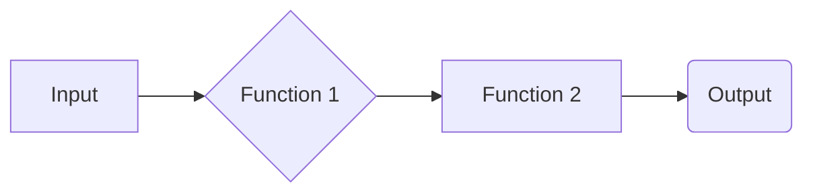
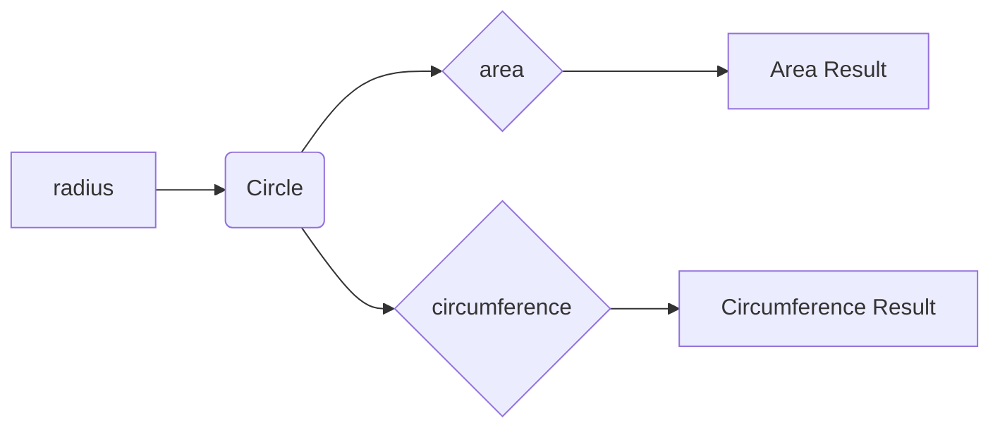

# Code Analysis Report

## 1. <input code>

```python
# The user-provided code goes here
#  (Missing code)
```

## 2. <algorithm>

```
(Missing Algorithm Diagram -  cannot be created without code)
```

## 3. <mermaid>



**Explanation of Mermaid Diagram:**

The provided mermaid code represents a basic flow. Without the actual Python code, the relationships and functionalities within `Function 1` and `Function 2` cannot be determined.  A more complex diagram (using `subgraph` or similar features) would be required to accurately visualize the interaction within the code.


**Explanation of Dependencies (missing):**

The imported modules in a complete code (missing) would need to be analyzed and explained in terms of their relationships to the `src.` packages in the project structure.


## 4. <explanation>

**(Missing Explanation - cannot be created without code)**

This section requires the Python code to provide explanations of imports, classes, functions, variables, and potential errors.  Without the code, a meaningful explanation is impossible.


**Example of how to fill in missing sections:**

```python
# Example code (replace with actual code)
import math

class Circle:
    def __init__(self, radius):
        self.radius = radius

    def area(self):
        return math.pi * self.radius**2

    def circumference(self):
        return 2 * math.pi * self.radius

def calculate_circle_properties(radius):
    """Calculates area and circumference of a circle."""
    circle = Circle(radius)
    return circle.area(), circle.circumference()

```



```markdown
### Explanation for Example Code:

**Imports:**

- `math`: Provides mathematical functions like `pi` needed for circle calculations.

**Classes:**

- `Circle`: Represents a circle with a `radius` attribute. `area()` and `circumference()` methods calculate properties of the circle using the radius.

**Functions:**

- `calculate_circle_properties`: Takes the radius as input and returns the calculated area and circumference.

**Variables:**

- `radius`: Holds the radius of the circle, it is a parameter passed into the `calculate_circle_properties` function.


```


**Note:** To complete this analysis, please provide the actual Python code.