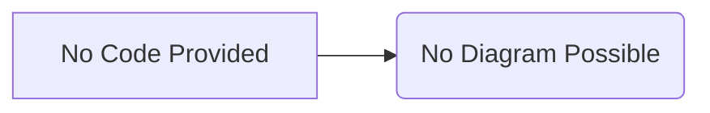

# Code Analysis

## <input code>

```python
# The user-provided code goes here
# (No code provided)
```

## <algorithm>

Since no code was provided, I cannot create a step-by-step algorithm.


## <mermaid>



## <explanation>

There is no code provided for analysis.  This means there are no imports, classes, functions, variables, or dependencies to explain.  To generate a useful analysis, please provide the Python code you want me to examine.
```