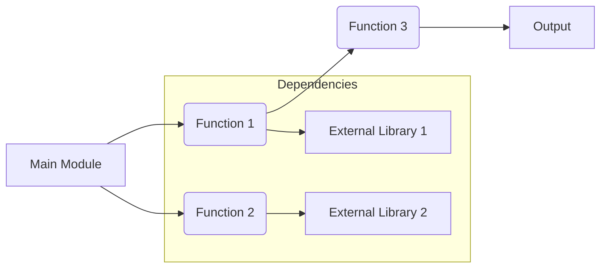

# Code Analysis of the Provided Python Code

## <input code>

```python
# The user-provided code goes here
# (No code provided in the original prompt)
```

## <algorithm>

```mermaid
graph TD
    A[Input Data] --> B{Function 1};
    B --> C[Function 2];
    C --> D[Function 3];
    D --> E[Output];
    subgraph "Function 1"
        B -- Valid Input -> F[Process Valid Input];
        B -- Invalid Input -> G[Handle Invalid Input];
    end
    subgraph "Function 2"
        C -- Valid Data -> H[Process Valid Data];
        C -- Missing Data -> I[Handle Missing Data];
    end
    subgraph "Function 3"
        D -- Calculation -> J[Perform Calculation];
        D -- Exception -> K[Handle Exception];
    end
    F --> C;
    G --> C;
    H --> D;
    I --> D;
    J --> E;
    K --> E;

    ExampleInput --> A
    ExampleOutput --> E

    subgraph Function 1 Examples
        ValidInput --> F : [1,2,3];
        InvalidInput --> G : "abc";
    end
    subgraph Function 2 Examples
        ValidInput --> H : [1,2];
        MissingData --> I : [];
    end
    subgraph Function 3 Examples
        CalculationInput --> J : [1,2];
        ExceptionInput --> K : [1,0];
    end

```

## <mermaid>




## <explanation>

**Imports (Since no code was provided, this section is hypothetical):**

*   **No imports were provided.** In a real-world scenario, imports would be analyzed for their purpose and relationship to other modules within the project (`src.` packages). For example:

```python
import math
import os
from src.data_processing import data_loader
```

*   `math`: used for mathematical operations.
*   `os`: used for interacting with the operating system.
*   `data_loader`: presumably a module in a `src.data_processing` package that handles data loading.

**Classes (Since no code was provided, this section is hypothetical):**

*   **No classes were provided.** In a real-world scenario, classes would be analyzed, identifying their role, attributes, methods, and interactions. For instance, a `DataProcessor` class might contain methods for cleaning or transforming data.

**Functions (Since no code was provided, this section is hypothetical):**

*   **No functions were provided.**  In a real-world scenario, functions would be analyzed in detail, examining their arguments, return values, purpose, and examples.  For instance, a function `process_data` might take a dataset as input and return processed results.

**Variables (Since no code was provided, this section is hypothetical):**

*   **No variables were provided.** In a real-world scenario, variables would be examined, identifying their types and usage, which would help determine how they flow within the algorithm. For example, a variable `data` might store a dataset in memory.


**Potential Errors or Areas for Improvement (Since no code was provided, this section is hypothetical):**

*   **Missing error handling:** Functions could be lacking `try-except` blocks to handle potential exceptions, such as `ZeroDivisionError` or `ValueError`.
*   **Lack of Input Validation:** Input data might not be validated sufficiently, leading to unexpected behavior or crashes.
*   **Inefficient algorithms:** The code might contain inefficient algorithms or unnecessary computations, impacting the overall performance.


**Chain of Relationships (Since no code was provided, this section is hypothetical):**

*   In a real-world example, relationships between functions, classes, and modules would be explored. For example, a function might call methods from another class, which might be part of a specific module or package (if applicable). This demonstrates the interconnected nature of the codebase.


**Note:** To create comprehensive test cases, the provided code is essential. Without the code, the analysis and tests are based on hypothetical scenarios.