```python
import pytest

# No fixtures are needed for this specific case as the prompt is about text analysis, not code execution

def test_code_explanation_prompt_structure():
    """
    Checks that the prompt specifies a three-part structure for the explanation,
    including <input code>, <algorithm>, and <explanation>.
    """
    assert "### Формат ответа:" in prompt_text
    assert "<input code>" in prompt_text
    assert "<algorithm>" in prompt_text
    assert "<explanation>" in prompt_text
    assert "1. **<input code>**: " in prompt_text
    assert "2. **<algorithm>**: " in prompt_text
    assert "3. **<explanation>**: " in prompt_text

def test_code_explanation_prompt_input_code_section():
    """
    Checks that the prompt specifies the <input code> section should include the original code without changes.
    """
    assert "1. **<input code>**:  \n   - Приведи предоставленный код без изменений." in prompt_text


def test_code_explanation_prompt_algorithm_section():
    """
    Checks that the prompt specifies the <algorithm> section should include a step-by-step description,
    examples, and how data moves between components.
    """
    assert "2. **<algorithm>**:  \n   - Опиши алгоритм работы кода в виде пошаговой блок-схемы." in prompt_text
    assert "- Для каждого логического блока приведи пример его работы (если применимо)." in prompt_text
    assert "- Покажи, как данные перемещаются между функциями, классами или методами." in prompt_text


def test_code_explanation_prompt_explanation_section():
    """
    Checks that the prompt specifies the <explanation> section should include detailed description of imports,
    classes, functions, variables, and how they relate to other parts of the project.
    """
    assert "3. **<explanation>**:  \n   - Дай подробное описание:" in prompt_text
    assert "- Импортов: объясни, зачем они нужны, и опиши их связь с другими пакетами, начиная с `src.` (если такие есть)." in prompt_text
    assert "- Классов: укажи их назначение, атрибуты и методы, а также взаимосвязь с другими компонентами проекта." in prompt_text
    assert "- Функций: распиши назначение, аргументы, возвращаемые значения и их примеры." in prompt_text
    assert "- Переменных: опиши их типы и использование." in prompt_text
    assert "- Построй цепочку взаимосвязей с другими частями проекта (если есть)." in prompt_text
    assert "- Укажи потенциальные ошибки или области для улучшений, если они есть." in prompt_text
    
def test_code_explanation_prompt_mermaid_instruction():
    """
    Checks the instruction for building Mermaid diagrams, including the type of graph, node names, HTML usage, links, etc
    """
    assert "### Инструкция для создания Mermaid flowchart диаграмм с использованием HTML в описании узлов" in prompt_text
    assert "1. **Тип графа:**" in prompt_text
    assert "2. **Названия узлов:**" in prompt_text
    assert "3. **Использование HTML:**" in prompt_text
    assert "4. **Связи между узлами:**" in prompt_text
    assert "5. **Пример использования:**" in prompt_text
    assert "6. **Генерация узлов:**" in prompt_text
    assert "7. **Использование меток и комментариев:**" in prompt_text
    assert "8. **Проверка синтаксиса:**" in prompt_text
    
def test_code_explanation_prompt_mermaid_example():
      """
      Checks the example given for building the mermaid diagram
      """
      assert "```mermaid\nflowchart TD\n    Start[<html>Начало процесса<br><b>Создание экземпляра</b></html>] \n        --> InitSupplier[<html>Инициализация Supplier<br><code>_payload&#40;params&#41;</code></html>]\n    InitSupplier --> Validate[<html>Проверка параметров<br><i>is_valid&#40;params&#41;</i></html>]\n    Validate -->|Проверка успешна| Success[<html><b>Успех</b><br>Создание завершено</html>]\n    Validate -->|Ошибка| Error[<html>Ошибка<br><span style=\"color:red;\">Некорректные параметры</span></html>]\n```" in prompt_text

# The prompt text as a string
prompt_text = """**Prompt**:

Твоя задача - помочь разработчику кода проекта `hypotez` объяснить разработчику как работает код
### Требования:  
Проанализируй предоставленный код и объясни его работу.
 

### Формат ответа:  

```
<input code>
<algorithm>
<explanation>
```
1. **<input code>**:  
   - Приведи предоставленный код без изменений.  

2. **<algorithm>**:  
   - Опиши алгоритм работы кода в виде пошаговой блок-схемы.  
   - Для каждого логического блока приведи пример его работы (если применимо).  
   - Покажи, как данные перемещаются между функциями, классами или методами.  

3. **<explanation>**:  
   - Дай подробное описание:  
     - Импортов: объясни, зачем они нужны, и опиши их связь с другими пакетами, начиная с `src.` (если такие есть).  
     - Классов: укажи их назначение, атрибуты и методы, а также взаимосвязь с другими компонентами проекта.  
     - Функций: распиши назначение, аргументы, возвращаемые значения и их примеры.  
     - Переменных: опиши их типы и использование.  
   - Построй цепочку взаимосвязей с другими частями проекта (если есть).  
   - Укажи потенциальные ошибки или области для улучшений, если они есть. 
---

**Пример вызова**:  

```python
from src.utils.calculator import calculate_sum

def add_numbers(a, b):
    result = calculate_sum(a, b)
    return result
```

**Ожидаемый ответ**:  

```
<input code>
from src.utils.calculator import calculate_sum

def add_numbers(a, b):
    result = calculate_sum(a, b)
    return result

<algorithm>
1. Импортируется функция `calculate_sum` из модуля `src.utils.calculator`.
2. Определяется функция `add_numbers`, принимающая два аргумента `a` и `b`.
3. Вызов функции `calculate_sum(a, b)` выполняет сложение `a` и `b`.
4. Результат функции возвращается вызывающему коду.

Пример:  
- Входные данные: `a = 3`, `b = 5`.  
- Алгоритм: `calculate_sum(3, 5)`.  
- Результат: `8`.  

<explanation>
**Импорты**:  
- `from src.utils.calculator import calculate_sum`: Импортирует функцию `calculate_sum`, которая используется для вычисления суммы. Этот модуль лежит в папке `src.utils`.

**Функция `add_numbers`**:  
- Назначение: упрощает сложение двух чисел через вызов функции `calculate_sum`.  
- Аргументы:  
  - `a` (число): Первое слагаемое.  
  - `b` (число): Второе слагаемое.  
- Возвращаемое значение: результат сложения `a` и `b`.  

**Связь с другими пакетами**:  
- Модуль `src.utils.calculator` может быть частью библиотеки для математических вычислений.  
- Если `calculate_sum` использует дополнительные модули, это можно уточнить в её документации.

**Возможные улучшения**:  
- Добавить проверку типов аргументов `a` и `b` для предотвращения ошибок.  
- Локализовать вызов `calculate_sum` в рамках модуля, если он больше нигде не используется.


### Инструкция для создания Mermaid flowchart диаграмм с использованием HTML в описании узлов

1. **Тип графа:** 
   - Использовать `flowchart` (например, `flowchart TD` для направленного графа сверху вниз).
   - Другие варианты: `LR` (слева направо), `BT` (снизу вверх), `RL` (справа налево).

2. **Названия узлов:**
   - Узлы должны иметь осмысленные и описательные названия, отражающие выполняемую операцию или состояние.
   - Избегать названий типа `A`, `B`, `C`. Использовать читабельные и понятные имена, например: `Start`, `InitSupplier`, `ValidateInput`.

3. **Использование HTML:**
   - Для оформления текста узлов применять HTML-теги.
   - Поддерживаются стилизация текста, форматирование, добавление тегов `h1`, `h3`, `<code>`, `<b>`, `<i>` и т.д.
   - При необходимости использовать HTML-escape для символов: 
     - `(` → `&#40;`
     - `)` → `&#41;`
     - `'` → `&#39;`
     - `"` → `&quot;`
     - `:` → `&#58;`

4. **Связи между узлами:**
   - Указывать логический переход между узлами с использованием стрелок: `-->` для однонаправленных или `---` для ассоциативных связей.
   - Использовать текстовые метки на стрелках для уточнения условий перехода, например: `-->|Success|`.

5. **Пример использования:**

```mermaid
flowchart TD
    Start[<html>Начало процесса<br><b>Создание экземпляра</b></html>] 
        --> InitSupplier[<html>Инициализация Supplier<br><code>_payload&#40;params&#41;</code></html>]
    InitSupplier --> Validate[<html>Проверка параметров<br><i>is_valid&#40;params&#41;</i></html>]
    Validate -->|Проверка успешна| Success[<html><b>Успех</b><br>Создание завершено</html>]
    Validate -->|Ошибка| Error[<html>Ошибка<br><span style="color:red;">Некорректные параметры</span></html>]
```



6. **Генерация узлов:**
   - Генерировать названия узлов на основе действия или состояния.
   - Узлы должны быть короткими, но информативными. При необходимости дополнять текст HTML-тегами для улучшения визуального восприятия.

7. **Использование меток и комментариев:**
   - Добавлять метки на стрелках для пояснения условий перехода.
   - Использовать комментарии `%%` для описания сложных связей.

8. **Проверка синтаксиса:**
   - Убедиться, что HTML-код внутри узлов корректен и не нарушает синтаксис Mermaid.

**Результат:** Диаграмма с осмысленными узлами, описанными с использованием HTML, демонстрирующая логический процесс или архитектуру системы.


Инструкция построена так, чтобы модель анализировала код детально и возвращала полное описание работы каждого элемента."""
```