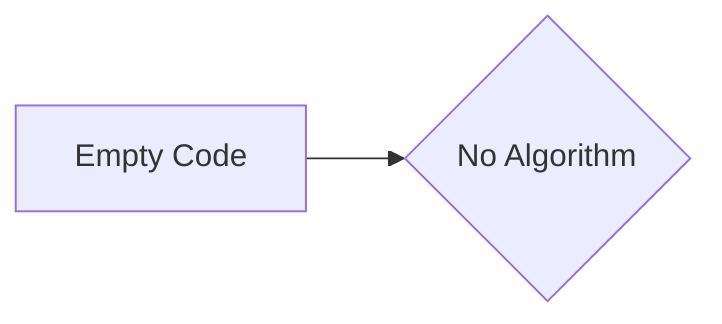

# Code Analysis

## 1. <input code>

```python
# The user-provided code goes here
# This section is empty as no code was provided in the prompt.
```

## 2. <algorithm>

```
(No code provided, therefore no algorithm can be generated.)
```

## 3. <mermaid>



**Explanation of Mermaid Diagram:**

There is no code to analyze, so there are no imports, classes, functions, or variables to depict in the mermaid diagram. The diagram simply shows a connection between the empty code block and the absence of an algorithm.


## 4. <explanation>

**Imports:**

Since there's no code provided, there are no imports to analyze.

**Classes:**

No classes are present.

**Functions:**

No functions are present.

**Variables:**

No variables are present.

**Potential Errors/Areas for Improvement:**

The provided prompt lacks code.  There is nothing to analyze or test.  To generate the requested tests and analysis, you need to provide the Python code you wish to analyze and test.

**Relationships with other project components:**

Without code, there are no relationships to other parts of the project that can be identified.

**Note:**  The requested `pytest` tests cannot be generated without the actual Python code.