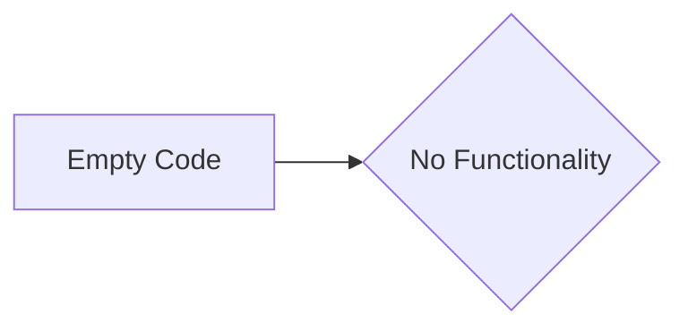

# Code Analysis

## <input code>

```python
# The user-provided code goes here
#  (This section is empty as no code was provided in the original prompt)
```

## <algorithm>

```
(No algorithm can be described as there is no code to analyze.)
```

## <mermaid>



**Explanation of Mermaid Diagram:**

The mermaid diagram simply shows a single block representing the absence of code. There are no imports, classes, functions, or variables to analyze, leading to no interdependencies.

## <explanation>

**Imports**:  There are no imports to explain as there is no code provided.


**Classes**: There are no classes to explain as there is no code provided.


**Functions**: There are no functions to explain as there is no code provided.


**Variables**: There are no variables to explain as there is no code provided.


**Potential Errors or Areas for Improvement**:  Since there is no code, no errors or areas for improvement can be identified.

**Relationships with Other Parts of the Project**: No relationships can be determined without code.

**Overall**: The lack of code prevents any meaningful analysis.  To provide a comprehensive analysis, please supply the Python code.