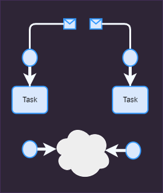

Here's a polished and translated version of your `README.md` into English:

---

# Hypotez Project

## Project Description 
The `hypotez` project involves developing a personal AI assistant capable of performing various tasks, including roles such as insurance agent, real estate agent, sales specialist, HR representative, postal secretary, and more. Each assistant will require separate training for specific tasks, and models will be sold for different types of businesses. The goal is to create an adaptive assistant capable of effectively handling complex tasks without requesting help during operation.

In addition, the `hypotez` project is designed to streamline hypothesis analysis and data analysis. It offers a suite of tools and libraries to facilitate statistical analysis and data visualization, enabling users to efficiently analyze hypotheses and interpret data.

Furthermore, the project includes a parser and scraper designed to gather and process data from various sources. This tool will automate the extraction of relevant information from websites and documents, enabling users to collect data efficiently for analysis. By integrating the parser and scraper into the workflow, the project enhances the ability to obtain timely and accurate data, further supporting the assistant's functionality and decision-making capabilities. Together, these projects aim to enhance productivity and improve decision-making processes in various domains.

**In a Nutshell**:

<br>

<br>

---

### Key Features

1. **Lead Management**:
   - **Capture Leads**: Automatically gather and store lead information from various sources (websites, social media, etc.).
   - **Track Interactions**: Log all interactions with leads, including emails, calls, and meetings.
   - **Lead Scoring**: Evaluate and rank leads based on their potential value and engagement level.

2. **Sales Pipeline Management**:
   - **Track Deals**: Monitor the progress of deals through different stages of the sales pipeline.
   - **Forecasting**: Predict future sales performance based on current data and trends.
   - **Task Management**: Assign and track tasks related to each deal or lead.

3. **Reporting and Analytics**:
   - **Performance Metrics**: Generate reports on sales performance, team productivity, and lead conversion rates.
   - **Custom Reports**: Create and customize reports to analyze specific aspects of the sales process.

4. **Communication Tools**:
   - **Email Integration**: Integrate with email systems to manage and track communications.
   - **Scheduling**: Schedule meetings and follow-ups with clients and team members.

5. **Customer Relationship Management (CRM)**:
   - **Contact Management**: Maintain a database of customer contacts and details.
   - **Interaction History**: Keep a record of all customer interactions and transactions.

6. **Automation**:
   - **Email Campaigns**: Automate follow-up emails and marketing campaigns.
   - **Data Entry**: Reduce manual data entry through automated data capture and integration.

7. **Team Collaboration**:
   - **Shared Dashboards**: Provide access to shared dashboards for real-time updates and collaboration.
   - **Notes and Comments**: Allow team members to leave notes and comments on leads and deals.

8. **Integration with Other Tools**:
   - **Accounting Software**: Sync with accounting software for invoicing and financial tracking.
   - **Project Management**: Integrate with project management tools to manage sales-related projects.

### Example Workflow

1. **Lead Capture**: The assistant automatically imports lead information from various sources.
2. **Lead Scoring**: Assigns a score to each lead based on predefined criteria.
3. **Pipeline Management**: Moves the leads through different stages of the sales pipeline.
4. **Follow-Up**: Automates follow-up emails and schedules meetings.
5. **Reporting**: Generates weekly reports on lead status and sales performance.
6. **Collaboration**: Shares relevant information with the sales team and updates on progress.

### Potential Tools

- **CRM Systems**: Salesforce, HubSpot, Zoho CRM.
- **Automation Platforms**: Zapier, Microsoft Power Automate.
- **Reporting Tools**: Google Data Studio, Tableau.

---

## Setup Instructions

### Required Software (Pre-installed on your computer)

1. **Web Browsers**: `Firefox`, `Chrome`, and/or `Edge` for testing and analysis.
2. **PowerShell**: Command-line shell for task automation (for `Windows`).
3. **Python 3.12**: Required version of Python.

### Software Used in the Project (No Installation Required, Located in the `bin` Folder)

- **`ffmpeg.exe`**: Multimedia processing tool for handling video, audio, and other multimedia files and streams.
- **`doxygen.exe`**: Documentation generator that extracts documentation from annotated source code, useful for creating reference manuals and documentation pages.
- **`chrome drivers`**: Drivers for Google Chrome, used for automating testing tasks and browser interactions in Chrome.
- **`chrome for developers`**: Developer version of the Google Chrome browser, designed for testing and debugging web applications.
- **`geckodriver`**: Driver for Mozilla Firefox, facilitating automation testing and interaction with the Firefox browser.
- **`edge drivers`**: Drivers for Microsoft Edge, enabling automation testing for applications running in the Edge browser.
- **`gtk`**: Toolkit for creating graphical user interfaces, used to develop applications with a rich user interface.

### Installation Steps

1. Download the repository from GitHub to a convenient location on your disk (preferably alongside your projects). **Important!** The root directory name of the project must be `hypotez`. If not, you'll need to change the name in the configuration file `setting.json` located in the root of the project.
   ```powershell
   git clone https://github.com/hypo69/hypo.git
   ```
   - Navigate to the `hypotez` directory.

2. Download the `bin` directory with all the necessary binaries from this link:
   [Download bin directory](https://mega.nz/file/VahExTTQ#igYq3AM8W_xUDvONX3VOKM5Nx-m9pLgno-YpqCzWNPo)
   - Unzip the file inside the `hypotez` folder. Your structure should be `hypotez/bin`.

3. Set the execution policy:
   ```powershell
   Set-ExecutionPolicy RemoteSigned -Scope CurrentUser
   ```

4. Create a virtual environment:
   ```powershell
   python -m venv venv
   ```

5. Activate the virtual environment:
   ```powershell
   venv\Scripts\Activate.ps1
   ```

6. Upgrade `pip`:
   ```powershell
   pip install --upgrade pip setuptools wheel
   ```

7. Install dependencies from `requirements.txt`:
   ```powershell
   pip install -r requirements.txt --ignore-installed
   ```

8. Create project folders:
```powershell
# DEPRECATED. будет создано программой по мере необходиимости

#   New-Item -ItemType Directory -Path .\docs
#   New-Item -ItemType Directory -Path .\export
#   New-Item -ItemType Directory -Path .\log
#   New-Item -ItemType Directory -Path .\tmp
#   New-Item -ItemType Directory -Path .\sandbox
```

9. Install npm and web-ext:
   ```powershell
   # Install npm
   npm install -g npm

   # Install web-ext using npm
   npm install -g web-ext
   ```

10. Install Jupyter Lab extensions:
   ```powershell
   jupyter labextension install @jupyter-widgets/jupyterlab-manager
   ```

11. Install Playwright features:
   ```powershell
   playwright install
   ```

For more details, please check out the [codebase in the `src/readme.md`](src/readme.md). 
Instructions for setting up passwords and secrets are documented in the [SECURITY.md](SECURITY.md) file.


---

Feel free to adjust any specific sections or terminology as needed!