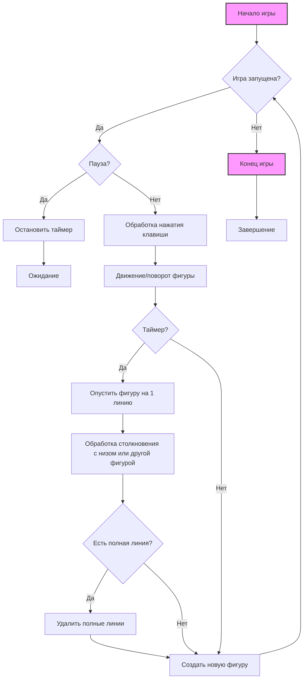

## Игра №2: Тетрис

### Описание

Классическая головоломка, где фигуры (тетрамино) падают сверху, и игрок должен вращать и перемещать их, чтобы создавать полные горизонтальные линии.

### Правила

1.  Тетрамино падают сверху игрового поля.
2.  Игрок может вращать и перемещать падающие фигуры.
3.  Когда горизонтальная линия заполнена, она исчезает, и игрок получает очки.
4.  Игра заканчивается, если новые фигуры не могут поместиться на поле.

### Код

```python
import sys, random
from PyQt5.QtWidgets import QMainWindow, QFrame, QDesktopWidget, QApplication
from PyQt5.QtCore import Qt, QBasicTimer, pyqtSignal
from PyQt5.QtGui import QPainter, QColor

class Tetris(QMainWindow):
    """
    Главное окно приложения Tetris.
    """
    def __init__(self) -> None:
        """
        Инициализация окна Tetris.
        """
        super().__init__()
        self.initUI()

    def initUI(self) -> None:
        """
         Инициализация пользовательского интерфейса.
        """
        self.tboard = Board(self)
        self.setCentralWidget(self.tboard)
        self.statusbar = self.statusBar()
        self.tboard.msg2Statusbar[str].connect(self.statusbar.showMessage)
        self.tboard.start()
        self.resize(180, 380)
        self.center()
        self.setWindowTitle('Tetris')
        self.show()

    def center(self) -> None:
        """
        Центрирует окно на экране.
        """
        screen = QDesktopWidget().screenGeometry()
        size = self.geometry()
        self.move((screen.width() - size.width()) / 2, (screen.height() - size.height()) / 2)


class Board(QFrame):
    """
    Класс, представляющий игровое поле Tetris.
    """
    msg2Statusbar = pyqtSignal(str)
    BoardWidth = 10
    BoardHeight = 22
    Speed = 300

    def __init__(self, parent: QMainWindow) -> None:
        """
        Инициализация игрового поля.
        
        Args:
            parent: Родительское окно.
        """
        super().__init__(parent)
        self.initBoard()

    def initBoard(self) -> None:
         """
        Инициализирует доску и игровые переменные.
        """
        self.timer = QBasicTimer()
        self.isWaitingAfterLine = False
        self.curX = 0
        self.curY = 0
        self.numLinesRemoved = 0
        self.board = []
        self.setFocusPolicy(Qt.StrongFocus)
        self.isStarted = False
        self.isPaused = False
        self.clearBoard()

    def shapeAt(self, x: int, y: int) -> int:
        """
        Возвращает форму фигуры в заданной позиции.
        
        Args:
            x: Координата x.
            y: Координата y.
        Returns:
            Форма тетрамино в позиции.
        """
        return self.board[(y * Board.BoardWidth) + x]

    def setShapeAt(self, x: int, y: int, shape: int) -> None:
        """
        Устанавливает форму фигуры в заданной позиции.
        
        Args:
            x: Координата x.
            y: Координата y.
            shape: Форма тетрамино.
        """
        self.board[(y * Board.BoardWidth) + x] = shape

    def squareWidth(self) -> int:
         """
        Возвращает ширину одного квадрата.
        
        Returns:
             Ширина квадрата.
        """
        return self.contentsRect().width() // Board.BoardWidth

    def squareHeight(self) -> int:
        """
        Возвращает высоту одного квадрата.
         
        Returns:
             Высота квадрата.
        """
        return self.contentsRect().height() // Board.BoardHeight

    def start(self) -> None:
         """
        Запускает игру.
        """
        if self.isPaused:
            return
        self.isStarted = True
        self.isWaitingAfterLine = False
        self.numLinesRemoved = 0
        self.clearBoard()
        self.msg2Statusbar.emit(str(self.numLinesRemoved))
        self.newPiece()
        self.timer.start(Board.Speed, self)

    def pause(self) -> None:
         """
        Ставит игру на паузу или возобновляет ее.
        """
        if not self.isStarted:
            return
        self.isPaused = not self.isPaused
        if self.isPaused:
            self.timer.stop()
            self.msg2Statusbar.emit("paused")
        else:
            self.timer.start(Board.Speed, self)
            self.msg2Statusbar.emit(str(self.numLinesRemoved))
        self.update()

    def paintEvent(self, event: object) -> None:
          """
         Отрисовывает игровое поле и текущую фигуру.
         
         Args:
             event: Событие отрисовки.
         """
        painter = QPainter(self)
        rect = self.contentsRect()
        boardTop = rect.bottom() - Board.BoardHeight * self.squareHeight()
        for i in range(Board.BoardHeight):
            for j in range(Board.BoardWidth):
                shape = self.shapeAt(j, Board.BoardHeight - i - 1)
                if shape != Tetrominoe.NoShape:
                    self.drawSquare(painter,
                        rect.left() + j * self.squareWidth(),
                        boardTop + i * self.squareHeight(), shape)
        if self.curPiece.shape() != Tetrominoe.NoShape:
            for i in range(4):
                x = self.curX + self.curPiece.x(i)
                y = self.curY - self.curPiece.y(i)
                self.drawSquare(painter, rect.left() + x * self.squareWidth(),
                    boardTop + (Board.BoardHeight - y - 1) * self.squareHeight(),
                    self.curPiece.shape())

    def keyPressEvent(self, event: object) -> None:
        """
        Обрабатывает нажатия клавиш.
         
        Args:
             event: Событие нажатия клавиши.
        """
        if not self.isStarted or self.curPiece.shape() == Tetrominoe.NoShape:
            super(Board, self).keyPressEvent(event)
            return
        key = event.key()
        if key == Qt.Key_P:
            self.pause()
            return
        if self.isPaused:
            return
        elif key == Qt.Key_Left:
            self.tryMove(self.curPiece, self.curX - 1, self.curY)
        elif key == Qt.Key_Right:
            self.tryMove(self.curPiece, self.curX + 1, self.curY)
        elif key == Qt.Key_Down:
            self.tryMove(self.curPiece.rotateRight(), self.curX, self.curY)
        elif key == Qt.Key_Up:
            self.tryMove(self.curPiece.rotateLeft(), self.curX, self.curY)
        elif key == Qt.Key_Space:
            self.dropDown()
        elif key == Qt.Key_D:
            self.oneLineDown()
        else:
            super(Board, self).keyPressEvent(event)

    def timerEvent(self, event: object) -> None:
          """
         Обрабатывает события таймера.
         
         Args:
            event: Событие таймера.
        """
        if event.timerId() == self.timer.timerId():
            if self.isWaitingAfterLine:
                self.isWaitingAfterLine = False
                self.newPiece()
            else:
                self.oneLineDown()
        else:
            super(Board, self).timerEvent(event)

    def clearBoard(self) -> None:
        """
        Очищает игровое поле.
        """
        for i in range(Board.BoardHeight * Board.BoardWidth):
            self.board.append(Tetrominoe.NoShape)

    def dropDown(self) -> None:
         """
        Опускает текущую фигуру до упора.
        """
        newY = self.curY
        while newY > 0:
            if not self.tryMove(self.curPiece, self.curX, newY - 1):
                break
            newY -= 1
        self.pieceDropped()

    def oneLineDown(self) -> None:
         """
        Опускает текущую фигуру на одну линию.
        """
        if not self.tryMove(self.curPiece, self.curX, self.curY - 1):
            self.pieceDropped()

    def pieceDropped(self) -> None:
        """
        Фиксирует упавшую фигуру на поле.
        """
        for i in range(4):
            x = self.curX + self.curPiece.x(i)
            y = self.curY - self.curPiece.y(i)
            self.setShapeAt(x, y, self.curPiece.shape())
        self.removeFullLines()
        if not self.isWaitingAfterLine:
            self.newPiece()

    def removeFullLines(self) -> None:
        """
        Удаляет полные линии и обновляет счетчик очков.
        """
        numFullLines = 0
        rowsToRemove = []
        for i in range(Board.BoardHeight):
            n = 0
            for j in range(Board.BoardWidth):
                if not self.shapeAt(j, i) == Tetrominoe.NoShape:
                    n = n + 1
            if n == 10:
                rowsToRemove.append(i)
        rowsToRemove.reverse()
        for m in rowsToRemove:
            for k in range(m, Board.BoardHeight):
                for l in range(Board.BoardWidth):
                        self.setShapeAt(l, k, self.shapeAt(l, k + 1))
        numFullLines = numFullLines + len(rowsToRemove)
        if numFullLines > 0:
            self.numLinesRemoved = self.numLinesRemoved + numFullLines
            self.msg2Statusbar.emit(str(self.numLinesRemoved))
            self.isWaitingAfterLine = True
            self.curPiece.setShape(Tetrominoe.NoShape)
            self.update()

    def newPiece(self) -> None:
         """
        Генерирует новую фигуру для игры.
        """
        self.curPiece = Shape()
        self.curPiece.setRandomShape()
        self.curX = Board.BoardWidth // 2 + 1
        self.curY = Board.BoardHeight - 1 + self.curPiece.minY()
        if not self.tryMove(self.curPiece, self.curX, self.curY):
            self.curPiece.setShape(Tetrominoe.NoShape)
            self.timer.stop()
            self.isStarted = False
            self.msg2Statusbar.emit("Game over")

    def tryMove(self, newPiece: object, newX: int, newY: int) -> bool:
         """
        Пытается переместить фигуру на новые координаты.
        
        Args:
            newPiece: Новая форма фигуры.
            newX: Новая координата X.
            newY: Новая координата Y.
        
        Returns:
            True, если перемещение успешно, иначе False.
        """
        for i in range(4):
            x = newX + newPiece.x(i)
            y = newY - newPiece.y(i)
            if x < 0 or x >= Board.BoardWidth or y < 0 or y >= Board.BoardHeight:
                return False
            if self.shapeAt(x, y) != Tetrominoe.NoShape:
                return False
        self.curPiece = newPiece
        self.curX = newX
        self.curY = newY
        self.update()
        return True

    def drawSquare(self, painter: QPainter, x: int, y: int, shape: int) -> None:
         """
        Рисует квадрат на игровом поле.
        
         Args:
             painter: Объект QPainter.
             x: Координата x.
             y: Координата y.
             shape: Форма тетрамино.
        """
        colorTable = [0x000000, 0xCC6666, 0x66CC66, 0x6666CC,
                      0xCCCC66, 0xCC66CC, 0x66CCCC, 0xDAAA00]
        color = QColor(colorTable[shape])
        painter.fillRect(x + 1, y + 1, self.squareWidth() - 2,
            self.squareHeight() - 2, color)
        painter.setPen(color.lighter())
        painter.drawLine(x, y + self.squareHeight() - 1, x, y)
        painter.drawLine(x, y, x + self.squareWidth() - 1, y)
        painter.setPen(color.darker())
        painter.drawLine(x + 1, y + self.squareHeight() - 1,
            x + self.squareWidth() - 1, y + self.squareHeight() - 1)
        painter.drawLine(x + self.squareWidth() - 1,
            y + self.squareHeight() - 1, x + self.squareWidth() - 1, y + 1)


class Tetrominoe(object):
    """
    Перечисление всех возможных фигур тетрамино.
    """
    NoShape = 0
    ZShape = 1
    SShape = 2
    LineShape = 3
    TShape = 4
    SquareShape = 5
    LShape = 6
    MirroredLShape = 7

class Shape(object):
    """
    Класс, представляющий фигуру тетрамино.
    """
    coordsTable = (
        ((0, 0),     (0, 0),     (0, 0),     (0, 0)),
        ((0, -1),    (0, 0),     (-1, 0),    (-1, 1)),
        ((0, -1),    (0, 0),     (1, 0),     (1, 1)),
        ((0, -1),    (0, 0),     (0, 1),     (0, 2)),
        ((-1, 0),    (0, 0),     (1, 0),     (0, 1)),
        ((0, 0),     (1, 0),     (0, 1),     (1, 1)),
        ((-1, -1),   (0, -1),    (0, 0),     (0, 1)),
        ((1, -1),    (0, -1),    (0, 0),     (0, 1))
    )
    def __init__(self) -> None:
        """
         Инициализация фигуры тетрамино.
        """
        self.coords = [[0, 0] for i in range(4)]
        self.pieceShape = Tetrominoe.NoShape
        self.setShape(Tetrominoe.NoShape)

    def shape(self) -> int:
        """
        Возвращает форму фигуры.
        
        Returns:
             Форма фигуры.
        """
        return self.pieceShape

    def setShape(self, shape: int) -> None:
        """
        Устанавливает форму фигуры.
        
        Args:
            shape: Форма тетрамино.
        """
        table = Shape.coordsTable[shape]
        for i in range(4):
            for j in range(2):
                self.coords[i][j] = table[i][j]
        self.pieceShape = shape

    def setRandomShape(self) -> None:
        """
        Устанавливает случайную форму фигуры.
        """
        self.setShape(random.randint(1, 7))

    def x(self, index: int) -> int:
         """
        Возвращает координату x для заданной точки фигуры.
        
        Args:
            index: Индекс точки фигуры.
        Returns:
            Координата x.
        """
        return self.coords[index][0]

    def y(self, index: int) -> int:
         """
        Возвращает координату y для заданной точки фигуры.
        
        Args:
            index: Индекс точки фигуры.
        Returns:
             Координата y.
        """
        return self.coords[index][1]

    def setX(self, index: int, x: int) -> None:
          """
         Устанавливает координату x для заданной точки фигуры.
         
        Args:
             index: Индекс точки фигуры.
             x: Новая координата x.
        """
        self.coords[index][0] = x

    def setY(self, index: int, y: int) -> None:
         """
        Устанавливает координату y для заданной точки фигуры.
        
        Args:
            index: Индекс точки фигуры.
            y: Новая координата y.
        """
        self.coords[index][1] = y

    def minX(self) -> int:
        """
         Возвращает минимальную координату x для фигуры.
        
        Returns:
             Минимальная координата x.
        """
        m = self.coords[0][0]
        for i in range(4):
            m = min(m, self.coords[i][0])
        return m

    def maxX(self) -> int:
          """
         Возвращает максимальную координату x для фигуры.
         
        Returns:
             Максимальная координата x.
        """
        m = self.coords[0][0]
        for i in range(4):
            m = max(m, self.coords[i][0])
        return m

    def minY(self) -> int:
         """
         Возвращает минимальную координату y для фигуры.
        
         Returns:
             Минимальная координата y.
        """
        m = self.coords[0][1]
        for i in range(4):
            m = min(m, self.coords[i][1])
        return m

    def maxY(self) -> int:
        """
        Возвращает максимальную координату y для фигуры.
       
        Returns:
             Максимальная координата y.
        """
        m = self.coords[0][1]
        for i in range(4):
            m = max(m, self.coords[i][1])
        return m

    def rotateLeft(self) -> object:
         """
        Поворачивает фигуру на 90 градусов влево.
        
        Returns:
            Новая фигура после поворота.
        """
        if self.pieceShape == Tetrominoe.SquareShape:
            return self
        result = Shape()
        result.pieceShape = self.pieceShape
        for i in range(4):
            result.setX(i, self.y(i))
            result.setY(i, -self.x(i))
        return result

    def rotateRight(self) -> object:
        """
        Поворачивает фигуру на 90 градусов вправо.
        
        Returns:
            Новая фигура после поворота.
        """
        if self.pieceShape == Tetrominoe.SquareShape:
            return self
        result = Shape()
        result.pieceShape = self.pieceShape
        for i in range(4):
            result.setX(i, -self.y(i))
            result.setY(i, self.x(i))
        return result

if __name__ == '__main__':
    app = QApplication([])
    tetris = Tetris()
    sys.exit(app.exec_())
```

### Разбор кода

*   **Класс `Tetris`:**
    *   Создает основное окно приложения.
    *   `initUI()`: Инициализирует интерфейс, создает игровое поле.
*   **Класс `Board`:**
    *   `initBoard()`: Инициализирует игровое поле, таймер, текущую фигуру.
    *   `start()`: Запускает игру, генерирует новую фигуру.
    *   `pause()`: Приостанавливает игру.
    *   `paintEvent()`: Отрисовывает игровое поле и падающую фигуру.
    *    `keyPressEvent()`: Обрабатывает нажатия клавиш.
    *   `timerEvent()`: Вызывает метод `oneLineDown` по таймеру.
    *   `clearBoard()`: Очищает игровое поле.
    *   `dropDown()`: Опускает фигуру до упора.
    *   `oneLineDown()`: Опускает фигуру на одну линию.
    *   `pieceDropped()`: Фиксирует фигуру на поле.
    *   `removeFullLines()`: Удаляет заполненные линии.
    *   `newPiece()`: Создает новую фигуру.
    *   `tryMove()`: Пытается переместить фигуру.
    *   `drawSquare()`: Рисует один квадрат.
*  **Класс `Tetrominoe`:**
    *   Определяет все возможные формы фигур.
*   **Класс `Shape`:**
    *   Представляет одну фигуру тетрамино.
    *   `setShape()`: Устанавливает форму фигуры.
    *   `setRandomShape()`: Выбирает случайную фигуру.
    *   `x()`/`y()`: Возвращает координаты фигуры.
    *   `rotateLeft()`/`rotateRight()`: Вращает фигуру.

### Блок-схема
