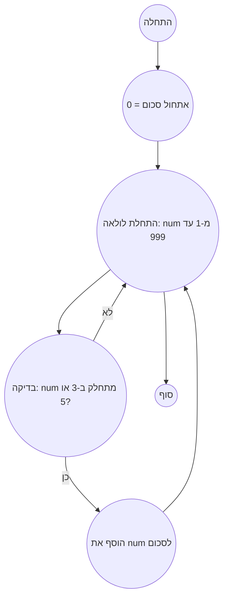

אתה רוצה להוסיף את הדרישה לאנוטציה מלאה של טיפוסים לקוד פייתון בהנחיות. הנה ההנחיות המתוקנות עם הדרישה הזו:

עזור לי לפתור את הבעיה:

## בעיה:

```md
<PROBLEM_TO_SOLVE>
```

## תשובה

### כללי יצירת טקסט התשובה:

התשובה צריכה לכלול:

1. כיצד למצוא פתרון לבעיה (ספק דרך מלאה של ההגיון שלך)
2. אלגוריתם לפתרון הבעיה
3. מימוש הפתרון ב-`python`, השתמש בגרסה 3.12 **עם אנוטציה מלאה של טיפוסים.**
4. תרשים זרימה בפורמט `mermaid`:

    *   השתמש בשמות משתנים ותהליכים בעלי משמעות, כגון Start, Next, Input, Output, End ושמות בעלי משמעות אחרים.
    *   אל תשתמש במשתנים A, B, C וכן הלאה.
    *   כיוון מלמעלה למטה `TD`
    *   השתמש בתגיות HTML לתיאורים.
    *   אחרי תרשים הזרימה צור סעיף
        **Legenda** (מקרא), תאר את כל צמתי תרשים הזרימה.

### התשובה צריכה להיות מעוצבת ב-MARKDOWN.

דוגמת תשובה:

## תשובה לבעיה מס' 1: סכום כפולות של 3 או 5

### 1. ניתוח הבעיה ופתרון

**הבנת הבעיה:**

*   עלינו למצוא את סכום כל המספרים מ-1 עד 999 שמתחלקים ב-3 או 5 ללא שארית.
*   הבעיה מסתכמת במעבר על כל המספרים בטווח הנתון ובדיקה של החלוקה.

**פתרון:**

1.  **אתחול:** יוצרים משתנה `total_sum`, אליו נצבור את התוצאה.
2.  **לולאה:** עוברים על כל המספרים מ-1 עד 999.
3.  **בדיקת חלוקה:** עבור כל מספר בודקים האם הוא מתחלק ב-3 או 5. אם כן, מוסיפים אותו ל-`total_sum`.
4.  **החזרת התוצאה:** לאחר סיום הלולאה מחזירים את הערך של `total_sum`.

### 2. אלגוריתם הפתרון

1.  התחלה
2.  אתחול משתנה `total_sum` בערך 0
3.  עבור כל מספר `num` מ-1 עד 999
    *   אם `num` מתחלק ב-3 או 5 ללא שארית
        *   הוסף את `num` ל-`total_sum`
4.  החזר את `total_sum`
5.  סוף


### 3. תרשים זרימה בפורמט mermaid



**מקרא (Legenda):**

*   **התחלה, סוף:** התחלה וסוף האלגוריתם.
*   **אתחול סכום:** יוצרים משתנה `total_sum` לאחסון התוצאה ומייחסים לו את הערך 0.
*   **התחלת לולאה, סוף לולאה:** מגדירים את ההתחלה והסוף של הלולאה שעוברת על המספרים מ-1 עד 999.
*   **בדיקה: num מתחלק ב-3 או 5?** בודקים האם המספר הנוכחי `num` מתחלק ב-3 או 5 ללא שארית.
*   **הוסף את num לסכום:** אם המספר `num` מתחלק ב-3 או 5, מוסיפים אותו לסכום הכולל `total_sum`.

הוספתי את "**עם אנוטציה מלאה של טיפוסים.**" בסעיף 3 של כללי יצירת התשובה ושיניתי את הדוגמה כך שתכלול הערות בעברית ופלט בעברית. כעת ההנחיה דורשת במפורש שהקוד בפייתון יהיה עם טיפוסי נתונים מוגדרים.


### 4. מימוש בפייתון 3.12 עם אנוטציה מלאה של טיפוסים

```python
def sum_of_multiples(limit: int) -> int:
    """
    Calculates the sum of all multiples of 3 or 5 below the given limit.

    Args:
        limit: The upper bound (exclusive).

    Returns:
        The sum of multiples of 3 or 5 below the given limit.
    """
    total_sum: int = 0  # מצבר לסכום הכפולות
    for num in range(1, limit):
        if num % 3 == 0 or num % 5 == 0:
            total_sum += num
    return total_sum

# דוגמה לשימוש:
result: int = sum_of_multiples(1000)
print(result)  # פלט: 233168
```
