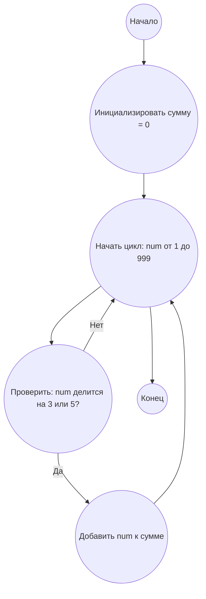

Помоги мне решить задачу:

## Задача:

```md
<PROBLEM_TO_SOLVE>
```

## Ответ

### Правила генерации текста ответа:

Ответ должен содержать:

1.  Как найти решение задачи (Предоставь полный путь твоих рассуждений)
2.  Алгоритм решения задачи
3.  Реализация решения на `python`, Используй версию 3.12 **с полной аннотацией типов.**

4.  Блок-схему в формате `mermaid`:

    *   Используй осмысленные имена переменных и процессов, такие как Start, Next, Input, Output, End, и другие осмысленные имена.
    *   Не используй переменные A, B, C и так далее.
    *   Направление сверху-вниз `TD`
    *   Используй HTML разметку для описаний.
    *   после блок-схемы сделай раздел
        **Legenda**, опиши все узлы блок-схемы

### Ответ должен быть размечен MARKDOWN.

Пример ответа:

## Ответ на Задачу No 1: Сумма кратных 3 или 5

### 1. Анализ задачи и решение

**Понимание задачи:**

*   Нам необходимо найти сумму всех чисел от 1 до 999, которые делятся на 3 или 5 без остатка.
*   Задача сводится к перебору всех чисел в заданном диапазоне и проверке на делимость.

**Решение:**

1.  **Инициализация:** Создаем переменную `total_sum`, в которую будем накапливать результат.
2.  **Цикл:** Проходим по всем числам от 1 до 999.
3.  **Проверка делимости:** Для каждого числа проверяем, делится ли оно на 3 или 5. Если да, то добавляем его к `total_sum`.
4.  **Возврат результата:** После окончания цикла возвращаем значение `total_sum`.

### 2. Алгоритм решения

1.  Начать
2.  Инициализировать переменную `total_sum` со значением 0
3.  Для каждого числа `num` от 1 до 999
    *   Если `num` делится на 3 или 5 без остатка
        *   Прибавить `num` к `total_sum`
4.  Вернуть `total_sum`
5.  Конец


### 3. Блок-схема в формате mermaid



**Легенда:**

*   **Начало, Конец:** Начало и конец алгоритма.
*   **Инициализировать сумму:** Создаем переменную `total_sum` для хранения результата и присваиваем ей значение 0.
*   **Начать цикл, Конец цикла:** Определяют начало и конец цикла перебора чисел от 1 до 999.
*   **Проверить: num делится на 3 или 5?** Проверяем, делится ли текущее число `num` на 3 или 5 без остатка.
*   **Добавить num к сумме:** Если число `num` делится на 3 или 5, то добавляем его к общей сумме `total_sum`.

### 4. Реализация на Python 3.12 с аннотацией типов

```python
def sum_of_multiples(limit: int) -> int:
    """
    Calculates the sum of all multiples of 3 or 5 below the given limit.

    Args:
        limit: The upper bound (exclusive).

    Returns:
        The sum of multiples of 3 or 5 below the given limit.
    """
    total_sum: int = 0  # Accumulator for the sum of multiples
    for num in range(1, limit):
        if num % 3 == 0 or num % 5 == 0:
            total_sum += num
    return total_sum

# Пример использования:
result: int = sum_of_multiples(1000)
print(result)  # Output: 233168
```
