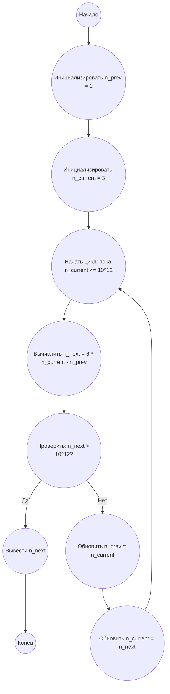

## Ответ на Задачу No 100: Расположенные диски

### 1. Анализ задачи и решение
**Понимание задачи:**
* Нам нужно найти наименьшее количество дисков `n` больше 10^12, при котором вероятность вытаскивания синего диска равна ровно 50%. Это означает, что количество синих дисков равно `n/2`.
* Уравнение для вероятности 50% выглядит как `синие_диски / n = 1/2`, или `синие_диски = n / 2`. Это означает, что `n` должно быть четным числом.
* Нам дается последовательность начальных значений, которые, как кажется, генерируются по определенной формуле. Наша задача - найти эту формулу и применить ее.
* Наблюдая за последовательностью: 3, 15, 85, 493, 2871, можно заметить закономерность, что каждое новое n вычисляется на основе предыдущего n.
    * 15 = 6 * 3 - 3
    * 85 = 6 * 15 - 5
    * 493 = 6 * 85 - 17
    * 2871 = 6 * 493 - 77
    * Это не линейная закономерность, но что если мы попробуем использовать рекурентную формулу.
* Пробуем использовать формулу `n_next = 6 * n_current - n_prev`

**Решение:**
1. **Начальные условия:** Задаем начальные значения `n_prev` = 1 (условно) и `n_current` = 3.
2. **Итерация:** В цикле вычисляем следующее значение `n_next` по формуле `n_next = 6 * n_current - n_prev`.
3. **Проверка:** Проверяем, если `n_next > 10^12`. Если да, то выводим `n_next` и заканчиваем работу.
4. **Обновление:** Обновляем `n_prev = n_current` и `n_current = n_next` для следующей итерации.

### 2. Алгоритм решения
1. Начать
2. Инициализировать `n_prev` = 1
3. Инициализировать `n_current` = 3
4. Пока `n_current` <= 10^12
   * Вычислить `n_next = 6 * n_current - n_prev`
   * Если `n_next` > 10^12
     * Вывести `n_next`
     * Завершить работу
   * Обновить `n_prev = n_current`
   * Обновить `n_current = n_next`
5. Конец

### 3. Реализация на Python 3.12
```python
def find_min_n():
    """
    Finds the smallest number of discs n > 10^12 where the probability of picking a blue disc is 50%.
    """
    n_prev = 1
    n_current = 3
    limit = 10**12

    while True:
        n_next = 6 * n_current - n_prev
        if n_next > limit:
            return n_next
        n_prev = n_current
        n_current = n_next

# Example usage:
result = find_min_n()
print(result)
```

### 4. Блок-схема в формате mermaid


**Легенда:**
*   **Начало, Конец:** Начало и конец алгоритма.
*   **Инициализировать n\_prev:** Присваиваем начальное значение 1 переменной n\_prev.
*   **Инициализировать n\_current:** Присваиваем начальное значение 3 переменной n\_current.
*   **Начать цикл:** Начало цикла, который будет выполняться, пока n\_current меньше или равно 10 в 12 степени.
*   **Вычислить n\_next:** Вычисляем следующее значение n\_next на основе формулы.
*   **Проверить:** Проверяем, если n\_next больше, чем 10 в 12 степени.
*   **Вывести n\_next:** Если условие выполняется, то выводим значение n\_next.
*   **Обновить n\_prev:** Обновляем значение переменной n\_prev.
*  **Обновить n\_current:** Обновляем значение переменной n\_current.
