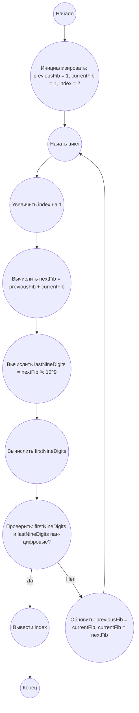

## Ответ на Задачу No 104: Fibonaccи с началом и концом палиндрома

### 1. Анализ задачи и решение
**Понимание задачи:**
* Нам нужно найти первое число Фибоначчи, у которого первые и последние 9 цифр являются пан-цифровыми (содержат все цифры от 1 до 9).
* Поскольку числа Фибоначчи быстро растут, мы не можем хранить их целиком, необходимо использовать подходящий способ работы с большими числами. 
* Нам нужно уметь извлекать первые и последние 9 цифр.

**Решение:**
1. **Генерация чисел Фибоначчи:** Начинаем генерацию чисел Фибоначчи, используя итеративный подход.
2. **Извлечение первых 9 цифр:**  Используем подход с плавающей точкой для хранения и расчета больших чисел. Для получения первых 9 цифр будем использовать логарифмы для получения порядка числа, а затем степень 10, а потом  оставлять только 9 первых цифр через деление на 10^n
3. **Извлечение последних 9 цифр:** Храним и вычисляем числа Фибоначчи по модулю 10^9 для получения последних 9 цифр.
4. **Проверка на пан-цифровые:** Для каждой группы из 9 цифр, проверяем, содержат ли они все цифры от 1 до 9. Используем для этого множества.
5. **Поиск первого соответствия:**  Продолжаем генерацию до тех пор, пока не найдем число Фибоначчи, удовлетворяющее условию задачи.

### 2. Алгоритм решения
1. Начать
2. Инициализировать `previous_fib` = 1, `current_fib` = 1,  `index` = 2
3. Цикл: Пока не найдено искомое число Фибоначчи:
   *  Увеличить `index` на 1
   *  Вычислить `next_fib` = `previous_fib` + `current_fib`
   *  Вычислить `last_nine_digits` = `next_fib` % 1000000000 (10^9)
   *  Вычислить `first_nine_digits`
     *  Вычислить `log_value` = log10( `next_fib`)
     *  Вычислить `order` = floor(`log_value`)
     *  Вычислить `first_part` = `next_fib` / (10 ** (`order` - 8))
     *  Получить целую часть `first_nine_digits`
   *  Проверить, является ли `first_nine_digits` пан-цифровым
   *  Проверить, является ли `last_nine_digits` пан-цифровым
   *  Если обе группы цифр пан-цифровые:
     *  Вернуть `index`
   *  Обновить:  `previous_fib` = `current_fib` , `current_fib` = `next_fib`
4. Конец

### 3. Реализация на Python 3.12
```python
import math

def is_pandigital(number):
    """Проверяет, является ли число пан-цифровым (содержит все цифры от 1 до 9)."""
    return set(str(number)) == set('123456789')

def find_fibonacci_with_pandigital_ends():
    """
    Находит первый индекс k, для которого первые и последние 9 цифр F_k
    являются пан-цифровыми.
    """
    previous_fib = 1
    current_fib = 1
    index = 2
    while True:
        index += 1
        next_fib = previous_fib + current_fib
        last_nine_digits = next_fib % 1000000000

        log_value = math.log10(next_fib)
        order = math.floor(log_value)
        first_part = next_fib / (10 ** (order - 8))
        first_nine_digits = int(first_part)

        if is_pandigital(first_nine_digits) and is_pandigital(last_nine_digits):
             return index

        previous_fib = current_fib
        current_fib = next_fib


# Вызов функции и вывод результата
result = find_fibonacci_with_pandigital_ends()
print(result)

```

### 4. Блок-схема в формате mermaid


**Легенда:**
* **Начало, Конец:** Начало и конец алгоритма.
* **Инициализировать переменные:** Инициализация переменных для хранения текущих и предыдущих чисел Фибоначчи, а так же индекса.
* **Начать цикл:** Начало цикла, который продолжается до тех пор, пока не будет найдено искомое число.
* **Увеличить индекс:** Увеличиваем индекс для отслеживания текущего числа Фибоначчи.
* **Вычислить следующее число Фибоначчи:** Вычисляем следующее число Фибоначчи, как сумму двух предыдущих.
* **Вычислить последние 9 цифр:** Находим последние 9 цифр, используя операцию взятия по модулю.
* **Вычислить первые 9 цифр:** Находим первые 9 цифр, используя логарифмы.
* **Проверить пан-цифровые:** Проверяем, являются ли первые и последние 9 цифр пан-цифровыми.
* **Вывести индекс:** Выводим индекс найденного числа Фибоначчи.
* **Обновить значения Фибоначчи:** Обновляем значения `previous_fib` и `current_fib` для следующей итерации цикла.
