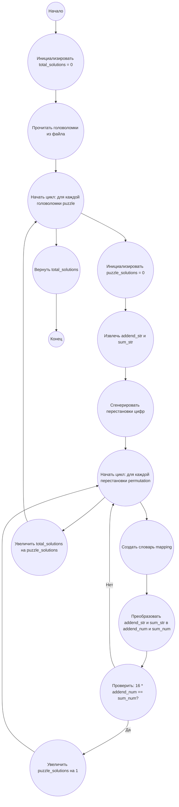

## Ответ на Задачу No 185: Числовые головоломки

### 1. Анализ задачи и решение
**Понимание задачи:**
*   Нам дано 40 головоломок, каждая из которых представляет собой уравнение вида `N * ABCDEFGHIJ = KLMNOPQRST`, где N - количество слагаемых (в нашем случае, всегда 16), а буквы представляют цифры от 0 до 9.
*   Необходимо найти количество решений для каждой головоломки, а затем сложить эти количества.
*   Решение головоломки - это такое назначение цифр буквам, при котором уравнение становится верным.
*   Важно, что одинаковые буквы должны представлять одинаковые цифры, а разные буквы - разные цифры.
*   Числа могут начинаться с 0.

**Решение:**
1.  **Чтение данных:** Считываем головоломки из файла `p185_numbers.txt`.
2.  **Генерация перестановок:** Для каждой головоломки перебираем все возможные перестановки цифр от 0 до 9.
3.  **Проверка решения:** Для каждой перестановки цифр:
    *   Подставляем цифры в слагаемое и сумму.
    *   Проверяем, что полученное умножение верно (умножаем слагаемое на 16 и сравниваем с суммой).
    *   Увеличиваем счетчик решений, если решение найдено.
4.  **Суммирование результатов:** Суммируем количество решений для всех головоломок.
5.  **Возврат результата:** Возвращаем общую сумму решений.

### 2. Алгоритм решения
1.  Начать
2.  Инициализировать переменную `total_solutions` со значением 0
3.  Прочитать головоломки из файла `p185_numbers.txt` в список строк.
4.  Для каждой головоломки `puzzle` в списке головоломок:
    *   Инициализировать переменную `puzzle_solutions` со значением 0
    *   Извлечь слагаемое `addend_str` и сумму `sum_str` из строки `puzzle`.
    *   Сгенерировать все возможные перестановки цифр от 0 до 9.
    *   Для каждой перестановки `permutation` цифр:
        *   Создать словарь `mapping`, где ключ - это буква из слагаемого и суммы, а значение - цифра из `permutation`.
        *   Преобразовать слагаемое `addend_str` и сумму `sum_str` в числа `addend_num` и `sum_num`, используя `mapping`.
        *   Если `16 * addend_num == sum_num`, то:
             * Увеличить `puzzle_solutions` на 1
    *   Увеличить `total_solutions` на `puzzle_solutions`
5.  Вернуть `total_solutions`
6.  Конец

### 3. Реализация на Python 3.12
```python
import itertools

def solve_puzzle(addend_str, sum_str):
    """
    Calculates the number of solutions for a single puzzle.
    """
    count = 0
    unique_chars = "".join(sorted(set(addend_str + sum_str)))
    for permutation in itertools.permutations(range(10), len(unique_chars)):
        mapping = dict(zip(unique_chars, permutation))
        addend_num = int("".join(str(mapping[char]) for char in addend_str))
        sum_num = int("".join(str(mapping[char]) for char in sum_str))
        if 16 * addend_num == sum_num:
            count += 1
    return count


def solve_all_puzzles(filename):
    """
    Reads puzzles from a file, solves each one, and returns the total count.
    """
    total_solutions = 0
    with open(filename, "r") as file:
        for line in file:
            addend_str = line[:10]
            sum_str = line[11:21]
            total_solutions += solve_puzzle(addend_str, sum_str)
    return total_solutions


if __name__ == "__main__":
    filename = "p185_numbers.txt"
    total_solutions = solve_all_puzzles(filename)
    print(total_solutions)
```

### 4. Блок-схема в формате mermaid


**Легенда:**
* **Начало, Конец:** Начало и конец алгоритма.
* **Инициализировать total_solutions:** Инициализируем переменную `total_solutions` для хранения общего количества решений и присваиваем ей значение 0.
* **Прочитать головоломки из файла:** Считываем головоломки из файла в список строк.
* **Начать цикл: для каждой головоломки puzzle, Конец цикла:** Организуем цикл перебора всех головоломок.
* **Инициализировать puzzle_solutions:** Инициализируем переменную `puzzle_solutions` для хранения количества решений для текущей головоломки и присваиваем ей значение 0.
* **Извлечь addend_str и sum_str:** Извлекаем строки слагаемого и суммы из текущей строки головоломки.
* **Сгенерировать перестановки цифр:** Генерируем все возможные перестановки цифр от 0 до 9.
* **Начать цикл: для каждой перестановки permutation, Конец цикла:** Организуем цикл перебора всех возможных перестановок.
* **Создать словарь mapping:** Создаем словарь, который связывает буквы с соответствующими цифрами из текущей перестановки.
* **Преобразовать addend_str и sum_str в addend_num и sum_num:** Преобразуем строковые представления слагаемого и суммы в числовые значения, используя словарь соответствий.
* **Проверить: 16 * addend_num == sum_num?** Проверяем, верно ли уравнение для текущей перестановки цифр.
* **Увеличить puzzle_solutions на 1:** Если уравнение верно, увеличиваем счетчик решений для текущей головоломки.
* **Увеличить total_solutions на puzzle_solutions:** После перебора всех перестановок, увеличиваем общий счетчик решений на количество решений текущей головоломки.
* **Вернуть total_solutions:** Возвращаем общее количество решений всех головоломок.
