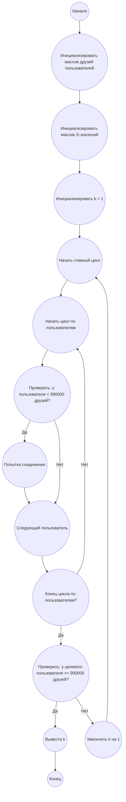

## Ответ на Задачу No 186: Подключения в социальной сети

### 1. Анализ задачи и решение
**Понимание задачи:**
*   Задача моделирует процесс установления связей (дружбы) между пользователями в социальной сети.
*   Для установления связи пользователь A пытается отправить сообщение пользователю B, выбирая случайного пользователя S(k).
*   Связь устанавливается, только если S(k) = B и B еще не друг A.
*   Генерация S(k) зависит от номера попытки k.
*   Необходимо найти минимальное k, при котором пользователь 524287 будет иметь не менее 990000 друзей.
*   Сложность заключается в моделировании динамики дружбы и в работе с генератором псевдослучайных чисел.

**Решение:**
1.  **Инициализация:**
    *   Создаем множество `friends` для каждого пользователя, где будем хранить номера его друзей.
    *   Создаем массив `s_values` для хранения значений генератора S(k).
2.  **Функция генерации S(k):** Реализуем функцию `generate_s(k)`, которая вычисляет S(k) в соответствии с условиями задачи.
3.  **Функция установления связи:** Реализуем функцию `try_connect(user_a, k)`, которая принимает номер пользователя A и номер попытки k:
    *   Вычисляем S(k).
    *   Если S(k) == user_a, то попытка провалена.
    *   Если S(k) не является другом user_a, то добавляем S(k) в друзья user_a и попытка удачная.
    *   В противном случае попытка провалена.
4.  **Основной цикл:**
    *   Начинаем с k = 1.
    *   Для каждого k, пытаемся установить связь для каждого пользователя, который еще не имеет 990000 друзей.
    *   Проверяем, достиг ли пользователь 524287 нужного количества друзей. Если да, то выводим k и заканчиваем.
    *   Увеличиваем k и продолжаем цикл.

### 2. Алгоритм решения
1.  Начать.
2.  Инициализировать пустой массив `friends` для каждого пользователя.
3.  Инициализировать пустой массив `s_values` для хранения результатов функции `S(k)`.
4.  Определить функцию `generate_s(k)` для вычисления S(k):
    *   Если `k <= 55`, то `s_value = (100003 - 200003 * k + 300007 * k**3) mod 1000000`
    *   Если `k > 55`, то `s_value = (s_values[k-25] + s_values[k-56]) mod 1000000`
    *   Добавить `s_value` в `s_values` по индексу `k`, вернуть `s_value`
5.  Определить функцию `try_connect(user_a, k)`:
    *   Вычислить `s_value = generate_s(k)`
    *   Если `s_value` равно `user_a` вернуть `False`
    *   Если `s_value` не в списке друзей `user_a`:
        *   Добавить `s_value` в список друзей `user_a`
        *   Вернуть `True`
    *   В противном случае вернуть `False`.
6.  Инициализировать `k = 1`
7.  Цикл пока пользователь 524287 не имеет 990000 друзей:
    *   Для каждого `user` от 1 до 1000000:
        *   Если количество друзей у `user` меньше 990000:
            *   Выполнить `try_connect(user, k)`.
    *   Увеличить k на 1.
8.  Вывести `k - 1` (поскольку цикл завершается при k+1)
9.  Завершить.

### 3. Реализация на Python 3.12
```python
def generate_s(k, s_values):
    if k <= 55:
        s_value = (100003 - 200003 * k + 300007 * k**3) % 1000000
    else:
        s_value = (s_values[k-25] + s_values[k-56]) % 1000000
    s_values[k] = s_value
    return s_value

def try_connect(user_a, k, friends, s_values):
    s_value = generate_s(k, s_values)
    if s_value == user_a:
        return False
    if s_value not in friends[user_a]:
        friends[user_a].add(s_value)
        return True
    return False

def solve():
    num_users = 1000000
    friends = [set() for _ in range(num_users + 1)]
    s_values = [0] * (1000000 * 50)  # Allocate space for S values
    target_user = 524287
    target_friends = 990000
    k = 1
    
    while True:
      for user in range(1, num_users + 1):
          if len(friends[user]) < target_friends:
            try_connect(user, k, friends, s_values)
      
      if len(friends[target_user]) >= target_friends:
          print(k)
          return
      k += 1

solve()
```

### 4. Блок-схема в формате mermaid


**Legenda:**
* **Начало, Конец:** Начало и конец алгоритма.
* **Инициализировать массив друзей пользователей:** Создаем массив, в котором для каждого пользователя хранится информация о его друзьях.
* **Инициализировать массив S-значений:** Создаем массив для хранения результатов функции генератора случайных чисел S(k).
* **Инициализировать k = 1:** Задаем начальное значение счетчику попыток установления связи.
* **Начать главный цикл:** Начало цикла, который продолжается пока не выполнится условие выхода (пока целевой пользователь не получит нужное количество друзей).
* **Начать цикл по пользователям:** Начало цикла перебора всех пользователей.
* **Проверить: у пользователя < 990000 друзей?:** Проверяем, достиг ли пользователь необходимого количества друзей, чтобы попытаться установить новые связи.
* **Попытка соединения:** Функция, которая пытается установить связь для текущего пользователя с помощью генератора S(k).
* **Следующий пользователь:** Переход к следующему пользователю в цикле.
* **Конец цикла по пользователям?:** Проверяем, закончился ли перебор всех пользователей.
* **Проверить: у целевого пользователя >= 990000 друзей?:** Проверяем, достиг ли целевой пользователь необходимого количества друзей.
* **Вывести k:** Выводим значение k, когда выполнилось условие выхода.
* **Увеличить k на 1:** Увеличиваем счетчик попыток на 1.
