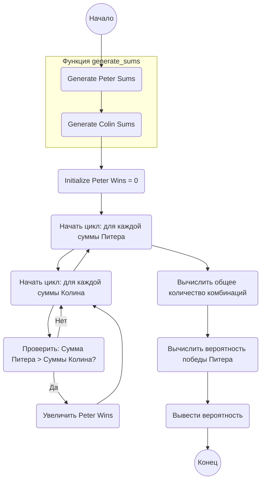

## Ответ на Задачу No 205: Игра в кости

### 1. Анализ задачи и решение
**Понимание задачи:**
* Питер бросает 9 четырехгранных кубиков (грани 1-4).
* Колин бросает 6 шестигранных кубиков (грани 1-6).
* Нужно найти вероятность того, что сумма очков Питера больше, чем сумма очков Колина.

**Решение:**
1. **Генерация всех возможных сумм:** Необходимо вычислить все возможные суммы, которые могут получиться у Питера и Колина, а также посчитать количество способов получить каждую сумму.
2. **Сравнение сумм:** Перебираем все возможные суммы Питера и Колина, и если сумма Питера больше суммы Колина, то увеличиваем счетчик побед Питера.
3. **Расчет вероятности:** Делим количество побед Питера на общее количество возможных комбинаций сумм (произведение количества всех возможных сумм Питера на количество всех возможных сумм Колина).

Для генерации возможных сумм будем использовать рекурсивную функцию, которая будет для каждого кубика добавлять его значения к ранее сгенерированным суммам.

### 2. Алгоритм решения
1. Начать
2. Функция `generate_sums(num_dice, sides)`:
    *   Если `num_dice` равно 0, вернуть словарь `{0: 1}` (сумма 0 с 1 способом)
    *   Иначе:
        *   Вызвать рекурсивно `generate_sums(num_dice - 1, sides)`
        *   Создать пустой словарь `sums`
        *   Для каждой суммы `prev_sum` и ее количества `count` из результатов предыдущего рекурсивного вызова:
            *   Для каждого значения грани `side` от 1 до `sides`:
                *   Новая сумма `new_sum` = `prev_sum` + `side`
                *   Увеличить количество `new_sum` в `sums` на `count`, иначе добавить `new_sum` со значением `count`.
        *   Вернуть словарь `sums`
3. Сгенерировать суммы Питера `peter_sums` = `generate_sums(9, 4)`
4. Сгенерировать суммы Колина `colin_sums` = `generate_sums(6, 6)`
5. Инициализировать счетчик побед Питера `peter_wins` = 0
6. Для каждой суммы `peter_sum` и ее количества `peter_count` из `peter_sums`:
    *   Для каждой суммы `colin_sum` и ее количества `colin_count` из `colin_sums`:
        *   Если `peter_sum` > `colin_sum`, то `peter_wins` += `peter_count` * `colin_count`
7. Вычислить общее количество комбинаций `total_combinations` = (сумма всех значений в `peter_sums`) * (сумма всех значений в `colin_sums`)
8. Вычислить вероятность победы Питера `probability` = `peter_wins` / `total_combinations`
9. Вывести `probability`
10. Конец

### 3. Реализация на Python 3.12
```python
def generate_sums(num_dice, sides):
    if num_dice == 0:
        return {0: 1}
    prev_sums = generate_sums(num_dice - 1, sides)
    sums = {}
    for prev_sum, count in prev_sums.items():
        for side in range(1, sides + 1):
            new_sum = prev_sum + side
            sums[new_sum] = sums.get(new_sum, 0) + count
    return sums

peter_sums = generate_sums(9, 4)
colin_sums = generate_sums(6, 6)

peter_wins = 0
for peter_sum, peter_count in peter_sums.items():
    for colin_sum, colin_count in colin_sums.items():
        if peter_sum > colin_sum:
            peter_wins += peter_count * colin_count

total_combinations = sum(peter_sums.values()) * sum(colin_sums.values())
probability = peter_wins / total_combinations

print(f"{probability:.7f}")
```

### 4. Блок-схема в формате mermaid


**Легенда:**
*   **Начало, Конец:** Начало и конец алгоритма.
*   **Generate Peter Sums:** Вызов функции `generate_sums` для генерации всех возможных сумм Питера.
*  **Generate Colin Sums:** Вызов функции `generate_sums` для генерации всех возможных сумм Колина.
*   **Initialize Peter Wins:** Инициализирует счетчик побед Питера значением 0.
*   **Начать цикл: для каждой суммы Питера:** Начало цикла по всем возможным суммам Питера.
*    **Начать цикл: для каждой суммы Колина:** Начало вложенного цикла по всем возможным суммам Колина.
*  **Проверить: Сумма Питера > Суммы Колина?:** Проверяет, больше ли текущая сумма Питера, чем текущая сумма Колина.
*   **Увеличить Peter Wins:** Если условие выполняется, то увеличивает счетчик побед Питера.
*    **Вычислить общее количество комбинаций:** Вычисляет общее количество возможных комбинаций сумм.
*    **Вычислить вероятность победы Питера:** Вычисляет вероятность победы Питера, поделив количество побед Питера на общее количество комбинаций.
*   **Вывести вероятность:** Выводит посчитанную вероятность.
