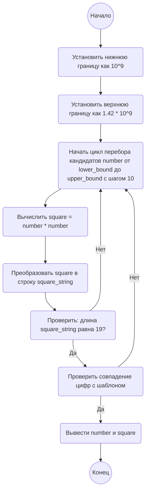

## Ответ на Задачу No 206: Скрытая последовательность квадратов

### 1. Анализ задачи и решение
**Понимание задачи:**
*   Нам нужно найти такое положительное целое число, квадрат которого имеет вид 1_2_3_4_5_6_7_8_9_0, где на месте "_" может стоять любая цифра. Это значит, что искомый квадрат имеет 10 известных цифр и 8 неизвестных.
*   Задача сводится к поиску такого числа, при возведении которого в квадрат получается число, удовлетворяющее шаблону.
*   Поскольку число заканчивается на 0, то искомое число должно заканчиваться на 0.

**Решение:**
1. **Определение границ:** Оценим нижнюю и верхнюю границы для искомого числа. Квадрат должен начинаться с 1 и иметь 19 цифр, то есть он не меньше 10^18. Следовательно, само число не меньше sqrt(10^18) = 10^9 = 1 000 000 000. Аналогично верхняя граница sqrt(2 * 10^19) ~ 1.41 * 10^9
2. **Перебор кандидатов:** Поскольку искомое число должно заканчиваться на 0, будем перебирать числа вида `x * 10`, где x - целое.
3. **Проверка шаблона:** После возведения кандидата в квадрат, преобразуем результат в строку и сравним её с шаблоном, проверяя соответствие известных цифр.

### 2. Алгоритм решения
1. Начать
2. Определить нижнюю границу `lower_bound` как 10^9
3. Определить верхнюю границу `upper_bound` как 1.42 * 10^9
4. Начать цикл перебора кандидатов `number` от `lower_bound` до `upper_bound` с шагом 10
5.  Вычислить квадрат числа `square = number * number`.
6.  Преобразовать квадрат `square` в строку `square_string`.
7.  Проверить длину `square_string`, она должна быть равна 19.
8.  Если длина `square_string` не равна 19, перейти к следующему кандидату.
9.  Проверить совпадение цифр с шаблоном "1_2_3_4_5_6_7_8_9_0":
    * `square_string[0]` должен быть равен "1"
    * `square_string[2]` должен быть равен "2"
    * `square_string[4]` должен быть равен "3"
    * `square_string[6]` должен быть равен "4"
    * `square_string[8]` должен быть равен "5"
    * `square_string[10]` должен быть равен "6"
    * `square_string[12]` должен быть равен "7"
    * `square_string[14]` должен быть равен "8"
    * `square_string[16]` должен быть равен "9"
    * `square_string[18]` должен быть равен "0"
10. Если все проверки пройдены, вывести найденное число `number` и его квадрат `square`.
11. Завершить выполнение.

### 3. Реализация на Python 3.12
```python
import math

def find_hidden_square():
    """
    Finds the positive integer whose square has the form 1_2_3_4_5_6_7_8_9_0.
    """
    lower_bound = 10**9
    upper_bound = int(1.42 * 10**9)  # Adjusted upper bound
    for number in range(lower_bound, upper_bound, 10):
        square = number * number
        square_string = str(square)
        if len(square_string) != 19:
            continue
        if (square_string[0] == '1' and
            square_string[2] == '2' and
            square_string[4] == '3' and
            square_string[6] == '4' and
            square_string[8] == '5' and
            square_string[10] == '6' and
            square_string[12] == '7' and
            square_string[14] == '8' and
            square_string[16] == '9' and
            square_string[18] == '0'):
            print(f"The number is: {number}")
            print(f"The square is: {square}")
            return

find_hidden_square()
```

### 4. Блок-схема в формате mermaid

**Легенда:**
*   **Начало, Конец:** Начало и конец алгоритма.
*   **Установить нижнюю границу:** Устанавливается нижняя граница для поиска искомого числа.
*   **Установить верхнюю границу:** Устанавливается верхняя граница для поиска искомого числа.
*   **Начать цикл перебора кандидатов:** Начало цикла, перебирающего числа с шагом 10 в заданном диапазоне.
*   **Вычислить square:** Возведение числа в квадрат.
*   **Преобразовать square в строку:** Квадрат преобразуется в строковый формат для проверки шаблона.
*   **Проверить: длина square_string равна 19?:** Проверяется, соответствует ли длина строки квадрата ожидаемому значению.
*  **Проверить совпадение цифр с шаблоном:** Проверка соответствия строки квадрата заданному шаблону 1_2_3_4_5_6_7_8_9_0.
*   **Вывести number и square:** Вывод найденного числа и его квадрата.
