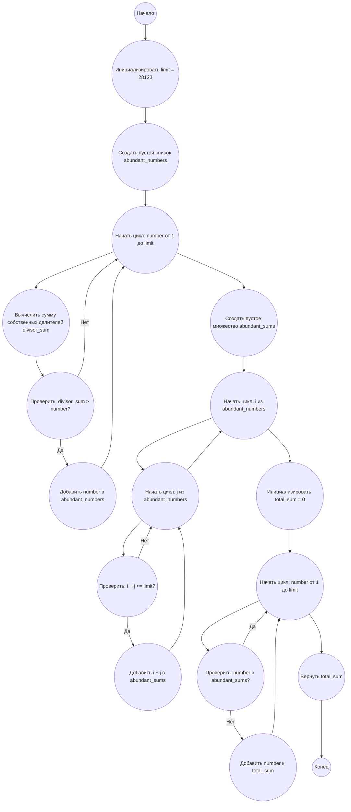

## Ответ на Задачу No 23: Недостаточные и избыточные числа

### 1. Анализ задачи и решение
**Понимание задачи:**
*   **Совершенные числа:** Число равно сумме своих собственных делителей (например, 28 = 1 + 2 + 4 + 7 + 14).
*   **Недостаточные числа:** Сумма собственных делителей меньше самого числа.
*   **Избыточные числа:** Сумма собственных делителей больше самого числа.
*   Необходимо найти все числа до 28123, которые нельзя представить в виде суммы двух избыточных чисел.

**Решение:**
1.  **Найти избыточные числа:** Необходимо определить все избыточные числа в пределах от 1 до 28123. Для этого для каждого числа нужно найти сумму его собственных делителей и сравнить эту сумму с самим числом.
2.  **Создать список избыточных чисел:** Сохраняем все найденные избыточные числа в отдельный список.
3.  **Найти суммы двух избыточных чисел:** Генерируем все возможные суммы из двух чисел из списка избыточных чисел.
4.  **Найти числа, не представимые как сумма:** Создаем множество (set) из всех возможных сумм двух избыточных чисел. Проходим по всем числам от 1 до 28123 и проверяем, есть ли они в этом множестве. Если числа нет в множестве, то добавляем его к общей сумме.
5.  **Возврат результата:** Возвращаем общую сумму всех чисел, которые нельзя представить как сумму двух избыточных чисел.

### 2. Алгоритм решения
1.  Начать
2.  Инициализировать `limit` = 28123
3.  Создать пустой список `abundant_numbers`
4.  Для каждого числа `number` от 1 до `limit`
    *   Найти сумму собственных делителей `divisor_sum`
    *   Если `divisor_sum > number`
        *   Добавить `number` в `abundant_numbers`
5.  Создать пустое множество `abundant_sums`
6.  Для каждого числа `i` из `abundant_numbers`
    *   Для каждого числа `j` из `abundant_numbers`
        *   Если `i + j <= limit`
            *   Добавить `i + j` в `abundant_sums`
7.  Инициализировать `total_sum` = 0
8.  Для каждого числа `number` от 1 до `limit`
    *   Если `number` не в `abundant_sums`
        *   Добавить `number` к `total_sum`
9.  Вернуть `total_sum`
10. Конец

### 3. Реализация на Python 3.12
```python
def sum_of_divisors(number):
  """Calculates the sum of proper divisors of a number."""
  total = 0
  for i in range(1, number):
    if number % i == 0:
      total += i
  return total

def find_abundant_numbers(limit):
    """Finds all abundant numbers up to a limit."""
    abundant_numbers = []
    for number in range(1, limit + 1):
        if sum_of_divisors(number) > number:
            abundant_numbers.append(number)
    return abundant_numbers

def solve():
    limit = 28123
    abundant_numbers = find_abundant_numbers(limit)
    abundant_sums = set()
    for i in abundant_numbers:
        for j in abundant_numbers:
            if i + j <= limit:
                abundant_sums.add(i + j)

    total_sum = 0
    for number in range(1, limit + 1):
        if number not in abundant_sums:
            total_sum += number
    return total_sum


if __name__ == "__main__":
    result = solve()
    print(result)
```

### 4. Блок-схема в формате mermaid


**Легенда:**
*   **Начало, Конец:** Начало и конец алгоритма.
*   **Инициализировать limit:** Присваиваем переменной `limit` значение 28123.
*   **Создать пустой список abundant\_numbers:** Инициализируем пустой список для хранения избыточных чисел.
*   **Начать цикл: number от 1 до limit:** Начало цикла перебора чисел от 1 до `limit`.
*   **Вычислить сумму собственных делителей divisor\_sum:** Вычисляем сумму делителей текущего числа.
*   **Проверить: divisor\_sum > number?:** Проверяем, является ли текущее число избыточным.
*   **Добавить number в abundant\_numbers:** Добавляем текущее число в список избыточных чисел, если оно избыточное.
*   **Создать пустое множество abundant\_sums:** Инициализируем пустое множество для хранения сумм двух избыточных чисел.
*   **Начать цикл: i из abundant\_numbers:** Начало цикла перебора избыточных чисел.
*  **Начать цикл: j из abundant\_numbers:** Начало вложенного цикла перебора избыточных чисел.
*  **Проверить: i + j <= limit?:** Проверяем сумму двух избыточных чисел на превышение предела.
*   **Добавить i + j в abundant\_sums:** Добавляем сумму двух избыточных чисел в множество, если она не превышает лимит.
*   **Инициализировать total\_sum = 0:** Инициализируем переменную для хранения суммы чисел, не являющихся суммой двух избыточных.
*   **Начать цикл: number от 1 до limit:** Начало цикла перебора чисел от 1 до `limit` для проверки.
*   **Проверить: number в abundant\_sums?:** Проверяем, является ли текущее число суммой двух избыточных.
*   **Добавить number к total\_sum:** Добавляем текущее число к общей сумме, если оно не является суммой двух избыточных.
*   **Вернуть total\_sum:** Возвращаем общую сумму.
