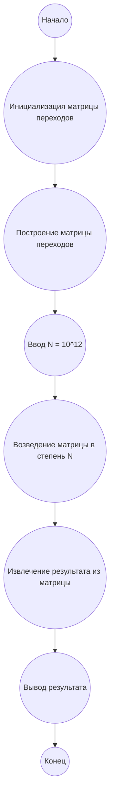

## Ответ на Задачу No 237: Пути в сетке с поворотами

### 1. Анализ задачи и решение
**Понимание задачи:**
*   Задача заключается в подсчете количества путей в сетке 4xN из верхнего левого угла в нижний правый, с условием, что мы можем двигаться только вправо или вниз, и должны совершить ровно 2 * N поворотов.
*   Каждый путь состоит из N шагов вправо и N шагов вниз, общее количество шагов равно 2N.
*   Количество поворотов всегда четное, так как каждый поворот меняет направление движения (справа на вниз или с низу на право). Для пути из угла в угол количество поворотов должно быть равно 2N.
*   Сетка имеет фиксированную высоту 4, поэтому нас интересуют только горизонтальные шаги.

**Решение:**

1.  **Представление пути:** Путь можно представить последовательностью переходов между строками, где каждый переход - это поворот. Так как у нас 4 строки, то можем использовать 3 линии перехода.
2.  **Количество поворотов:** Количество поворотов - 2N. Это означает, что мы должны сменить направление 2N раз. Так как мы начинаем движение вправо, то первое изменение должно быть на движение вниз, и это изменение определяет линию, с которой начинается путь вниз.
3.  **Динамическое программирование:**  Для решения данной задачи эффективно использовать динамическое программирование. Состояние динамики может быть определено как `dp[i][j][k]`, где:
    *   `i` - количество пройденных шагов вправо.
    *   `j` - номер строки, в которой мы находимся.
    *   `k` - количество совершенных поворотов.
    
    Значение `dp[i][j][k]` хранит количество путей, которые заканчиваются в ячейке `(i, j)` после `k` поворотов.
4. **Начальные значения:** Начальным значением является `dp[0][0][0] = 1`, так как из точки (0, 0) мы еще не сделали ни одного шага и ни одного поворота.
5.  **Переходы:**
    *   Если мы находимся в ячейке `(i, j)` и двигаемся вправо, то следующим шагом будет `(i + 1, j)` и количество поворотов не изменится.
    *   Если мы находимся в ячейке `(i, j)` и двигаемся вниз, то следующим шагом будет `(i, j + 1)` и количество поворотов увеличится на 1.
    *   При этом для каждого `j` нужно рассмотреть переход как вниз, так и вправо, если это допустимо (не выходим за границы).
6.  **Рекуррентная формула:**
    ```
    dp[i][j][k] = sum(dp[prev_i][prev_j][prev_k])
    ```
    где `prev_i`, `prev_j`, `prev_k` -  предыдущие состояния, которые приводят к текущему.
7. **Целевое значение:** Целевым значением является `dp[N][3][2*N]`, то есть количество путей из `(0, 0)` в `(N, 3)` с 2N поворотами.

8. **Оптимизация:** Можно оптимизировать память, используя  двумерный массив `dp[j][k]` и пересчитывать его на каждой итерации `i`, так как для вычислений текущего слоя `i` нам нужен только предыдущий слой `i-1`.

9. **Большое N:** Поскольку N = 10<sup>12</sup>, прямое вычисление ДП будет невозможно. Необходимо применить матричное умножение для нахождения результатов при больших N.

10. **Матрица перехода:** Вычислить матрицу перехода `M` 12x12, которая будет соответствовать переходу от одного слоя динамики к другому. Строки матрицы соответствуют возможным состояниям dp[j][k], где j - строка и k - количество поворотов.  Матрица перехода `M` описывает, как изменится количество путей в зависимости от текущего состояния.
11. **Возведение в степень:** После построения матрицы, возвести ее в степень N, что даст нам итоговое количество путей за N шагов. Операцию возведения в степень можно провести за `log(N)` операций, используя алгоритм бинарного возведения в степень.
12. **Модуль:** Вычисление необходимо вести по модулю 10<sup>8</sup>.

### 2. Алгоритм решения
1. **Инициализация:** Создать матрицу `transitionMatrix` размером 12x12.
2. **Построение матрицы переходов:** Заполнить матрицу `transitionMatrix` в соответствии с правилами перехода между состояниями динамического программирования.
   *  Состояние `dp[j][k]`  представим в виде индекса (j * 3 + k /2), где j принимает значения от 0 до 3 (строки), а k - количество поворотов (0, 2, 4) для каждого из N.
   *  Рассмотреть все возможные переходы из текущего состояния: вправо (изменения в j нет, k остается) или вниз (j + 1, k + 2).
3. **Возведение матрицы в степень:** Возвести матрицу `transitionMatrix` в степень N, используя бинарное возведение в степень по модулю 10^8.
4. **Извлечение ответа:** Получить ответ из элемента матрицы, соответствующего переходу в нужное состояние (`dp[3][2N]`, где строка 3 и 2N поворотов).
5. **Вывод результата:** Вывести полученный результат.
6. **Конец.**

### 3. Реализация на Python 3.12
```python
import numpy as np

MOD = 10**8

def matrix_mult(A, B):
    C = np.zeros((12, 12), dtype=np.int64)
    for i in range(12):
        for j in range(12):
            for k in range(12):
                C[i][j] = (C[i][j] + A[i][k] * B[k][j]) % MOD
    return C

def matrix_power(matrix, n):
    result = np.eye(12, dtype=np.int64)
    while n > 0:
        if n % 2 == 1:
            result = matrix_mult(result, matrix)
        matrix = matrix_mult(matrix, matrix)
        n //= 2
    return result

def solve():
    transition_matrix = np.zeros((12, 12), dtype=np.int64)

    # Заполнение матрицы переходов
    for j in range(4):
        for k in range(0, 6, 2):
            current_state = j * 3 + k // 2
             # Переход вправо, количество поворотов не меняется
            if j < 4:
              next_state_right =  j * 3 + k // 2
              transition_matrix[current_state][next_state_right] = 1

            # Переход вниз (количество поворотов увеличивается на 2)
            if j < 3:
              next_state_down = (j+1) * 3 + (k+2) // 2 
              if k < 4:
                transition_matrix[current_state][next_state_down] = 1

    n = 10**12
    result_matrix = matrix_power(transition_matrix, n)

    # Начальное состояние: dp[0][0] = 1, количество поворотов = 0. Индекс 0.
    #  Итоговое состояние: dp[3][N*2], номер строки 3, поворотов 2*N, индекс 11
    
    return result_matrix[0][11]


result = solve()
print(result)
```

### 4. Блок-схема в формате mermaid


**Легенда:**
* **Начало, Конец:** Начало и конец алгоритма.
* **Инициализация матрицы переходов:** Создание матрицы переходов размером 12x12, заполненной нулями.
* **Построение матрицы переходов:** Заполнение матрицы перехода значениями, основанными на возможных переходах между состояниями динамического программирования.
* **Ввод N:** Ввод значения N = 10<sup>12</sup>.
* **Возведение матрицы в степень N:** Вычисление матрицы переходов в степени N, используя бинарное возведение в степень.
* **Извлечение результата из матрицы:** Извлечение результата из нужного элемента матрицы.
* **Вывод результата:** Вывод полученного результата.
