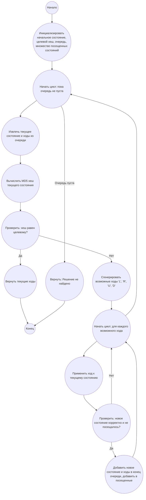

## Ответ на Задачу No 244: Сдвиги в головоломке

### 1. Анализ задачи и решение

**Понимание задачи:**
*   Дана головоломка 4x4 с 15 пронумерованными плитками и одной пустой клеткой (0).
*   Необходимо найти кратчайшую последовательность ходов (L, R, U, D), которая, начиная с начальной конфигурации, приведет к состоянию, хеш MD5 которого равен заданному хешу.
*   Если есть несколько кратчайших решений, нужно выбрать лексикографически наименьшее.
*   Функция F(s) применяет последовательность ходов s к начальной конфигурации и возвращает строковое представление головоломки.
*   Функция G(s) вычисляет MD5 хеш строкового представления головоломки после применения ходов s.

**Решение:**

1.  **Представление головоломки:** Головоломку будем представлять в виде списка целых чисел.
2.  **Функция F(s):**
    *   Реализуем функцию, которая принимает текущее состояние головоломки и последовательность ходов, и возвращает новое состояние.
    *   Нужно следить за позицией пустой клетки (0) и перемещать соседние плитки в нее в соответствии с ходами.
3.  **Функция G(s):**
    *   Реализуем функцию, которая принимает состояние головоломки и возвращает MD5 хеш его строкового представления.
4.  **Поиск в ширину (BFS):**
    *   Используем поиск в ширину, чтобы найти кратчайший путь к целевому состоянию.
    *   Начнем с начального состояния и пустой строки ходов.
    *   На каждом шаге BFS, генерируем все возможные ходы (L, R, U, D) для текущего состояния.
    *   Если полученное состояние имеет MD5 хеш, равный целевому, то решение найдено.
    *   Если не найдено, то продолжаем поиск.
    *   Чтобы получить лексикографически наименьшее решение, будем добавлять ходы в порядке 'L', 'R', 'U', 'D' при обходе дерева.

### 2. Алгоритм решения

1.  Начать.
2.  Инициализировать начальное состояние головоломки: `initial_state = [1, 2, 3, 4, 5, 6, 7, 8, 9, 10, 11, 12, 13, 14, 15, 0]`.
3.  Инициализировать очередь `queue` с начальным состоянием и пустой строкой ходов: `queue = [(initial_state, "")]`.
4.  Инициализировать множество посещенных состояний: `visited = {tuple(initial_state)}`.
5.  Пока очередь `queue` не пуста:
    *   Извлечь из очереди текущее состояние `current_state` и строку ходов `current_moves`.
    *   Вычислить MD5 хеш строкового представления `current_state` с помощью функции `G` и сохранить в `current_hash`.
    *   Если `current_hash` равен целевому хешу `86b5960b520812ad850c878864a84454`:
        *   Вернуть `current_moves`.
        *   Завершить алгоритм.
    *   Получить индекс пустой клетки 0 в `current_state`.
    *   Для каждого возможного хода `move` в порядке 'L', 'R', 'U', 'D':
        *   Вычислить новое состояние `next_state` и новую строку ходов `next_moves`  применяя ход `move` к `current_state`.
        *  Если `next_state` является корректным состоянием и его не посещали ранее, то:
            *  Добавить `next_state` и `next_moves` в конец очереди `queue`.
            *   Добавить `tuple(next_state)` в множество посещенных состояний `visited`.
6.  Если очередь пуста и целевой хеш не был найден, вернуть "Решение не найдено".
7.  Завершить алгоритм.

### 3. Реализация на Python 3.12
```python
import hashlib
from collections import deque

def apply_move(state, move):
    """Применяет ход к состоянию головоломки."""
    zero_index = state.index(0)
    new_state = list(state)

    if move == 'L':
        if zero_index % 4 > 0:
            new_state[zero_index], new_state[zero_index - 1] = new_state[zero_index - 1], new_state[zero_index]
            return new_state
    elif move == 'R':
        if zero_index % 4 < 3:
            new_state[zero_index], new_state[zero_index + 1] = new_state[zero_index + 1], new_state[zero_index]
            return new_state
    elif move == 'U':
        if zero_index // 4 > 0:
            new_state[zero_index], new_state[zero_index - 4] = new_state[zero_index - 4], new_state[zero_index]
            return new_state
    elif move == 'D':
        if zero_index // 4 < 3:
            new_state[zero_index], new_state[zero_index + 4] = new_state[zero_index + 4], new_state[zero_index]
            return new_state
    return None

def get_string_representation(state):
    """Возвращает строковое представление головоломки."""
    return "".join(map(str, state))

def calculate_md5_hash(state):
    """Вычисляет MD5 хеш строкового представления головоломки."""
    string_repr = get_string_representation(state)
    md5_hash = hashlib.md5(string_repr.encode()).hexdigest()
    return md5_hash

def solve_puzzle():
    """Решает головоломку и возвращает кратчайшую последовательность ходов."""
    initial_state = [1, 2, 3, 4, 5, 6, 7, 8, 9, 10, 11, 12, 13, 14, 15, 0]
    target_hash = '86b5960b520812ad850c878864a84454'
    queue = deque([(initial_state, "")])
    visited = {tuple(initial_state)}
    moves_order = ['L', 'R', 'U', 'D']

    while queue:
        current_state, current_moves = queue.popleft()
        current_hash = calculate_md5_hash(current_state)
        
        if current_hash == target_hash:
            return current_moves

        for move in moves_order:
            next_state = apply_move(current_state, move)
            if next_state and tuple(next_state) not in visited:
                next_moves = current_moves + move
                queue.append((next_state, next_moves))
                visited.add(tuple(next_state))
    return "Решение не найдено"

# Вызов функции и вывод результата
result = solve_puzzle()
print(result)
```

### 4. Блок-схема в формате mermaid


**Легенда:**

*   **Начало, Конец:** Начало и конец алгоритма.
*   **Инициализировать начальное состояние, целевой хеш, очередь, множество посещенных состояний:** Инициализация переменных: начальное состояние головоломки, целевой MD5 хеш, очередь для обхода BFS и множество для хранения посещенных состояний.
*   **Начать цикл: пока очередь не пуста:** Начало цикла, пока в очереди есть состояния для обработки.
*   **Извлечь текущее состояние и ходы из очереди:** Извлечение первого элемента из очереди (состояние головоломки и соответствующая последовательность ходов).
*   **Вычислить MD5 хеш текущего состояния:** Вычисление MD5 хеша для текущего состояния головоломки.
*   **Проверить: хеш равен целевому?:** Проверка, равен ли вычисленный хеш целевому.
*   **Вернуть текущие ходы:** Возврат последовательности ходов, если текущий хеш равен целевому.
*   **Сгенерировать возможные ходы 'L', 'R', 'U', 'D':** Генерация всех возможных ходов для текущего состояния головоломки.
*  **Начать цикл: для каждого возможного хода**: Начало цикла перебора всех сгенерированных ходов.
*   **Применить ход к текущему состоянию:** Применение текущего хода к состоянию головоломки для получения нового состояния.
*   **Проверить: новое состояние корректно и не посещалось?:** Проверка, является ли новое состояние корректным (возможным для данной головоломки) и не было ли оно посещено ранее.
*   **Добавить новое состояние и ходы в конец очереди, добавить в посещенные:** Если новое состояние корректно и не посещалось, оно добавляется в очередь для дальнейшей обработки, а также добавляется в множество посещенных состояний.
*   **Вернуть: Решение не найдено:**  Возвращение сообщения, что решение не найдено, если очередь пуста и целевое состояние не достигнуто.
