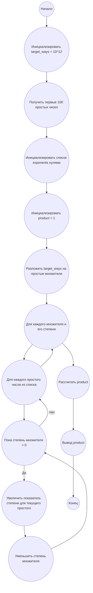

## Ответ на Задачу No 248: Числа генерации

### 1. Анализ задачи и решение

**Понимание задачи:**

*   Нам дано множество `S`, состоящее из первых 100 простых чисел.
*   Функция `f(n)` возвращает количество способов, которыми число `n` может быть представлено как произведение элементов из `S` (порядок множителей не важен).
*   Функция `g(n)` возвращает наименьшее число `k`, для которого `f(k) = n`.
*   Нам нужно найти `g(10^12)` для `S`, состоящего из первых 100 простых чисел.

**Ключевые идеи:**

1.  **Представление числа в виде произведения:** Любое число, которое может быть представлено как произведение элементов из `S`, может быть записано в виде: `n = p1^a1 * p2^a2 * ... * pk^ak`, где `p1, p2, ..., pk` - простые числа из `S`, а `a1, a2, ..., ak` - неотрицательные целые числа (показатели степени).
2.  **Количество способов разложения:** Функция `f(n)` фактически подсчитывает количество способов, которыми мы можем выбрать показатели степеней `a1, a2, ..., ak`. Если `n = p1^a1 * p2^a2 * ... * pk^ak`, тогда `f(n) = (a1 + 1) * (a2 + 1) * ... * (ak + 1)`. Это связано с тем, что каждый показатель степени `ai` может быть выбран любым числом от 0 до `ai`, и все эти выборы независимы.
3.  **Минимизация `k`:** Чтобы минимизировать `k`, нужно максимизировать показатели степеней `ai` при заданном произведении `(a1 + 1) * (a2 + 1) * ... * (ak + 1)`. Поскольку первые простые числа меньше, то лучше использовать большие показатели степеней для маленьких простых чисел.

**Решение:**

1.  Разложим `10^12` на простые множители: `10^12 = 2^12 * 5^12`. Это означает, что произведение `(a1 + 1) * (a2 + 1) * ... * (ak + 1) = 2^12 * 5^12`.
2.  Чтобы минимизировать `k`, мы должны "распределить" множители 2 и 5 по показателям степеней (аi + 1)  максимально рационально. Т.е мы должны использовать как можно больше множителей, чтобы показатели степеней `ai` были малы.
3. Поскольку нам нужно найти минимальное число k, то надо использовать первые простые числа из множества S. Т.е. p1 = 2, p2 = 3, p3 = 5...
4.  Рассмотрим распределение множителей 2 и 5 в произведение (a1 + 1) * (a2 + 1) * ... * (ak + 1). Начнем с присваивания степеней наименьшим простым числам из S, максимизируя показатели степеней.

### 2. Алгоритм решения

1.  Начать
2.  Инициализировать `target_ways` = `10^12`.
3.  Инициализировать `primes` = список первых 100 простых чисел.
4.  Инициализировать `exponents` = список из 100 нулей (показатели степеней для каждого простого числа).
5.  Инициализировать `product` = 1.
6.  Разложим `target_ways` на простые множители (2 и 5). `target_ways = 2^12 * 5^12`.
7.  Для каждого простого множителя `p` с показателем `e` из разложения `target_ways`:
    *  Для i от 0 до 100:
      * Пока  `e > 0`:
           *   Увеличить `exponents[i]` на 1 (соответствует добавлению множителя p)
           *   Уменьшить `e` на 1
8.  Для каждого простого числа `primes[i]` и показателя степени `exponents[i]`:
        *   Умножить `product` на  `primes[i]` в степени `exponents[i]`
9.  Вернуть `product`
10. Конец

### 3. Реализация на Python 3.12

```python
import math

def get_primes(limit):
    """Generate primes up to a given limit."""
    is_prime = [True] * (limit + 1)
    is_prime[0] = is_prime[1] = False
    for i in range(2, int(math.sqrt(limit)) + 1):
        if is_prime[i]:
            for j in range(i * i, limit + 1, i):
                is_prime[j] = False
    return [i for i, prime in enumerate(is_prime) if prime]

def solve():
  """Calculates the smallest number k such that f(k) = 10^12 for S = first 100 primes."""
  target_ways = 10**12
  primes = get_primes(600) # достаточно первых 100, но можно сделать с запасом
  primes = primes[:100]

  exponents = [0] * len(primes)
  product = 1
  
  factors = {}
  n = target_ways
  i = 2
  while i * i <= n:
      if n % i:
          i += 1
      else:
          n //= i
          factors[i] = factors.get(i, 0) + 1
  if n > 1:
      factors[n] = factors.get(n, 0) + 1
  
  for factor, count in factors.items():
    for prime_index in range(len(primes)):
        while count > 0:
            exponents[prime_index] += 1
            count -= 1

  for i in range(len(primes)):
        product *= primes[i] ** exponents[i]


  return product

result = solve()
print(result)
```

### 4. Блок-схема в формате mermaid



**Легенда:**

* **Start, End:** Начало и конец алгоритма.
*   **InitializeTargetWays:** Инициализация переменной `target_ways` со значением `10^12`.
*   **GetFirst100Primes:** Получение списка первых 100 простых чисел.
*   **InitializeExponents:**  Инициализация списка `exponents` нулями.
*   **InitializeProduct:** Инициализация переменной `product` значением 1.
*   **FactorizeTargetWays:** Разложение `target_ways` на простые множители.
*   **LoopFactors:** Цикл по простым множителям `target_ways`.
*   **LoopPrimes:** Цикл по списку первых 100 простых чисел.
*   **WhileExponent:** Цикл, выполняемый пока степень множителя больше 0.
*   **IncrementExponent:** Увеличение показателя степени для текущего простого числа.
*   **DecrementFactorExponent:** Уменьшение степени множителя.
*   **CalculateProduct:** Расчет произведения `product` с учетом простых чисел и их степеней.
*  **Output:** Вывод результата `product`.
