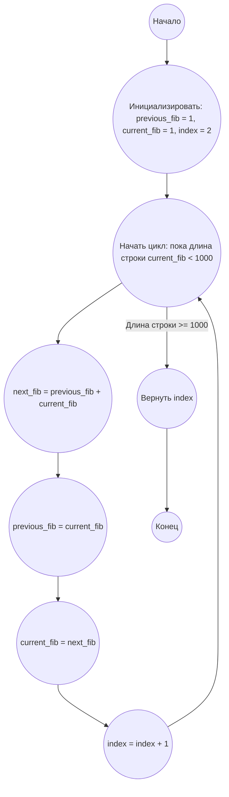

## Ответ на Задачу No 25: 1000-значное число Фибоначчи

### 1. Анализ задачи и решение
**Понимание задачи:**
*   Необходимо найти порядковый номер первого числа Фибоначчи, которое содержит 1000 цифр.
*   Числа Фибоначчи генерируются последовательно, начиная с F1 = 1 и F2 = 1.

**Решение:**
1.  **Инициализация:** Начинаем с первых двух чисел Фибоначчи (`previous_fib = 1`, `current_fib = 1`) и порядкового номера (`index = 2`).
2.  **Цикл:** В цикле, пока длина строки текущего числа Фибоначчи (`current_fib`) не достигнет 1000, вычисляем следующее число Фибоначчи:
    *   `next_fib = previous_fib + current_fib`
    *   Обновляем `previous_fib` значением `current_fib`
    *   Обновляем `current_fib` значением `next_fib`
    *   Увеличиваем индекс `index` на 1
3.  **Возврат результата:** Когда длина числа `current_fib` достигнет 1000, возвращаем значение `index`.

### 2. Алгоритм решения
1. Начать
2. Инициализировать `previous_fib` = 1
3. Инициализировать `current_fib` = 1
4. Инициализировать `index` = 2
5. Пока длина строки `current_fib` меньше 1000:
    * Вычислить `next_fib` = `previous_fib` + `current_fib`
    * Присвоить `previous_fib` значение `current_fib`
    * Присвоить `current_fib` значение `next_fib`
    * Увеличить `index` на 1
6. Вернуть `index`
7. Конец

### 3. Реализация на Python 3.12
```python
def find_fibonacci_index(digit_count):
    """
    Finds the index of the first Fibonacci number with a given number of digits.

    Args:
        digit_count: The desired number of digits in the Fibonacci number.

    Returns:
        The index of the first Fibonacci number with the specified number of digits.
    """

    previous_fib = 1
    current_fib = 1
    index = 2

    while len(str(current_fib)) < digit_count:
        next_fib = previous_fib + current_fib
        previous_fib = current_fib
        current_fib = next_fib
        index += 1

    return index

# Example usage:
result = find_fibonacci_index(1000)
print(result)
```

### 4. Блок-схема в формате mermaid


**Legenda:**
*   **Начало, Конец:** Начало и конец алгоритма.
*   **Инициализировать:**  Инициализация начальных значений переменных: `previous_fib`, `current_fib`, и `index`.
*   **Начать цикл:** Начало цикла, который выполняется, пока длина строки числа `current_fib` не станет равной 1000.
*   **Вычислить next_fib:** Вычисление следующего числа Фибоначчи.
*   **Обновить previous_fib:** Обновление предыдущего числа Фибоначчи значением текущего.
*   **Обновить current_fib:** Обновление текущего числа Фибоначчи значением вычисленного следующего.
*   **Увеличить индекс:** Увеличение индекса на 1.
*   **Вернуть index:** Возврат значения индекса, когда условие цикла не выполняется.
