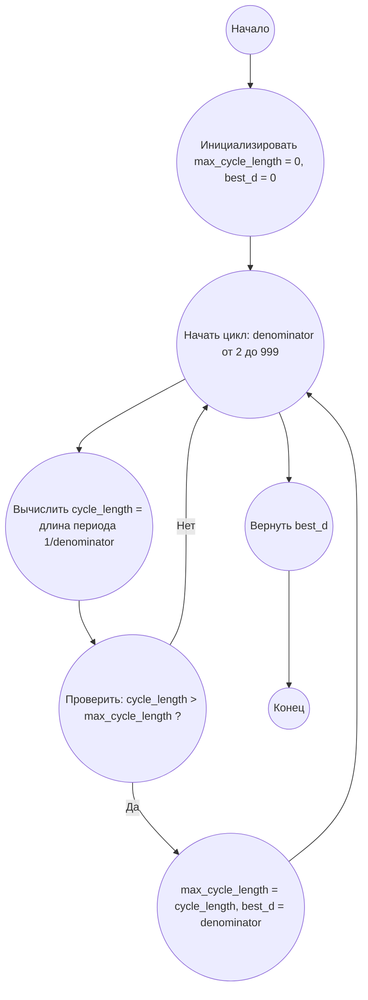

## Ответ на Задачу No 26: Взаимные длины периодов

### 1. Анализ задачи и решение

**Понимание задачи:**
* Нам нужно найти такое число `d` меньше 1000, для которого десятичная дробь `1/d` имеет самую длинную повторяющуюся часть (период).
* Для этого нужно проверить каждое число `d` от 1 до 999 и определить длину периода для дроби `1/d`.
* Длина периода - это количество цифр в повторяющейся последовательности после десятичной точки.

**Решение:**
1. **Функция для определения длины периода:** Напишем функцию `find_recurring_cycle_length(denominator)`, которая для заданного знаменателя `d` находит длину повторяющегося периода при делении 1 на `d`.
    *  Используем алгоритм длинного деления, запоминая остатки. Если остаток повторился - значит, цикл начался.
2. **Итерация и сравнение:** Проходим по всем числам `d` от 1 до 999.
   * Вычисляем длину периода для каждого `d`.
   * Сохраняем `d` и длину периода, если длина периода больше текущего максимального.
3. **Возврат результата:** После проверки всех `d`, возвращаем значение `d`, которое дало самую длинную длину периода.

### 2. Алгоритм решения
1.  Начать
2.  Инициализировать `max_cycle_length` = 0 и `best_d` = 0
3.  Для каждого числа `denominator` от 2 до 999
    * Вычислить `cycle_length` = длину периода дроби 1 / `denominator`
    * Если `cycle_length` > `max_cycle_length`:
       * `max_cycle_length` = `cycle_length`
       * `best_d` = `denominator`
4.  Вернуть `best_d`
5.  Конец

### 3. Реализация на Python 3.12
```python
def find_recurring_cycle_length(denominator):
    """
    Calculates the length of the recurring cycle in the decimal representation of 1/denominator.

    Args:
      denominator: The denominator of the fraction.

    Returns:
      The length of the recurring cycle.
    """
    remainders = {}
    remainder = 1
    position = 0
    while remainder != 0 and remainder not in remainders:
        remainders[remainder] = position
        remainder = (remainder * 10) % denominator
        position += 1
    if remainder == 0:
        return 0  # No recurring cycle
    else:
        return position - remainders[remainder]


def find_longest_recurring_cycle_d(limit):
    """
    Finds the value of d < limit for which 1/d has the longest recurring cycle.

    Args:
      limit: The upper bound (exclusive).

    Returns:
      The value of d with the longest recurring cycle.
    """
    max_cycle_length = 0
    best_d = 0
    for denominator in range(2, limit):
        cycle_length = find_recurring_cycle_length(denominator)
        if cycle_length > max_cycle_length:
            max_cycle_length = cycle_length
            best_d = denominator
    return best_d


# Пример использования:
result = find_longest_recurring_cycle_d(1000)
print(result)
```

### 4. Блок-схема в формате mermaid


**Легенда:**
* **Начало, Конец:** Начало и конец алгоритма.
* **Инициализировать max_cycle_length = 0, best_d = 0:** Инициализация переменных для хранения максимальной длины цикла и соответствующего значения `d`.
* **Начать цикл: denominator от 2 до 999:** Начало цикла перебора значений `denominator`.
* **Вычислить cycle_length = длина периода 1/denominator:** Вызов функции для расчета длины периода десятичной дроби.
* **Проверить: cycle_length > max_cycle_length ?:** Проверка, является ли текущая длина периода большей, чем максимальная найденная до этого момента.
* **max_cycle_length = cycle_length, best_d = denominator:** Обновление максимальной длины периода и соответствующего `d`.
* **Вернуть best_d:**  Возврат значения `d` с максимальной длиной периода.
