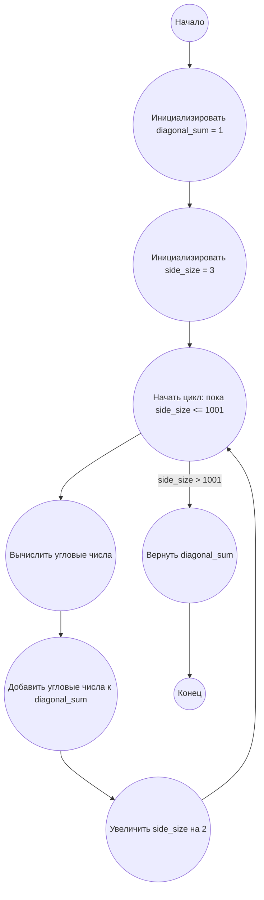

## Ответ на Задачу No 28: Сумма чисел по спирали

### 1. Анализ задачи и решение
**Понимание задачи:**
* Нам нужно найти сумму чисел на диагоналях спирали, которая закручивается по часовой стрелке, начиная с центра (1).
* Спираль имеет размерность 1001 на 1001.
* Диагональные числа - это числа, расположенные на линиях, идущих из верхнего левого угла в нижний правый, и из верхнего правого угла в нижний левый.
* Важно заметить, что у нас есть 4 числа на каждой "оболочке" спирали, которые участвуют в сумме диагоналей, за исключением самого первого числа (1).
* Каждая "оболочка" увеличивается на 2 единицы в размере (сторона 3, 5, 7 и т.д.), при этом числа на углах "оболочки" вычисляются на основе квадрата размера стороны, и к нему можно получить 4 диагональных числа.

**Решение:**
1. **Инициализация:** Создаем переменную `diagonal_sum`, в которую будем накапливать сумму. Начнем с 1.
2. **Цикл по оболочкам:** Создаем цикл, который будет обрабатывать каждую "оболочку" спирали, начиная с размера 3 и до размера 1001.
3. **Вычисление чисел на углах:** Для каждой оболочки размера `side_size` вычисляем числа на четырех углах, зная, что они будут на `side_size*side_size`, и предыдущие вычисления:
   - верхний правый: `side_size*side_size`
   - верхний левый: `side_size*side_size - (side_size-1)`
   - нижний левый: `side_size*side_size - 2*(side_size-1)`
   - нижний правый: `side_size*side_size - 3*(side_size-1)`
4. **Суммирование:** Прибавляем полученные 4 числа к `diagonal_sum`.
5. **Увеличение размера:** Увеличиваем `side_size` на 2 для перехода к следующей "оболочке".
6. **Возврат результата:** После окончания цикла возвращаем значение `diagonal_sum`.

### 2. Алгоритм решения
1. Начать
2. Инициализировать `diagonal_sum` = 1
3. Инициализировать `side_size` = 3
4. Пока `side_size` <= 1001
   * Вычислить числа на четырех углах текущей оболочки:
      * `top_right` = `side_size` * `side_size`
      * `top_left` = `top_right` - (`side_size` - 1)
      * `bottom_left` = `top_right` - 2 * (`side_size` - 1)
      * `bottom_right` = `top_right` - 3 * (`side_size` - 1)
   * Добавить `top_right` + `top_left` + `bottom_left` + `bottom_right` к `diagonal_sum`
   * Увеличить `side_size` на 2
5. Вернуть `diagonal_sum`
6. Конец

### 3. Реализация на Python 3.12
```python
def sum_of_spiral_diagonals(grid_size):
    """
    Calculates the sum of the numbers on the diagonals of a spiral grid.

    Args:
      grid_size: The size of the grid (must be an odd number).

    Returns:
      The sum of the numbers on the diagonals.
    """
    diagonal_sum = 1
    side_size = 3
    while side_size <= grid_size:
      top_right = side_size * side_size
      top_left = top_right - (side_size - 1)
      bottom_left = top_right - 2 * (side_size - 1)
      bottom_right = top_right - 3 * (side_size - 1)
      diagonal_sum += top_right + top_left + bottom_left + bottom_right
      side_size += 2
    return diagonal_sum


# Example usage
result = sum_of_spiral_diagonals(1001)
print(result)
```

### 4. Блок-схема в формате mermaid


**Legenda:**
* **Начало, Конец:** Начало и конец алгоритма.
* **Инициализировать diagonal_sum:** Создание переменной для хранения результата и присваивание ей начального значения 1.
* **Инициализировать side_size:** Создание переменной для размера стороны и присваивание ей начального значения 3.
* **Начать цикл: пока side_size <= 1001:** Условие цикла, которое выполняется пока размер стороны меньше или равен 1001.
* **Вычислить угловые числа:** Вычисляются значения чисел на четырех углах текущей оболочки спирали.
* **Добавить угловые числа к diagonal_sum:** Полученные угловые числа добавляются к общей сумме.
* **Увеличить side_size на 2:** Увеличение размера стороны для следующей оболочки.
* **Вернуть diagonal_sum:** Возврат значения накопленной суммы.
