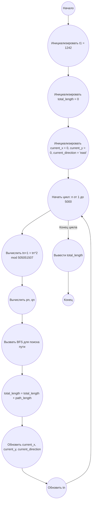

## Ответ на Задачу No 280: Затруднительная траектория муравья

### 1. Анализ задачи и решение

**Понимание задачи:**

*   Муравей движется по клетчатой плоскости, начиная с (0, 0) на восток.
*   Он может двигаться вперед или поворачивать налево.
*   Цели определяются последовательностью `t(n)`, где `t1 = 1242`, а `t(n+1) = t(n)^2 mod 505051507`.
*   Координаты n-ой цели `(pn, qn)` вычисляются как `pn = (tn mod 1000) - 500` и `qn = (tn+1 mod 1000) - 500`.
*   Муравей, достигнув цели, поворачивается на север и движется к следующей цели.
*   Нужно найти сумму длин кратчайших путей для первых 5000 целей.
*   Кратчайший путь можно найти, перебрав все возможные повороты муравья.

**Решение:**

1.  **Генерация целей:** Сгенерировать координаты первых 5000 целей, используя рекуррентную формулу для `t(n)` и формулы для `p(n)` и `q(n)`.
2.  **Функция поиска пути:** Написать функцию, которая находит кратчайший путь между двумя точками с учетом поворотов муравья.
    *   Функция принимает начальные координаты, направление и координаты цели.
    *   Реализуем обход в ширину (BFS) для поиска кратчайшего пути.
    *   BFS будет отслеживать состояние (x, y, direction, steps).
    *   Будем добавлять в очередь все возможные варианты движения (вперед и налево).
    *   Запоминаем посещённые состояния, чтобы не было зацикливания.
3.  **Суммирование длин путей:**
    *   Для каждой пары целей (начиная с (0,0) на восток) посчитать длину кратчайшего пути, используя функцию поиска пути.
    *   Накопить сумму всех длин.
4.  **Возврат результата:** Вернуть общую сумму длин кратчайших путей.

### 2. Алгоритм решения

1.  Начать
2.  Инициализировать `t1 = 1242`
3.  Инициализировать `total_length = 0`
4.  Инициализировать `current_x = 0`, `current_y = 0`, `current_direction = 'east'`
5.  Для `n` от 1 до 5000:
    *   Вычислить `tn` и `tn+1` по формуле `t(n+1) = t(n)^2 mod 505051507`.
    *   Вычислить `pn = (tn mod 1000) - 500` и `qn = (tn+1 mod 1000) - 500` (координаты n-ой цели).
    *   Используя BFS, найти кратчайший путь `length` от `(current_x, current_y)` с направлением `current_direction` до `(pn, qn)`, и длину этого пути
    *   `total_length = total_length + length`.
    *   `current_x = pn`, `current_y = qn`, `current_direction = 'north'`
    *   Сохранить `tn` для следующей итерации.
6.  Вернуть `total_length`
7.  Конец

### 3. Реализация на Python 3.12

```python
from collections import deque

def calculate_next_t(t):
    return (t * t) % 505051507

def calculate_target_coords(t_n, t_n_plus_1):
    p_n = (t_n % 1000) - 500
    q_n = (t_n_plus_1 % 1000) - 500
    return p_n, q_n

def find_shortest_path(start_x, start_y, start_direction, target_x, target_y):
    queue = deque([(start_x, start_y, start_direction, 0)])
    visited = set()
    visited.add((start_x, start_y, start_direction))

    while queue:
        x, y, direction, steps = queue.popleft()

        if x == target_x and y == target_y and direction == 'north':
            return steps

        # Move forward
        if direction == 'east':
            new_x, new_y = x + 1, y
        elif direction == 'west':
            new_x, new_y = x - 1, y
        elif direction == 'north':
            new_x, new_y = x, y + 1
        elif direction == 'south':
            new_x, new_y = x, y - 1

        if (new_x, new_y, direction) not in visited:
            visited.add((new_x, new_y, direction))
            queue.append((new_x, new_y, direction, steps + 1))

        # Turn left
        if direction == 'east':
            new_direction = 'north'
        elif direction == 'north':
            new_direction = 'west'
        elif direction == 'west':
            new_direction = 'south'
        elif direction == 'south':
            new_direction = 'east'
        
        if (x, y, new_direction) not in visited:
           visited.add((x, y, new_direction))
           queue.append((x, y, new_direction, steps + 1))

    return float('inf') # Should never happen

def solve_task():
    t_n = 1242
    total_length = 0
    current_x, current_y = 0, 0
    current_direction = 'east'

    for _ in range(5000):
        t_n_plus_1 = calculate_next_t(t_n)
        target_x, target_y = calculate_target_coords(t_n, t_n_plus_1)

        path_length = find_shortest_path(current_x, current_y, current_direction, target_x, target_y)
        total_length += path_length

        current_x = target_x
        current_y = target_y
        current_direction = 'north'
        t_n = t_n_plus_1

    return total_length

result = solve_task()
print(result)
```

### 4. Блок-схема в формате mermaid



**Legenda:**
*   **Начало, Конец:** Начало и конец выполнения программы.
*   **Инициализировать t1 = 1242:** Устанавливаем начальное значение для последовательности `t`.
*   **Инициализировать total\_length = 0:** Обнуляем переменную для хранения общей длины пути.
*   **Инициализировать current\_x = 0, current\_y = 0, current\_direction = 'east':** Устанавливаем начальную позицию муравья и его направление.
*   **Начать цикл: n от 1 до 5000:** Начало цикла для обработки 5000 целей.
*   **Вычислить tn+1 = tn^2 mod 505051507:** Вычисляем следующее значение последовательности `t`.
*   **Вычислить pn, qn:** Вычисляем координаты следующей цели.
*   **Вызвать BFS для поиска пути:** Вызываем функцию поиска кратчайшего пути между текущей позицией муравья и новой целью.
*   **total\_length = total\_length + path\_length:** Добавляем длину текущего пути к общей длине.
*  **Обновить current\_x, current\_y, current\_direction:** Обновляем текущую позицию и направление муравья.
*  **Обновить tn:** Сохраняем новое значение `tn` для следующей итерации.
*   **Конец цикла:** Конец цикла.
*   **Вывести total\_length:** Выводим общую длину всех кратчайших путей.
