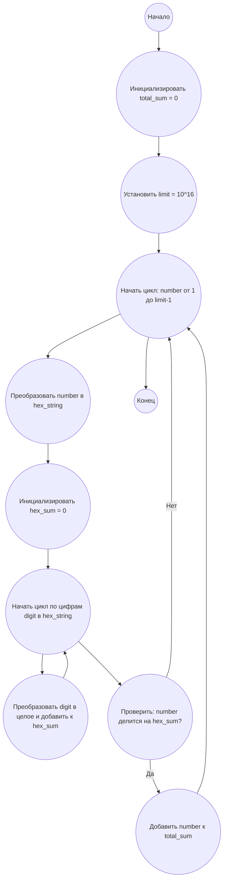

## Ответ на Задачу No 284: Сумма шестнадцатеричных цифр

### 1. Анализ задачи и решение
**Понимание задачи:**
* Нам нужно найти сумму всех "особенных" чисел, не превышающих 10^16.
* "Особенное" число - это десятичное число, сумма цифр шестнадцатеричного представления которого является делителем самого числа.
* Необходимо перебрать числа, конвертировать их в шестнадцатеричную систему, посчитать сумму цифр и проверить условие "особенного" числа.

**Решение:**
1. **Ограничение:** Задаем предел в 10^16.
2. **Перебор чисел:**  Проходим по числам от 1 до 10^16 (исключая 10^16, так как нужно "не превышающих").
3. **Конвертация в шестнадцатеричную:** Для каждого числа получаем его шестнадцатеричное представление в виде строки.
4. **Вычисление суммы цифр:** Суммируем цифры шестнадцатеричного представления (преобразуя их в целые числа).
5. **Проверка делимости:** Проверяем, является ли сумма цифр делителем исходного числа.
6. **Накопление суммы "особенных" чисел:** Если число "особенное", добавляем его к общей сумме.
7. **Возврат результата:** После завершения перебора возвращаем общую сумму "особенных" чисел.

### 2. Алгоритм решения
1. Начать
2. Инициализировать переменную `total_sum` со значением 0
3. Инициализировать предел `limit` = 10^16
4. Для каждого числа `number` от 1 до `limit`-1:
   *  Преобразовать `number` в шестнадцатеричную строку `hex_string`
   *  Инициализировать `hex_sum` со значением 0
   *  Для каждой цифры `digit` в `hex_string`:
        * Преобразовать `digit` в целое число и добавить к `hex_sum`
   *  Если `number` делится на `hex_sum` без остатка:
        * Добавить `number` к `total_sum`
5. Вернуть `total_sum`
6. Конец

### 3. Реализация на Python 3.12
```python
def sum_of_special_numbers(limit):
    """
    Calculates the sum of "special" numbers below the given limit.

    Args:
      limit: The upper bound (exclusive).

    Returns:
      The sum of special numbers.
    """

    total_sum = 0
    for number in range(1, limit):
        hex_string = hex(number)[2:]  # Convert to hexadecimal and remove "0x" prefix
        hex_sum = sum(int(digit, 16) for digit in hex_string)
        if hex_sum != 0 and number % hex_sum == 0:
            total_sum += number
    return total_sum

# Пример использования:
limit = 10**6
result = sum_of_special_numbers(limit)
print(f"Сумма 'особенных' чисел до {limit}: {result}")

limit = 10**4
result = sum_of_special_numbers(limit)
print(f"Сумма 'особенных' чисел до {limit}: {result}")

limit = 10**2
result = sum_of_special_numbers(limit)
print(f"Сумма 'особенных' чисел до {limit}: {result}")

```

### 4. Блок-схема в формате mermaid


**Legenda:**
* **Начало, Конец:** Начало и конец алгоритма.
* **Инициализировать total_sum:** Создаем переменную `total_sum` для хранения результата и присваиваем ей значение 0.
* **Установить limit:**  Устанавливаем предел `limit` как 10^16.
* **Начать цикл, Конец цикла:** Определяют начало и конец цикла перебора чисел от 1 до `limit-1`.
* **Преобразовать number в hex_string:** Преобразуем текущее число `number` в его шестнадцатеричное представление в виде строки.
* **Инициализировать hex_sum:** Создаем переменную `hex_sum` для хранения суммы цифр шестнадцатеричного представления и присваиваем ей значение 0.
* **Начать цикл по цифрам, Конец цикла по цифрам:**  Цикл перебора по цифрам строки `hex_string`.
* **Преобразовать digit в целое и добавить к hex_sum:**  Преобразуем текущую цифру `digit` из шестнадцатеричного представления в целое число и добавляем к сумме `hex_sum`.
* **Проверить: number делится на hex_sum?** Проверяем, является ли сумма цифр `hex_sum` делителем исходного числа `number`.
* **Добавить number к total_sum:** Если число "особенное" (условие проверки выполнено), добавляем его к общей сумме `total_sum`.
