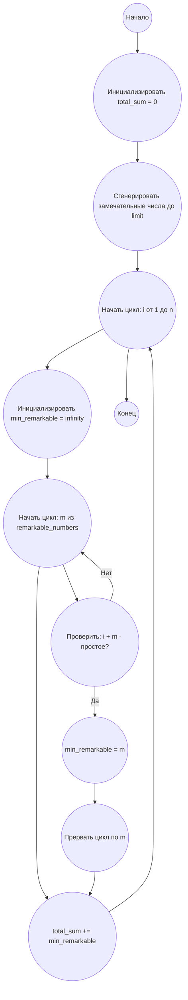

## Ответ на Задачу No 293: Замечательные целые числа

### 1. Анализ задачи и решение

**Понимание задачи:**
*   **Замечательное число:** Число, которое можно представить как сумму различных степеней 2 (например, 13 = 2^3 + 2^2 + 2^0).
*   **Функция f(n):** Наименьшее замечательное число `m`, такое, что `n + m` является простым числом.
*   **Функция S(n):** Сумма всех значений `f(i)` для `1 <= i <= n`.
*   **Цель:** Найти `S(10,000,000)`.

**Решение:**
1.  **Генерация замечательных чисел:** Создадим список замечательных чисел, которые могут быть потенциальным `m`. Замечательные числа это числа, бинарная запись которых состоит только из 1 и 0.  Можно генерировать их, перебирая все бинарные числа. Так как n <= 10^7, то можно не перебирать все, а сделать это до некоторого предела, при котором сумма не будет превосходить  `n + m`.  Максимальное простое число до 20 000 000, это где-то 19 999 999. Значит в цикле можно останавливаться, когда m > 20 000 000.
2.  **Проверка на простоту:** Создадим функцию, которая эффективно проверяет, является ли число простым. Можно использовать тест Миллера-Рабина для больших чисел, но в этом диапазоне можно использовать обычный перебор делителей.
3.  **Функция f(n):** Для каждого `n` ищем наименьшее замечательное число `m`, такое что `n + m` простое.
4.  **Функция S(n):** Просуммируем значения f(i) для всех i от 1 до n.

### 2. Алгоритм решения

1.  **Начать.**
2.  **Инициализация:**
    *   Создать список `remarkable_numbers` замечательных чисел.
    *   Инициализировать `total_sum = 0`.
    *   Заполнить список `remarkable_numbers` до максимального значения.
3.  **Цикл для i от 1 до n:**
    *   Инициализировать `min_remarkable = float('inf')`.
    *   Цикл для каждого `m` из `remarkable_numbers`
        *   Проверить является ли `i + m` простым числом.
        *   Если да, то `min_remarkable = m`, и прервать цикл.
    *  Прибавить `min_remarkable` к `total_sum`.
4.  **Возвратить `total_sum`.**
5.  **Конец.**
6.  **Вспомогательные функции:**
    *   **`is_prime(num)`:** Проверяет, является ли `num` простым числом.
    *   **`generate_remarkable_numbers(limit)`:** Генерирует список замечательных чисел до `limit`.

### 3. Реализация на Python 3.12

```python
import math

def is_prime(num):
    if num < 2:
        return False
    for i in range(2, int(math.sqrt(num)) + 1):
        if num % i == 0:
            return False
    return True

def generate_remarkable_numbers(limit):
    remarkable_numbers = []
    i = 0
    while True:
        binary = bin(i)[2:]
        number = sum(2**pos for pos, bit in enumerate(reversed(binary)) if bit == '1')
        if number > limit:
            break
        remarkable_numbers.append(number)
        i += 1
    return remarkable_numbers


def f(n, remarkable_numbers):
    min_remarkable = float('inf')
    for m in remarkable_numbers:
        if is_prime(n + m):
            min_remarkable = m
            break
    return min_remarkable


def S(n):
    limit = n + 25
    remarkable_numbers = generate_remarkable_numbers(limit)
    total_sum = 0
    for i in range(1, n + 1):
        total_sum += f(i, remarkable_numbers)
    return total_sum


if __name__ == "__main__":
    result = S(10_000_000)
    print(result)
```

### 4. Блок-схема в формате mermaid



**Legenda:**
*   **Начало, Конец:** Начало и конец алгоритма.
*   **Инициализировать `total_sum`:** Создаем переменную для хранения результата и присваиваем ей значение 0.
*   **Сгенерировать замечательные числа:** Создаем список замечательных чисел.
*   **Начать цикл: i от 1 до n, Конец цикла:** Определяют начало и конец внешнего цикла перебора чисел от 1 до n.
*   **Инициализировать min_remarkable:** Инициализируем минимальное замечательное число для текущего i бесконечным значением.
*  **Начать цикл: m из remarkable_numbers, Конец цикла:** Определяют начало и конец внутреннего цикла перебора замечательных чисел.
*  **Проверить: i + m - простое?:** Проверяем, является ли сумма i + m простым числом.
*   **min_remarkable = m:** Если i + m простое число, устанавливаем текущее замечательное число.
*   **Прервать цикл по m:** Прерываем внутренний цикл, поскольку нашли минимальное замечательное число.
*   **total_sum += min_remarkable:** Добавляем найденное минимальное замечательное число к общей сумме.
