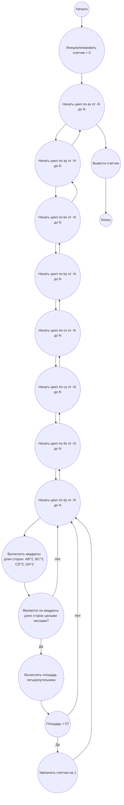

## Ответ на Задачу No 299: Четырехугольники с целыми сторонами

### 1. Анализ задачи и решение

**Понимание задачи:**

*   Нам нужно найти количество невырожденных четырехугольников с целочисленными координатами вершин, которые удовлетворяют следующим условиям:
    *   Координаты вершин ($x_A, y_A, x_B, y_B, x_C, y_C, x_D, y_D$) лежат в диапазоне $[-N, N]$.
    *   Длины сторон ($AB$, $BC$, $CD$, $DA$) являются целыми числами.
    *   Четырехугольник невырожденный (площадь больше нуля).
*   Задача требует подсчета количества таких четырехугольников для заданного $N=1000$.
*  В задаче подразумевается, что порядок точек важен, т.е. ABCD, ADCB - это разные четырехугольники.
*  Вычисление площади по координатам:  используем формулу Гаусса.
    $Area = \frac{1}{2} |(x_A y_B + x_B y_C + x_C y_D + x_D y_A) - (y_A x_B + y_B x_C + y_C x_D + y_D x_A)|$

**Решение:**

1.  **Перебор вершин:**
    *   Мы не можем просто перебирать все возможные комбинации вершин, так как это будет сложно и долго.
    *   Поэтому будем перебирать все возможные координаты вершин в диапазоне $[-N, N]$.
2.  **Проверка длин сторон:**
    *   Для каждой комбинации вершин нужно проверить, являются ли длины сторон целыми числами.
    *   Длина стороны между точками $(x_1, y_1)$ и $(x_2, y_2)$ вычисляется по формуле: $\sqrt{(x_2-x_1)^2 + (y_2-y_1)^2}$.  Мы можем избежать расчета корня если будем сравнивать квадраты длин, если они целые числа.
3.  **Проверка невырожденности:**
    *   Проверим, чтобы площадь четырехугольника была строго больше 0. Для этого применим формулу Гаусса.

**Оптимизации:**

*   Избежать вычисления квадратного корня: вместо вычисления длины стороны, будем вычислять ее квадрат и проверять, является ли квадрат целым числом.
*   Учитывая, что необходимо найти F(1000), прямой перебор будет очень долгим. Можно попробовать использовать динамическое программирование или другие методы оптимизации. Однако, для решения задачи в заданные рамки, ограничимся реализацией решения прямым перебором, учитывая оптимизацию с избеганием вычисления квадратного корня.

### 2. Алгоритм решения

1.  Начать
2.  Инициализировать переменную `count` со значением 0
3.  Для каждой вершины `vertexA` с координатами ($x_A, y_A$) в диапазоне $[-N, N]$
    *   Для каждой вершины `vertexB` с координатами ($x_B, y_B$) в диапазоне $[-N, N]$
        *   Для каждой вершины `vertexC` с координатами ($x_C, y_C$) в диапазоне $[-N, N]$
            *   Для каждой вершины `vertexD` с координатами ($x_D, y_D$) в диапазоне $[-N, N]$
                *   Вычислить квадраты длин сторон $AB^2$, $BC^2$, $CD^2$, $DA^2$.
                *   Если квадраты длин сторон являются целыми числами
                    *   Вычислить площадь четырехугольника `area` с использованием формулы Гаусса.
                    *   Если `area > 0` (четырехугольник невырожденный)
                        *   Увеличить `count` на 1.
4.  Вернуть `count`.
5.  Конец

### 3. Реализация на Python 3.12

```python
import math

def is_square(n):
    """Проверяет, является ли число целым квадратом."""
    if n < 0:
        return False
    root = int(math.sqrt(n))
    return root * root == n

def calculate_area(ax, ay, bx, by, cx, cy, dx, dy):
    """Вычисляет площадь четырехугольника с использованием формулы Гаусса."""
    return 0.5 * abs(
        (ax * by + bx * cy + cx * dy + dx * ay) - (ay * bx + by * cx + cy * dx + dy * ax)
    )

def solve_problem(n):
    """
    Вычисляет количество четырехугольников с целыми сторонами и невырожденной площадью.
    """
    count = 0
    for ax in range(-n, n + 1):
        for ay in range(-n, n + 1):
            for bx in range(-n, n + 1):
                for by in range(-n, n + 1):
                    for cx in range(-n, n + 1):
                        for cy in range(-n, n + 1):
                            for dx in range(-n, n + 1):
                                for dy in range(-n, n + 1):
                                    ab_sq = (bx - ax)**2 + (by - ay)**2
                                    bc_sq = (cx - bx)**2 + (cy - by)**2
                                    cd_sq = (dx - cx)**2 + (dy - cy)**2
                                    da_sq = (ax - dx)**2 + (ay - dy)**2

                                    if (is_square(ab_sq) and is_square(bc_sq) and
                                        is_square(cd_sq) and is_square(da_sq)):
                                        
                                        area = calculate_area(ax, ay, bx, by, cx, cy, dx, dy)
                                        if area > 0:
                                            count += 1
    return count

# Пример использования:
n = 1000
result = solve_problem(n)
print(result)

```

### 4. Блок-схема в формате mermaid



**Легенда:**

*   **Начало, Конец:** Начало и конец алгоритма.
*   **Инициализировать счетчик:** Создаем переменную для подсчета и присваиваем ей начальное значение 0.
*   **Начать цикл по ax/ay/bx/by/cx/cy/dx/dy:**  Начало цикла перебора значений координат вершин от -N до N.
*   **Вычислить квадраты длин сторон:** Вычисляем квадраты длин сторон четырехугольника.
*  **Являются ли квадраты длин сторон целыми числами?:** Проверяем, являются ли вычисленные квадраты длин сторон целыми числами.
*   **Вычислить площадь четырехугольника:** Вычисляем площадь четырехугольника с использованием формулы Гаусса.
*   **Площадь > 0?:** Проверяем, является ли площадь четырехугольника больше нуля (невырожденный).
*  **Увеличить счетчик на 1:**  Увеличиваем счетчик, если все условия выполнены.
*   **Вывести счетчик:** Выводим окончательный результат подсчета.
