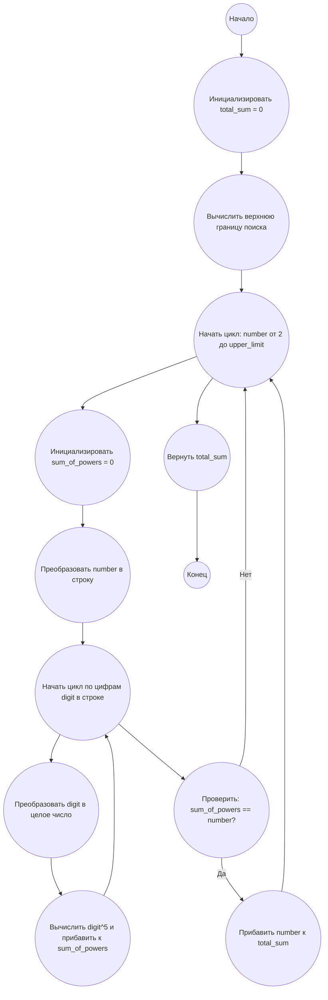

## Ответ на Задачу No 30: Сумма цифр в пятой степени

### 1. Анализ задачи и решение
**Понимание задачи:**
* Необходимо найти все числа, которые равны сумме пятых степеней своих цифр.
* Затем нужно сложить все найденные числа.
* Важно определить верхнюю границу поиска, так как перебирать все числа бесконечно не получится.

**Решение:**
1. **Определение верхней границы:** Максимальное значение суммы пятых степеней цифр достигается, когда все цифры в числе равны 9. Посчитаем, когда эта сумма станет меньше, чем само число.
2. **Перебор:** Перебираем числа от 2 до определенной верхней границы.
3. **Проверка условия:** Для каждого числа:
   * Разделяем число на отдельные цифры.
   * Вычисляем сумму пятых степеней этих цифр.
   * Если сумма равна исходному числу, то добавляем его в результирующую сумму.
4. **Возврат результата:** После перебора всех чисел возвращаем результирующую сумму.

### 2. Алгоритм решения
1. Начать
2. Инициализировать переменную `total_sum` со значением 0.
3. Определить `upper_limit` как верхнюю границу поиска (основано на анализе максимальной суммы пятых степеней).
4. Для каждого числа `number` от 2 до `upper_limit`:
   * Инициализировать переменную `sum_of_powers` со значением 0.
   * Преобразовать число `number` в строку.
   * Для каждой цифры `digit` в строке:
     * Преобразовать `digit` в целое число.
     * Вычислить пятую степень `digit` и прибавить к `sum_of_powers`.
   * Если `sum_of_powers` равен `number`, то прибавить `number` к `total_sum`.
5. Вернуть `total_sum`.
6. Конец.

### 3. Реализация на Python 3.12
```python
def sum_of_digit_powers(power):
    """
    Calculates the sum of numbers that are equal to the sum of their digits raised to the given power.

    Args:
      power: The power to raise the digits to.

    Returns:
      The sum of such numbers.
    """

    total_sum = 0
    upper_limit = 1  # start with 1 and find the upper limit
    digit_9_power = 9**power 
    while True:
      if upper_limit > digit_9_power * len(str(upper_limit)):
        break
      upper_limit += 1
    
    upper_limit = digit_9_power * len(str(upper_limit-1))
    

    for number in range(2, upper_limit):
        sum_of_powers = 0
        for digit in str(number):
            sum_of_powers += int(digit) ** power
        if sum_of_powers == number:
            total_sum += number
    return total_sum


# Пример использования:
result = sum_of_digit_powers(5)
print(result)
```

### 4. Блок-схема в формате mermaid


**Легенда:**
*   **Начало, Конец:** Начало и конец алгоритма.
*   **Инициализировать total\_sum:** Создаем переменную `total_sum` для хранения результата и присваиваем ей значение 0.
*   **Вычислить верхнюю границу поиска:** Определяем верхнюю границу поиска на основе анализа максимальной суммы пятых степеней цифр.
*   **Начать цикл: number от 2 до upper\_limit:** Начало цикла перебора чисел в заданном диапазоне.
*  **Инициализировать sum\_of\_powers:** Создаем переменную `sum_of_powers` для вычисления суммы степеней цифр текущего числа.
*   **Преобразовать number в строку:** Преобразуем текущее число в строку для итерации по его цифрам.
*   **Начать цикл по цифрам digit в строке:** Начало цикла по каждой цифре в строке.
*   **Преобразовать digit в целое число:** Преобразуем текущую цифру из строки в целое число.
*   **Вычислить digit^5 и прибавить к sum\_of\_powers:** Вычисляем пятую степень текущей цифры и добавляем ее к `sum_of_powers`.
*   **Проверить: sum\_of\_powers == number?:** Проверяем, равна ли сумма пятых степеней цифр текущему числу.
*   **Прибавить number к total\_sum:** Если сумма пятых степеней цифр равна числу, добавляем число к `total_sum`.
*   **Вернуть total\_sum:** Возвращаем окончательную сумму.
