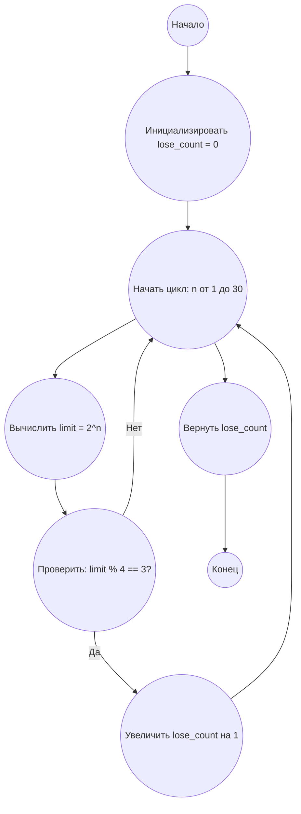

## Ответ на Задачу No 301: Ничейные игры

### 1. Анализ задачи и решение
**Понимание задачи:**

*   Нам дано правило игры, где два игрока по очереди добавляют жетоны на стол. Проигрывает игрок, после хода которого XOR-сумма жетонов на столе равна нулю. Если после выкладывания всех жетонов XOR-сумма не равна нулю, выигрывает первый игрок.
*   Нужно определить, сколько значений `n` в диапазоне от 1 до 30, таких что при наборе жетонов от 1 до 2^n, первый игрок проиграет.  Это означает, что XOR-сумма всех чисел от 1 до 2^n равна 0.

**Решение:**

1.  **Вычисление XOR-суммы:** XOR-сумма чисел от 1 до `m` может быть эффективно вычислена.
2.  **Свойство XOR:**  XOR обладает свойством:
    * `x ^ x = 0`
    * `x ^ 0 = x`
3.  **Паттерн:** XOR-сумма чисел от 1 до `m` имеет следующий паттерн в зависимости от `m % 4`:
    *   `m % 4 == 0`:  Сумма равна `m`.
    *   `m % 4 == 1`:  Сумма равна 1.
    *   `m % 4 == 2`:  Сумма равна `m + 1`.
    *   `m % 4 == 3`:  Сумма равна 0.
4.  **Проверка условия:** Для проигрыша первого игрока XOR-сумма чисел от 1 до 2^n должна быть равна 0.
5.  **Перебор n:** Нужно перебрать все `n` от 1 до 30 и для каждого `n` проверить, когда XOR-сумма чисел от 1 до 2^n равна 0. Для этого применим вышеописанный паттерн.

### 2. Алгоритм решения
1. Начать
2. Инициализировать переменную `lose_count` со значением 0
3. Для каждого числа `n` от 1 до 30
    *   Вычислить `limit` как 2^n
    *   Если `limit % 4 == 3`:
        *   Увеличить `lose_count` на 1
4. Вернуть `lose_count`
5. Конец

### 3. Реализация на Python 3.12
```python
def count_losing_n(max_n):
    """
    Counts the number of n values (1 to max_n) for which the first player loses
    in the described game.

    Args:
      max_n: The upper limit of n values.

    Returns:
      The number of losing n values.
    """
    lose_count = 0
    for n in range(1, max_n + 1):
        limit = 2**n
        if limit % 4 == 3:
            lose_count += 1
    return lose_count

# Example usage:
result = count_losing_n(30)
print(result)
```

### 4. Блок-схема в формате mermaid


**Легенда:**
* **Начало, Конец:** Начало и конец алгоритма.
* **Инициализировать lose\_count:** Создаем переменную `lose_count` для хранения количества проигрышных n и присваиваем ей значение 0.
* **Начать цикл, Конец цикла:** Определяют начало и конец цикла перебора значений n от 1 до 30.
* **Вычислить limit = 2^n:** Вычисляем верхний предел для текущего значения n.
* **Проверить: limit % 4 == 3?** Проверяем условие, при котором XOR-сумма чисел от 1 до 2^n равна 0.
* **Увеличить lose\_count на 1:** Если условие выполняется, увеличиваем счетчик проигрышных n.
* **Вернуть lose\_count:** После завершения цикла возвращаем общее количество проигрышных n.
