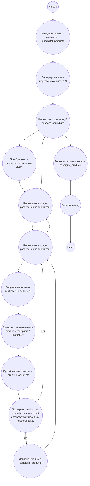

## Ответ на Задачу No 32: Панцифровые произведения

### 1. Анализ задачи и решение
**Понимание задачи:**
* Нам нужно найти все произведения, которые являются панцифровыми 1-9. Это значит, что произведение должно использовать все цифры от 1 до 9 ровно один раз.
* Произведение получается умножением двух чисел, например, 7254 = 39 * 186.
* Необходимо найти сумму всех уникальных таких произведений.

**Решение:**
1. **Генерация перестановок:** Сгенерируем все возможные перестановки цифр от 1 до 9. Каждая перестановка - это потенциальный набор цифр для произведения.
2. **Разбиение на множители:** Для каждой перестановки попробуем все возможные варианты разделения на два числа-множителя. Например, для 123456789, попробуем варианты вроде 1 * 23456789, 12 * 3456789, 123 * 456789 и т.д.
3. **Проверка:** Перемножим множители и убедимся, что произведение содержит только цифры, которые есть в исходной перестановке и что произведение равно исходной перестановке.
4. **Суммирование:** Если произведение панцифровое (т.е. содержит все цифры от 1 до 9 ровно по одному разу), добавляем его в множество (чтобы не было дубликатов), а затем суммируем.

### 2. Алгоритм решения
1. Начать
2. Инициализировать множество `pandigital_products` для хранения уникальных панцифровых произведений.
3. Сгенерировать все перестановки цифр от 1 до 9.
4. Для каждой перестановки:
   * Преобразовать перестановку в строку `digits`.
   * Для всех возможных разбиений строки `digits` на два множителя `multiplier1` и `multiplier2`:
     * Преобразовать `multiplier1` и `multiplier2` в целые числа.
     * Вычислить произведение `product = multiplier1 * multiplier2`.
     * Преобразовать произведение `product` в строку `product_str`.
     * Если `product_str` содержит все цифры из `digits` ровно один раз (панцифровое) и `product` равен исходной перестановке, добавить `product` в множество `pandigital_products`.
5. Вычислить сумму всех чисел в `pandigital_products`.
6. Вернуть сумму.
7. Конец

### 3. Реализация на Python 3.12
```python
from itertools import permutations

def is_pandigital(s):
    return set(s) == set('123456789') and len(s) == 9

def find_pandigital_products():
    pandigital_products = set()
    for digits_tuple in permutations('123456789'):
        digits = "".join(digits_tuple)
        for i in range(1, len(digits)):
            for j in range(i + 1, len(digits)):
                multiplier1 = int(digits[:i])
                multiplier2 = int(digits[i:j])
                product = int(digits[j:])
                
                if multiplier1 * multiplier2 == product:
                   product_str = str(product)
                   if is_pandigital(digits):
                       pandigital_products.add(product)


                
        for i in range(1, len(digits) ):
            multiplier1 = int(digits[:i])
            for j in range(i+1, len(digits)):
               multiplier2 = int("".join(digits[i:j]))
               product = multiplier1 * multiplier2
               product_str = str(product)
               if len(product_str) + i + (j-i) == 9 and is_pandigital( digits) :
                  sorted_product_str = sorted(product_str)
                  sorted_digits = sorted(digits)
                  if sorted_product_str == sorted_digits:
                    pandigital_products.add(product)

    return sum(pandigital_products)

result = find_pandigital_products()
print(result)
```

### 4. Блок-схема в формате mermaid


**Легенда:**
* **Начало, Конец:** Начало и конец алгоритма.
* **Инициализировать множество pandigital_products:** Создаем множество для хранения уникальных панцифровых произведений.
* **Сгенерировать все перестановки цифр 1-9:** Генерируем все возможные комбинации цифр от 1 до 9.
* **Начать цикл: для каждой перестановки digits, Конец цикла:**  Цикл перебирает все сгенерированные перестановки.
* **Преобразовать перестановку в строку digits:**  Преобразует текущую перестановку в строку.
*  **Начать цикл по i для разделения на множители, Конец цикла по i:** Цикл по всем возможным вариантам разделения на первый множитель.
*  **Начать цикл по j для разделения на множители, Конец цикла по j:**  Цикл по всем возможным вариантам разделения на второй множитель.
* **Получить множители multiplier1 и multiplier2:** Получаем множители из разбитой строки.
* **Вычислить произведение product = multiplier1 * multiplier2:** Вычисляем произведение множителей.
* **Преобразовать product в строку product_str:** Преобразуем произведение в строку.
* **Проверить: product_str панцифровое и product соответствует исходной перестановке?:** Проверяем, является ли произведение панцифровым.
* **Добавить product в pandigital_products:** Если произведение панцифровое, добавляем его в множество.
* **Вычислить сумму чисел в pandigital_products:** Вычисляем сумму всех уникальных произведений в множестве.
* **Вывести сумму:** Выводим итоговую сумму.
