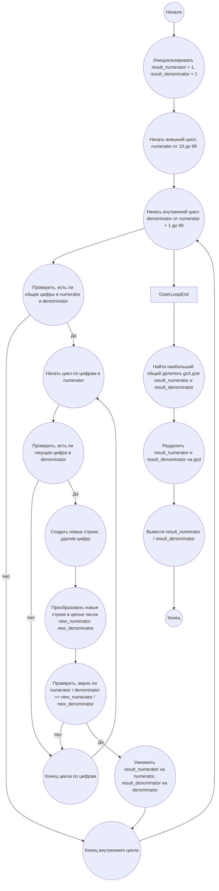

## Ответ на Задачу No 33: Цифры сокращения дробей

### 1. Анализ задачи и решение
**Понимание задачи:**
* Необходимо найти все "любопытные" дроби вида n/m, где n и m - двузначные числа, которые можно "сократить", удалив одинаковые цифры в числителе и знаменателе (например, 49/98 -> 4/8).
* Дроби должны быть нетривиальными (числитель и знаменатель не должны иметь одинаковые цифры), и n < m.
* После нахождения всех таких дробей, их необходимо перемножить и представить результат в виде несократимой дроби.

**Решение:**
1. **Генерация дробей:** Перебираем все возможные двузначные числа n и m, где n < m.
2. **Проверка на сокращение:** Для каждой пары n/m проверяем возможность "сокращения" описанным способом.
3. **Отбор "любопытных" дробей:**  Сохраняем дроби, удовлетворяющие условиям "сокращения" и нетривиальности.
4. **Перемножение дробей:** Перемножаем найденные "любопытные" дроби.
5. **Сокращение результирующей дроби:** Сокращаем полученную результирующую дробь до несократимого вида.

### 2. Алгоритм решения
1.  Начать
2.  Инициализировать переменные `result_numerator` = 1, `result_denominator` = 1.
3.  Для каждого `numerator` от 10 до 99:
    * Для каждого `denominator` от `numerator + 1` до 99:
        * Если `numerator` и `denominator` не содержат одинаковых цифр:
            * Преобразовать `numerator` и `denominator` в строки (`numerator_str`, `denominator_str`).
            * Для каждой цифры `digit` в `numerator_str`:
                * Если `digit` есть в `denominator_str`:
                    * Создать новые строки `new_numerator_str`, `new_denominator_str` удалив `digit` из соответствующих строк.
                    * Преобразовать `new_numerator_str` и `new_denominator_str` в целые числа `new_numerator`, `new_denominator`.
                    * Если `new_denominator` не равен нулю и `numerator / denominator` равно `new_numerator / new_denominator`:
                        * Умножить `result_numerator` на `numerator`, `result_denominator` на `denominator`.
                        * Перейти к следующему `denominator`.
4.  Найти наибольший общий делитель `gcd` для `result_numerator` и `result_denominator`.
5.  Разделить `result_numerator` и `result_denominator` на `gcd`.
6.  Вывести `result_numerator` / `result_denominator`.
7.  Конец

### 3. Реализация на Python 3.12
```python
from math import gcd

def find_curious_fractions():
    """
    Finds and multiplies all "curious" fractions.

    Returns:
        A tuple representing the reduced fraction (numerator, denominator).
    """
    result_numerator = 1
    result_denominator = 1

    for numerator in range(10, 100):
        for denominator in range(numerator + 1, 100):
            numerator_str = str(numerator)
            denominator_str = str(denominator)

            if any(digit in numerator_str and digit in denominator_str for digit in set(numerator_str)):
                for digit in set(numerator_str):
                    if digit in denominator_str:
                        new_numerator_str = numerator_str.replace(digit, "", 1)
                        new_denominator_str = denominator_str.replace(digit, "", 1)
                        if new_numerator_str and new_denominator_str:
                           new_numerator = int(new_numerator_str)
                           new_denominator = int(new_denominator_str)
                           if new_denominator != 0 and numerator / denominator == new_numerator / new_denominator:
                                result_numerator *= numerator
                                result_denominator *= denominator
                                break

    common_divisor = gcd(result_numerator, result_denominator)
    return result_numerator // common_divisor, result_denominator // common_divisor


if __name__ == "__main__":
    reduced_numerator, reduced_denominator = find_curious_fractions()
    print(f"{reduced_numerator}/{reduced_denominator}")
```

### 4. Блок-схема в формате mermaid


**Легенда:**
* **Начало, Конец:** Начало и конец алгоритма.
* **Инициализировать result_numerator = 1, result_denominator = 1:** Устанавливаем начальные значения переменных для накопления произведения дробей.
* **Начать внешний цикл, Конец внешнего цикла:** Цикл перебора `numerator` от 10 до 99.
* **Начать внутренний цикл, Конец внутреннего цикла:** Цикл перебора `denominator` от `numerator + 1` до 99.
* **Проверить, есть ли общие цифры в numerator и denominator:** Проверяем, есть ли совпадающие цифры в строковом представлении `numerator` и `denominator`.
* **Начать цикл по цифрам в numerator, Конец цикла по цифрам:** Цикл перебора цифр в строковом представлении `numerator`.
* **Проверить, есть ли текущая цифра в denominator:** Проверяем, присутствует ли текущая цифра в строковом представлении `denominator`.
* **Создать новые строки, удалив цифру:** Создаем новые строки, удалив первую найденную совпадающую цифру.
* **Преобразовать новые строки в целые числа new_numerator, new_denominator:** Преобразуем новые строки обратно в целые числа.
* **Проверить, верно ли numerator / denominator == new_numerator / new_denominator:** Проверяем, выполняется ли условие "сокращения" для данной пары.
* **Умножить result_numerator на numerator, result_denominator на denominator:** Умножаем аккумуляторы на текущие числитель и знаменатель.
* **Найти наибольший общий делитель gcd для result_numerator и result_denominator:** Находим наибольший общий делитель для сокращения дроби.
* **Разделить result_numerator и result_denominator на gcd:** Сокращаем дробь.
* **Вывести result_numerator / result_denominator:** Выводим результат.
