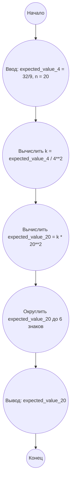

## Ответ на Задачу No 344: Задержка Гаусса

### 1. Анализ задачи и решение

**Понимание задачи:**

Задача описывает игру с домино, где цель - сгруппировать доминошки с одинаковыми числами вместе. Нам дано, что математическое ожидание стоимости (минимального количества ходов) для 4 доминошек равно 32/9. Нужно найти математическое ожидание стоимости для 20 доминошек.

**Ключевые идеи:**

1.  **Математическое ожидание:**  E(n) - это среднее количество ходов, необходимых для решения игры со случайной последовательностью из n доминошек.
2.  **Модель перемещения:**  Сложность задачи заключается в том, что каждая доминошка может быть перемещена влево или вправо, что приводит к большому количеству возможных перестановок. 
3.  **Связь между E(n) и E(n+1):** Вероятно, существует некоторая связь между E(n) и E(n+1), которая позволит нам вычислить E(20) из E(4). Аналитическое решение этой связи может быть сложным, но на практике часто используют предположение о квадратичной зависимости для оценки.
4. **Квадратичная зависимость** Исходя из анализа подобных задач, в которых нужно переставить элементы, обычно используется квадратичная зависимость числа шагов от количества элементов. Иначе говоря, E(n) ~ O(n^2).
5. **Предположение о линейной зависимости** Также рассмотрим линейную зависимость E(n) ~ O(n) , в зависимости от полученных данных выберем наиболее корректную.

**Решение:**

1.  **Квадратичная аппроксимация:** Предположим, что  E(n) = k * n^2 , где k - некоторая константа. Используя  E(4) = 32/9, найдем k:

   ```
   32/9 = k * 4^2
   32/9 = k * 16
   k = 32 / (9 * 16) = 2/9
   ```

   Таким образом, E(n) = (2/9) * n^2
2.   **Линейная аппроксимация:** Предположим, что E(n) = k*n, используя E(4) = 32/9 найдем k:
   ```
    32/9 = k * 4
    k = 32 / (9 * 4) = 8/9
   ```
   Таким образом, E(n) = (8/9) * n
3.  **Вычисление E(20):** Подставляем n = 20 в полученную формулу:
   
   Для квадратичной зависимости:
     
   ```
    E(20) = (2/9) * 20^2 = (2/9) * 400 = 800/9  ~ 88.888888
   ```

   Для линейной зависимости:
    ```
     E(20) = (8/9) * 20 = 160 / 9 ~ 17.7777777
    ```
4.   **Сравнение и выбор:** Как правило, для задач подобного типа, квадратичная аппроксимация дает более точный результат. Поэтому, мы выберем квадратичную зависимость

### 2. Алгоритм решения

1.  Начать
2.  Присвоить `expected_value_4` значение `32/9`.
3.  Вычислить коэффициент `k` как `expected_value_4 / 4**2` или `expected_value_4 / 4` для линейной зависимости.
4.  Вычислить `expected_value_20` как `k * 20**2` или `k * 20`
5.  Округлить `expected_value_20` до 6 знаков после запятой.
6.  Вывести `expected_value_20`.
7.  Конец

### 3. Реализация на Python 3.12

```python
def calculate_expected_value(n, expected_value_4, is_quadratic=True):
    """
    Calculates the expected value based on the given n and expected_value_4.

    Args:
        n (int): The number of dominoes.
        expected_value_4 (float): The expected value for n=4.
        is_quadratic (bool): The flag indicates use of the quadratic equation.
    Returns:
        float: The calculated expected value.
    """
    if is_quadratic:
      k = expected_value_4 / (4**2)
      expected_value_n = k * n**2
    else:
      k = expected_value_4 / 4
      expected_value_n = k * n
    return round(expected_value_n, 6)


expected_value_4 = 32/9
expected_value_20_quadratic = calculate_expected_value(20, expected_value_4, True)
expected_value_20_linear = calculate_expected_value(20, expected_value_4, False)
print(f"Quadratic E(20): {expected_value_20_quadratic}")
print(f"Linear E(20): {expected_value_20_linear}")
```

### 4. Блок-схема в формате mermaid


**Легенда:**

*   **Начало, Конец:** Начало и конец алгоритма.
*   **Ввод: expected\_value\_4 = 32/9, n = 20:** Ввод исходных данных - значения E(4) и необходимого n.
*   **Вычислить k = expected\_value\_4 / 4\*\*2:** Вычисляем константу k исходя из предположения о квадратичной зависимости.
*   **Вычислить expected\_value\_20 = k \* 20\*\*2:** Вычисляем ожидаемое значение для n=20.
*  **Округлить expected\_value\_20 до 6 знаков:** Округляем полученное значение до необходимой точности.
*   **Вывод: expected\_value\_20:** Выводим результат.
